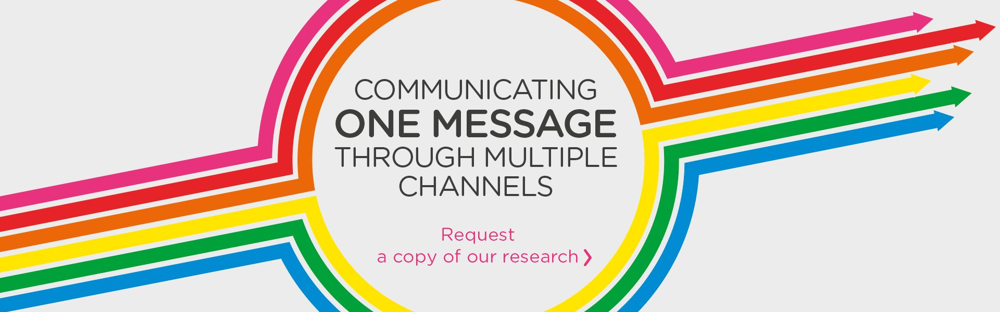
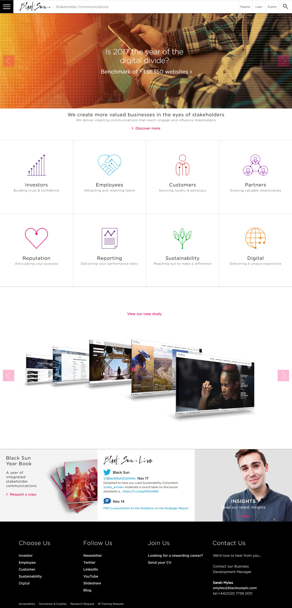
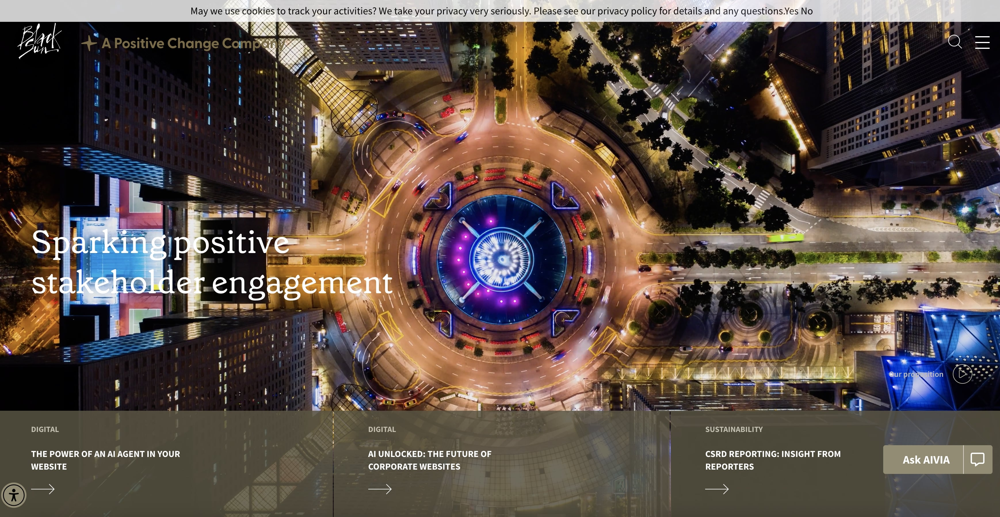
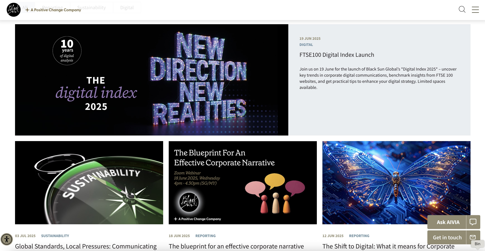
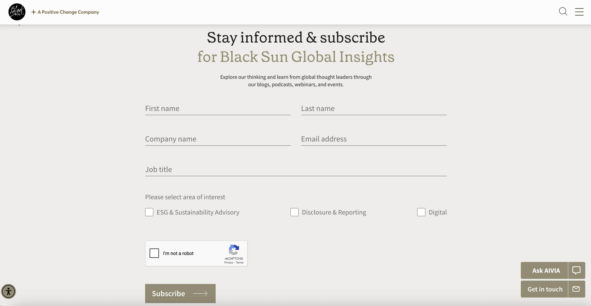
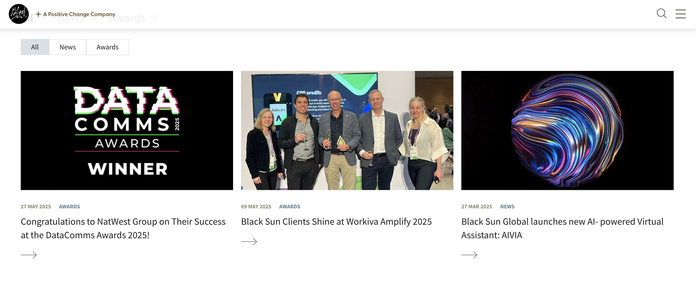

 
  

  
  <h1>Black Sun Plc. (Black Sun Plc.)</h1>

  

    I worked on this company website whilst worked for <strong>Black Sun Plc.</strong>, London.
  

  <h4>
    <a href="https://www.blacksun-global.com/"  target="_blank">View site</a>
  </h4>
  <h4>
    <a href="#" title="Sorry, it's company secret"  target="_blank"><s>View code (company secret)</s></a>
  </h4>

 

<!-- Table of Contents -->

# :notebook_with_decorative_cover: ToC

- [About the company](#family-about-the-company)
- [About the project](#star2-about-the-project)
  - [Screenshots](#camera-screenshots)
  - [Tech Stack](#space_invader-tech-stack)
  - [Features](#dart-features)
- [License](#warning-license)
- [Contact](#handshake-contact)

<!-- About the company -->

## :family: About the company

<strong>Black Sun Global</strong> is a global stakeholder advisory and engagement agency, founded in 1991, with offices in London and Singapore. They specialise in helping businesses navigate complex, evolving environments through strategic communications, ESG, sustainability, digital engagement, and stakeholder reporting.

The company helps companies spark positive change—transforming how they connect with stakeholders through strategic insight, compelling storytelling, and cutting‑edge technology.

  <h2>Core Expertise</h2>
  <ul>
    <li><strong>ESG &amp; Sustainability Advisory</strong>: Designing sustainability frameworks, aligning ESG initiatives with authentic storytelling, and ensuring compliance with global standards like CSRD, SASB, TCFD.</li>
    <li><strong>Disclosure &amp; Reporting</strong>: Supporting clients with compliance-driven disclosure and transforming corporate, ESG, and social reports into strategic stakeholder communication tools.</li>
    <li><strong>Digital Engagement &amp; Technology</strong>: Creating award‑winning digital experiences (websites, intranets, events, social media); leveraging proprietary tech like PrintConnect and WebConnect built on Adobe platforms, and integrating AI and analytics.</li>
  </ul>

  <h2>Additional Services</h2>
  <ul>
    <li><strong>Stakeholder insights &amp; analysis</strong>: Deep research into stakeholder needs to tailor communications strategies.</li>
    <li><strong>Financial communications strategy</strong>: Crafting clear messaging for complex financial and business performance.</li>
    <li><strong>Impact measurement &amp; reporting</strong>: Measuring effectiveness and output of engagement strategies.</li>
  </ul>

  <h2>Client Engagement & Thought Leadership</h2>
  <ul>
    <li>Hosts podcasts, webinars, and publishes insights on corporate reporting, sustainability, AI, and digital transformation.</li>
    <li>Organises practical events such as “AI Unlocked: The Future of Corporate Websites” and “The Shift to Digital: What It Means for Corporate Reporting”.</li>
  </ul>

  <h2>Global Presence & Group Vision</h2>
  
Part of the <em>Positive Change Group</em>, a global coalition of specialist agencies dedicated to sparking positive change through integrated stakeholder communications. They serve a diversified global client base and focus on creating resilience, trust, and long-term value.

  <h2>Headquarters & Contact</h2>
  <ul>
    <li><strong>London &amp; Europe</strong>: Fulham Palace, Bishop's Avenue, London SW6 6EA Tel: +44 (0)20 7736 0011 • Email: <a href="mailto:enquiries@blacksun-global.com">enquiries@blacksun-global.com</a>.</li>
    <li><strong>Asia Pacific</strong>: 89 Neil Road #02‑01, Singapore 088849 Tel: +65 6995 4335.</li>
  </ul>

<!-- About the project -->

## :star2: About the project

The task was building the official company website for Black Sun Plc.

Three types of pages were usually created:

<ul>
  <li>Static layout with editable content</li>
  <li>Dynamic layout with dynamic content, fetched from RESTful API sources</li>
  <li>Functional pages with mixed type of contents, such as contact us page, insights, map locations, </li>
</ul>

<!-- Screenshots -->

### :camera: Screenshots

 
  

 
  

 
  

 
  

 
  

 
  

<!-- TechStack -->

### :space_invader: Tech Stack

<a href="https://builtwith.com/?https%3a%2f%2fwww.blacksun-global.com%2f">Full list of used technologies</a>

  
Client

  <ul>
    <li><a href="https://www.w3schools.com/html/html5_semantic_elements.asp" target="_blank">Semantic HTML5</a></li>
    <li><a href="https://www.w3schools.com/css/"  target="_blank">CSS3</a></li>
    <li><a href="https://business.adobe.com/products/experience-manager/adobe-experience-manager.html"  target="_blank">AEM</a></li>
    <li><a href="https://developer.mozilla.org/en-US/docs/Web/JavaScript"  target="_blank">JavaScript</a></li>
    <li><a href="https://jquery.com/"  target="_blank">JQuery</a></li>
    <li><a href="https://gsap.com/">Greensock</a></li>
    <li><a href="https://www.ibm.com/think/topics/rest-apis"  target="_blank">RestAPI</a></li>
    <li><a href="https://www.json.org/">JSON</a></li>
    <li><a href="https://developer.mozilla.org/en-US/docs/Web/XML/Guides/XML_introduction"  target="_blank">XML</a></li>
  </ul>

  
Backend

  <ul>
    <li><a href="#"  target="_blank">Java</a></li>
    <li><a href="https://jade.tilab.com/">Jade</a></li>
    <li><a href="https://docs.oracle.com/cd/E13218_01/wlp/docs70/jsp/templats.htm"  target="_blank">JSP templates</a></li>
  </ul>

Database

  <ul>
    <li><a href="https://www.mysql.com/">MySQL</a></li>
  </ul>

DevOps

  <ul>
    <li><a href="https://www.liferay.com/">Liferay</a></li>
    <li><a href="https://www.atlassian.com/software/jira">JIRA</a></li>
    <li><a href="https://www.browserstack.com/">BrowserStack</a></li>
    <li><a href="https://github.com/">GitHub</a></li>
    <li><a href="https://en.wikipedia.org/wiki/Agile_software_development">Agile software development</a></li>
    
    
  </ul>

<!-- Features -->

### :dart: Features

- mobile first, full responsive solution
- optimized loading time and assets (compressed files and image assets, GZIP headers, minified scripts)
- user friendly CMS solution
- pixel perfect result from Adobe Illustrator / Photoshop designs
- wide variation of bespoken teasers and components

<!-- License -->

## :warning: License

Distributed under the Software copyright of <strong>Black Sun Plc.</strong> Any non-authorized usage of their code leads to legal consequences, thank you.

<!-- Contact -->

## :handshake: Contact

Black Sun Plc. - [https://www.blacksun-global.com/](https://www.blacksun-global.com/), Fulham Palace, Bishop's Avenue, London, SW6 6EA, United Kingdom
