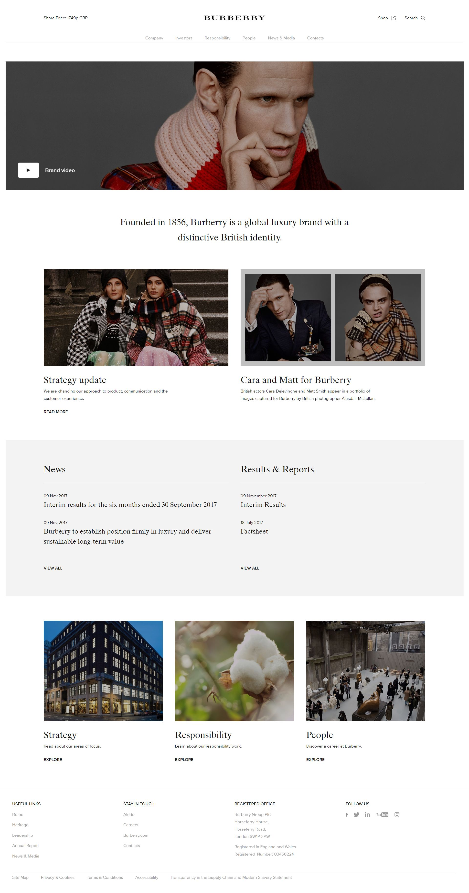

 
  

 
  

  
  <h1>Burberry Plc. (Black Sun Plc.)</h1>

  

    I worked on this project whilst worked for <strong>Black Sun Plc.</strong>, London, between Marc 2015 and October 2017.
  

  

    
  

   
  <h4>
    <a href="https://uk.burberry.com/"  target="_blank">View site</a>
  </h4>
  <h4>
    <a href="#" title="Sorry, it's company secret"  target="_blank"><s>View code (company secret)</s></a>
  </h4>

 

<!-- Table of Contents -->

# :notebook_with_decorative_cover: ToC

- [About the company](#family-about-the-company)
- [About the project](#star2-about-the-project)
  - [Screenshots](#camera-screenshots)
  - [Tech Stack](#space_invader-tech-stack)
  - [Features](#dart-features)
- [License](#warning-license)
- [Contact](#handshake-contact)

<!-- About the company -->

## :family: About the company

<section>
  <h3>Main Services</h3>
  <ul>
    <li>
      <strong>Personalisation</strong> – Add up to three initials (embroidery, engraving, embossing) on scarves, leather accessories, and fragrances. Complimentary, available online and in selected stores, within 3 months of purchase.</li>
    <li>
      <strong>Trench Bespoke</strong> – Custom-design trench coats: choose gabardine, lining, buttons, embroidery, appliqué patches for a fully personalized piece.</li>
    <li>
      <strong>ReBurberry Services</strong> – Circularity-focused aftercare: includes
      <ul>
        <li><strong>Refresh:</strong> cleaning and restoration of trenches, leather, canvas, cashmere, sneakers, rainwear;</li>
        <li><strong>Repair:</strong> stitching, dyeing, hardware fixes, alterations on clothing, leather goods, shoes;</li>
        <li><strong>Remake:</strong> scarf upcycling via embroidery/darning;</li>
        <li><strong>Rental:</strong> through Cocoon and HURR;</li>
        <li><strong>Resale:</strong> via Vestiaire Collective.</li>
      </ul>
    </li>
    <li>
      <strong>Gift Packaging</strong> – Complimentary, FSC-certified, plastic-free wrapping for products including garment bags and dust bags.</li>
  </ul>

  <h3>Omnichannel & Digital Experience</h3>
  <ul>
    <li>Immersive, editorial online storefront with full-screen filters, rich image galleries, zoom, and AR experiences (e.g., Lola handbags).</li>
    <li>Supports video shopping and digital clienteling—connecting online users with in-store advisors via live chat, messaging, and routing based on browsing, location, or preferences.</li>
    <li>Accessible design adhering to WCAG 2.1 AA standards for inclusive user experience.</li>
  </ul>

  <h3>Why It Matters</h3>
  <ul>
    <li>Luxury customization and bespoke services elevate the Burberry shopping experience.</li>
    <li>Circularity emphasis supports sustainable consumption and product longevity.</li>
    <li>Seamless blend of digital and physical realms via omnichannel tools and AR enhances engagement and conversion.</li>
    <li>Commitment to inclusivity ensures accessibility for a broad audience.</li>
  </ul>
</section>

<!-- About the project -->

## :star2: About the project

The task was building a corporate website for Burberry Plc.

Typical contents and pages were done, such as:

<ul>
  <li>Women</li>
  <li>Men</li>
  <li>Children</li>
  <li>Gifts</li>
  <li>Trench</li>
  <li>Bags</li>
  <li>Beauty</li>
  <li>Stories</li>
  <li>Find a Store</li>
  <li>Burberry Services</li>
  <li>Customer Support</li>
  <li>About Burberry</li>
  <li>Legal &amp; Cookies</li>
</ul>

Three types of pages were usually created:

<ul>
  <li>Static layout with editable content</li>
  <li>Dynamic layout with dynamic content, fetched from RESTful API sources</li>
  <li>Functional pages with mixed type of contents, such as contact us page, insights, map locations, </li>
</ul>

<!-- Screenshots -->

### :camera: Screenshots

 
  

<!-- TechStack -->

### :space_invader: Tech Stack

<a href="https://builtwith.com/?https%3a%2f%2fuk.burberry.com">Full list of used technologies</a>

  
Client

  <ul>
    <li><a href="https://developer.mozilla.org/en-US/docs/Web/JavaScript"  target="_blank">JavaScript</a></li>
    <li><a href="https://jquery.com/"  target="_blank">JQuery</a></li>
    <li><a href="https://www.w3schools.com/html/html5_semantic_elements.asp" target="_blank">Semantic HTML5</a></li>
    <li><a href="https://www.w3schools.com/css/"  target="_blank">CSS3</a></li>
    <li><a href="https://business.adobe.com/products/experience-manager/adobe-experience-manager.html"  target="_blank">AEM</a></li>
  </ul>

  
Backend

  <ul>
    <li><a href="#"  target="_blank">Java</a></li>
    <li><a href="https://docs.oracle.com/cd/E13218_01/wlp/docs70/jsp/templats.htm"  target="_blank">JSP templates</a></li>
  </ul>

Database

  <ul>
    <li><a href="https://www.mysql.com/">MySQL</a></li>
  </ul>

DevOps

  <ul>
    <li><a href="https://tortoisesvn.net/">Tortuise SVN</a></li>
    <li><a href="https://www.eclipse.org/topics/ide/">Eclipse</a></li>
    <li><a href="https://www.jslint.com/">JS Lint</a></li>
  </ul>

<!-- Features -->

### :dart: Features

- mobile first, full responsive solution
- optimized loading time and assets (compressed files and image assets, GZIP headers, minified scripts)
- user friendly CMS solution
- pixel perfect result from Adobe Illustrator / Photoshop designs
- wide variation of bespoken teasers and components

<!-- License -->

## :warning: License

Distributed under the Software copyright of <strong>Black Sun Plc.</strong> Any non-authorized usage of their code leads to legal consequences, thank you.

<!-- Contact -->

## :handshake: Contact

Black Sun Plc. - [https://www.blacksun-global.com/](https://www.blacksun-global.com/), Fulham Palace, Bishop's Avenue, London, SW6 6EA, United Kingdom
