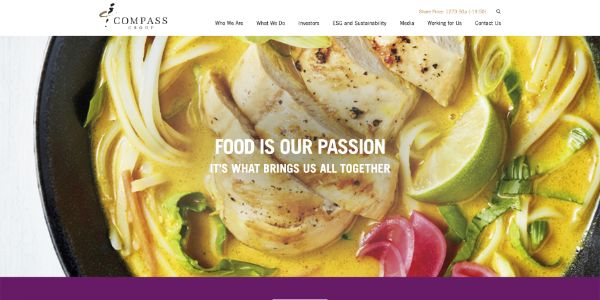
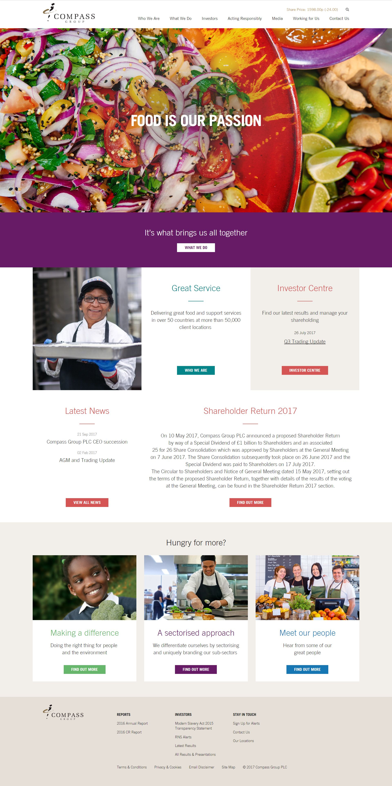

 
  

  
  <h1>Compass Group (Black Sun Plc.)</h1>

  

    I worked on this project whilst worked for <strong>Black Sun Plc.</strong>, London, between Marc 2015 and October 2017.
  
§
  

    
  

   
  <h4>
    <a href="https://www.compass-group.com/en/"  target="_blank">View site</a>
  </h4>
  <h4>
    <a href="#" title="Sorry, it's company secret"  target="_blank"><s>View code (company secret)</s></a>
  </h4>

 

<!-- Table of Contents -->

# :notebook_with_decorative_cover: ToC

- [About the company](#family-about-the-company)
- [About the project](#star2-about-the-project)
  - [Screenshots](#camera-screenshots)
  - [Tech Stack](#space_invader-tech-stack)
  - [Features](#dart-features)
- [License](#warning-license)
- [Contact](#handshake-contact)

<!-- About the company -->

## :family: About the company

<strong>Compass Group</strong> is a global leader in food and support services, operating in approximately 30 countries with a workforce of around 580,000 employees. The company provides a wide range of services, including catering, cleaning, facilities management, and vending solutions, to diverse sectors such as business, healthcare, education, sports, leisure, defence, and remote locations .

<section>
  

    Compass Group is a global leader in contract food and support services. Operating in around 30 countries, the company serves over 5.5 billion meals annually and employs approximately 580,000 people worldwide.
  

  <h3>Core Services</h3>
  <ul>
    <li>
      <strong>Food Services:</strong>
      
Delivers high-quality, nutritious meals tailored to clients across various sectors including business, healthcare, education, and leisure. Services range from large-scale catering to bespoke dining experiences.

    </li>
    <li>
      <strong>Support Services:</strong>
      
Provides non-food services such as cleaning, reception, groundskeeping, security, vending, and facilities management—either standalone or as part of a bundled service offering.

    </li>
  </ul>

  <h3>Sector Specialization</h3>
  <ul>
    <li>Business & Industry</li>
    <li>Healthcare & Senior Living</li>
    <li>Education</li>
    <li>Sports & Leisure</li>
    <li>Defence, Offshore & Remote</li>
  </ul>

  <h3>Why Choose Compass Group?</h3>
  <ul>
    <li>Comprehensive outsourcing of food and support services</li>
    <li>Customized, scalable solutions for diverse industries</li>
    <li>Commitment to sustainability, innovation, and safety</li>
    <li>Global consistency with localized execution</li>
  </ul>

  <h3>Quick Facts</h3>
  <ul>
    <li><strong>Countries:</strong> ~30</li>
    <li><strong>Employees:</strong> ~580,000</li>
    <li><strong>Meals Served Annually:</strong> 5.5 billion+</li>
    <li><strong>Revenue (2024):</strong> ~£42 billion</li>
  </ul>
</section>

<!-- About the project -->

## :star2: About the project

The task was building a corporate website for Compass Group

Typical contents and pages were done, such as:

<ul>
  <li>Who We Are</li>
  <li>What We Do
    <ul>
      <li>Services</li>
      <li>Sectors</li>
      <li>Locations</li>
    </ul>
  </li>
  <li>Sustainability</li>
  <li>Investors</li>
  <li>News</li>
  <li>Careers</li>
  <li>Contact Us</li>
</ul>

Three types of pages were usually created:

<ul>
  <li>Static layout with editable content</li>
  <li>Dynamic layout with dynamic content, fetched from RESTful API sources</li>
  <li>Functional pages with mixed type of contents, such as contact us page, insights, map locations, </li>
</ul>

<!-- Screenshots -->

### :camera: Screenshots

 
  

 
  

<!-- TechStack -->

### :space_invader: Tech Stack

<a href="https://builtwith.com/?https%3a%2f%2fwww.compass-group.com%2fen%2f">Full list of used technologies</a>

  
Client

  <ul>
    <li><a href="https://developer.mozilla.org/en-US/docs/Web/JavaScript"  target="_blank">JavaScript</a></li>
    <li><a href="https://jquery.com/"  target="_blank">JQuery</a></li>
    <li><a href="https://www.w3schools.com/html/html5_semantic_elements.asp" target="_blank">Semantic HTML5</a></li>
    <li><a href="https://www.w3schools.com/css/"  target="_blank">CSS3</a></li>
    <li><a href="https://business.adobe.com/products/experience-manager/adobe-experience-manager.html"  target="_blank">AEM</a></li>
  </ul>

  
Backend

  <ul>
    <li><a href="#"  target="_blank">Java</a></li>
    <li><a href="https://docs.oracle.com/cd/E13218_01/wlp/docs70/jsp/templats.htm"  target="_blank">JSP templates</a></li>
  </ul>

Database

  <ul>
    <li><a href="https://www.mysql.com/">MySQL</a></li>
  </ul>

DevOps

  <ul>
    <li><a href="https://tortoisesvn.net/">Tortuise SVN</a></li>
    <li><a href="https://www.eclipse.org/topics/ide/">Eclipse</a></li>
    <li><a href="https://www.jslint.com/">JS Lint</a></li>
  </ul>

<!-- Features -->

### :dart: Features

- mobile first, full responsive solution
- optimized loading time and assets (compressed files and image assets, GZIP headers, minified scripts)
- user friendly CMS solution
- pixel perfect result from Adobe Illustrator / Photoshop designs
- wide variation of bespoken teasers and components

<!-- License -->

## :warning: License

Distributed under the Software copyright of <strong>Black Sun Plc.</strong> Any non-authorized usage of their code leads to legal consequences, thank you.

<!-- Contact -->

## :handshake: Contact

Black Sun Plc. - [https://www.blacksun-global.com/](https://www.blacksun-global.com/), Fulham Palace, Bishop's Avenue, London, SW6 6EA, United Kingdom
