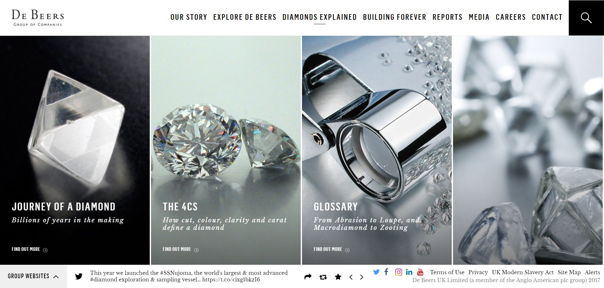

 
  

  
  <h1>De Beers Group (Black Sun Plc.)</h1>

  

    I worked on this project whilst worked for <strong>Black Sun Plc.</strong>, London, between Marc 2015 and October 2017.
  
§
  

    
  

   
  <h4>
    <a href="https://www.debeersgroup.com/"  target="_blank">View site</a>
  </h4>
  <h4>
    <a href="#" title="Sorry, it's company secret"  target="_blank"><s>View code (company secret)</s></a>
  </h4>

 

<!-- Table of Contents -->

# :notebook_with_decorative_cover: ToC

- [About the company](#family-about-the-company)
- [About the project](#star2-about-the-project)
  - [Screenshots](#camera-screenshots)
  - [Tech Stack](#space_invader-tech-stack)
  - [Features](#dart-features)
- [License](#warning-license)
- [Contact](#handshake-contact)

<!-- About the company -->

## :family: About the company

<strong>De Beers Group</strong> is a vertically integrated leader in the diamond industry.

<section>
  <h3>1. Diamond Mining & Trading</h3>
  <ul>
    <li>Engaged in exploration and extraction of natural diamonds across Botswana, Namibia, Canada, and South Africa, operating under joint ventures and wholly-owned entities.</li>
    <li>The Diamond Trading Company (DTC) sorts, values, and distributes approximately one-third of the world’s rough diamonds to sightholder buyers.</li>
  </ul>

  <h3>2. Diamond Verification & Industry Instruments</h3>
  <ul>
    <li>Develops and supplies verification instruments (e.g., DiamondProof, SynthDetect, AMS2, DiamondView) to detect natural versus synthetic diamonds with high accuracy.</li>
    <li>Manufactures these instruments at its UK R&D facility and provides global support, maintenance, instrumentation training, and demos.</li>
  </ul>

  <h3>3. Grading, Testing & Educational Services</h3>
  <ul>
    <li>Through the De Beers Institute of Diamonds (formerly IIDGR), offers diamond grading, melee and parcel testing, and synthetic detection services from labs in Maidenhead (UK), Antwerp (Belgium), and Surat (India).</li>
    <li>Delivers accredited training courses—online and in-person—on topics like the 4Cs, grading, and synthetic detection for diamond professionals.</li>
  </ul>

  <h3>4. Retail & Consumer Offerings</h3>
  <ul>
    <li>Operates De Beers Jewellers (rebranded De Beers London) and the Forevermark diamond brand for consumers, featuring customizable, lab-quality jewelry.</li>
    <li>Offers bespoke services—live chat, virtual appointments, engraving, cleaning, resizing, remounting, and post-sale care—available globally online and through flagship stores.</li>
  </ul>

  <h3>5. Digital & E‑commerce Experience</h3>
  <ul>
    <li>Utilizes Salesforce Commerce Cloud across 18 markets, delivering features like product personalization, 360° views, size guidance, lead-time estimates, and integrated online-offline purchasing workflows.</li>
    <li>Provides virtual consultations and seamless CRM integration during COVID‑era and beyond for enriched customer engagement.</li>
  </ul>

  <h3>6. Sustainability & Traceability Initiatives</h3>
  <ul>
    <li>Implements the Kimberley Process for conflict‑free diamonds and tracks stones through the “Tracr” blockchain platform.</li>
    <li>Conserves six hectares of land for every hectare mined and sets carbon-neutrality commitments supported by AI, blockchain, and conservation practices.</li>
  </ul>
</section>

<!-- About the project -->

## :star2: About the project

The task was building a corporate website for De Beers Group

Three types of pages were usually created:

<ul>
  <li>Static layout with editable content</li>
  <li>Dynamic layout with dynamic content, fetched from RESTful API sources</li>
  <li>Functional pages with mixed type of contents, such as contact us page, insights, map locations, </li>
</ul>

<!-- Screenshots -->

### :camera: Screenshots

 
  

<!-- TechStack -->

### :space_invader: Tech Stack

<a href="https://builtwith.com/?https%3a%2f%2fwww.debeersgroup.com%2f">Full list of used technologies</a>

  
Client

  <ul>
    <li><a href="https://www.w3schools.com/html/html5_semantic_elements.asp" target="_blank">Semantic HTML5</a></li>
    <li><a href="https://www.w3schools.com/css/"  target="_blank">CSS3</a></li>
    <li><a href="https://business.adobe.com/products/experience-manager/adobe-experience-manager.html"  target="_blank">AEM</a></li>
    <li><a href="https://developer.mozilla.org/en-US/docs/Web/JavaScript"  target="_blank">JavaScript</a></li>
    <li><a href="https://jquery.com/"  target="_blank">JQuery</a></li>
    <li><a href="https://gsap.com/">Greensock</a></li>
    <li><a href="https://www.ibm.com/think/topics/rest-apis"  target="_blank">RestAPI</a></li>
    <li><a href="https://www.json.org/">JSON</a></li>
    <li><a href="https://developer.mozilla.org/en-US/docs/Web/XML/Guides/XML_introduction"  target="_blank">XML</a></li>
  </ul>

  
Backend

  <ul>
    <li><a href="#"  target="_blank">Java</a></li>
    <li><a href="https://jade.tilab.com/">Jade</a></li>
    <li><a href="https://docs.oracle.com/cd/E13218_01/wlp/docs70/jsp/templats.htm"  target="_blank">JSP templates</a></li>
  </ul>

Database

  <ul>
    <li><a href="https://www.mysql.com/">MySQL</a></li>
  </ul>

DevOps

  <ul>
    <li><a href="https://tortoisesvn.net/">Tortuise SVN</a></li>
    <li><a href="https://www.eclipse.org/topics/ide/">Eclipse</a></li>
    <li><a href="https://www.jslint.com/">JS Lint</a></li>
    <li><a href="https://www.atlassian.com/software/jira">JIRA</a></li>
    <li><a href="https://www.browserstack.com/">BrowserStack</a></li>
    <li><a href="https://github.com/">GitHub</a></li>
    <li><a href="https://en.wikipedia.org/wiki/Agile_software_development">Agile software development</a></li>
  </ul>

<!-- Features -->

### :dart: Features

- mobile first, full responsive solution
- optimized loading time and assets (compressed files and image assets, GZIP headers, minified scripts)
- user friendly CMS solution
- pixel perfect result from Adobe Illustrator / Photoshop designs
- wide variation of bespoken teasers and components

<!-- License -->

## :warning: License

Distributed under the Software copyright of <strong>Black Sun Plc.</strong> Any non-authorized usage of their code leads to legal consequences, thank you.

<!-- Contact -->

## :handshake: Contact

Black Sun Plc. - [https://www.blacksun-global.com/](https://www.blacksun-global.com/), Fulham Palace, Bishop's Avenue, London, SW6 6EA, United Kingdom
