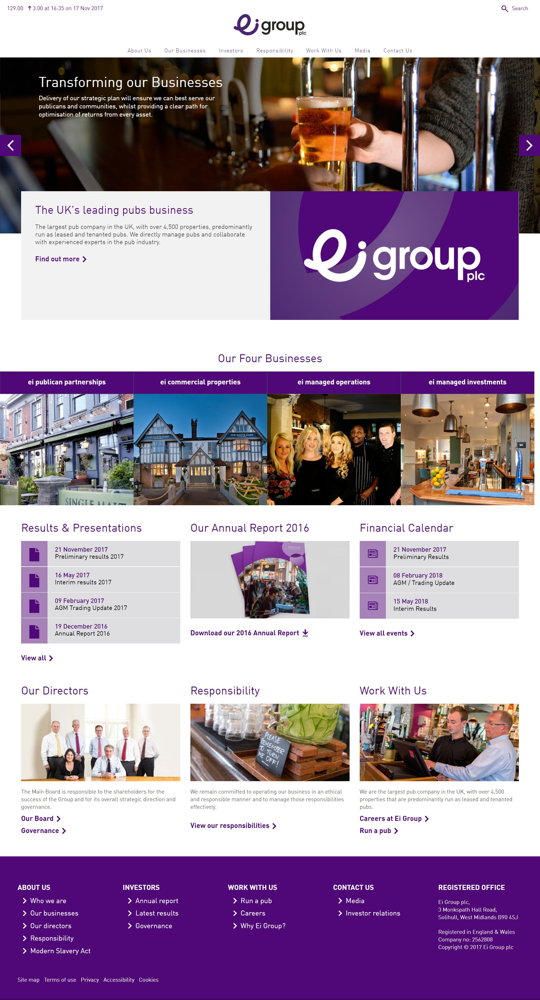

 
  

 
  

  
  <h1>EI Group (Black Sun Plc.)</h1>

  

    I worked on this project whilst worked for <strong>Black Sun Plc.</strong>, London, between Marc 2015 and October 2017.
  
§
  

    
  

   
  <h4>
    <a href="http://www.eigroupplc.com/"  target="_blank">View site</a>
  </h4>
  <h4>
    <a href="#" title="Sorry, it's company secret"  target="_blank"><s>View code (company secret)</s></a>
  </h4>

 

<!-- Table of Contents -->

# :notebook_with_decorative_cover: ToC

- [About the company](#family-about-the-company)
- [About the project](#star2-about-the-project)
  - [Screenshots](#camera-screenshots)
  - [Tech Stack](#space_invader-tech-stack)
  - [Features](#dart-features)
- [License](#warning-license)
- [Contact](#handshake-contact)

<!-- About the company -->

## :family: About the company

<strong>Ei Group plc</strong>, formerly known as <strong>Enterprise Inns</strong>, was a prominent UK-based pub company, operating a portfolio of leased and tenanted pubs across England and Wales. The company was headquartered in Solihull, West Midlands, and was listed on the London Stock Exchange until its acquisition by Stonegate Pub Company in March 2020

<section>
  <h3>Leased and Tenanted Pubs</h3>
  
Ei Group managed over 4,000 properties, primarily leased and tenanted pubs, offering individuals the opportunity to operate pubs without purchasing the freehold. These arrangements provided autonomy and support to pub operators.

  <h3>Managed Operations</h3>
  
The company operated approximately 100 managed pubs, including brands like Bermondsey and Craft Union, providing a more hands-on approach to pub management. These establishments were directly operated by Ei Group.

  <h3>Commercial Property Management</h3>
  
Ei Group managed a developing portfolio of commercial properties, leasing them to third parties on commercial property terms. This included providing asset management support for its leased and tenanted, and managed house businesses.

  <h3>Investment in Pubs</h3>
  
Over five years, Ei Group invested over £250 million to support, invest in, and add value to pubs throughout England and Wales, enhancing the quality and appeal of its establishments.

  <h3>Acquisition by Stonegate Pub Company</h3>
  
In March 2020, Ei Group plc was acquired by Stonegate Pub Company, marking the end of its independent operations. The acquisition added approximately 4,000 pubs to Stonegate's portfolio, making it the largest pub owner in the UK.

    </section>

<!-- About the project -->

## :star2: About the project

The task was building a corporate website for EI Group

Typical contents and pages were done, such as:

<ul>
    <li>About Us</li>
    <li>Our Businesses
        <ul>
            <li>Managed Estate</li>
            <li>Operator Led Managed Estate</li>
            <li>Joint Ventures</li>
            <li>Pub Partners</li>
            <li>Commercial Properties</li>
        </ul>
    </li>
    <li>Investors</li>
    <li>Responsibility</li>
    <li>Work With Us
        <ul>
            <li>Publican Opportunities</li>
            <li>Work For Us</li>
        </ul>
    </li>
    <li>Press</li>
    <li>Find Your Local</li>
    <li>Contact Us</li>
</ul>

Three types of pages were usually created:

<ul>
  <li>Static layout with editable content</li>
  <li>Dynamic layout with dynamic content, fetched from RESTful API sources</li>
  <li>Functional pages with mixed type of contents, such as contact us page, insights, map locations, </li>
</ul>

<!-- Screenshots -->

### :camera: Screenshots

 
  

<!-- TechStack -->

### :space_invader: Tech Stack

<a href="https://builtwith.com/eigroupplc.com">Full list of used technologies</a>

  
Client

  <ul>
    <li><a href="https://www.w3schools.com/html/html5_semantic_elements.asp" target="_blank">Semantic HTML5</a></li>
    <li><a href="https://www.w3schools.com/css/"  target="_blank">CSS3</a></li>
    <li><a href="https://business.adobe.com/products/experience-manager/adobe-experience-manager.html"  target="_blank">AEM</a></li>
    <li><a href="https://developer.mozilla.org/en-US/docs/Web/JavaScript"  target="_blank">JavaScript</a></li>
    <li><a href="https://jquery.com/"  target="_blank">JQuery</a></li>
    <li><a href="https://gsap.com/">Greensock</a></li>
    <li><a href="https://www.ibm.com/think/topics/rest-apis"  target="_blank">RestAPI</a></li>
    <li><a href="https://www.json.org/">JSON</a></li>
    <li><a href="https://developer.mozilla.org/en-US/docs/Web/XML/Guides/XML_introduction"  target="_blank">XML</a></li>
  </ul>

  
Backend

  <ul>
    <li><a href="#"  target="_blank">Java</a></li>
    <li><a href="https://jade.tilab.com/">Jade</a></li>
    <li><a href="https://docs.oracle.com/cd/E13218_01/wlp/docs70/jsp/templats.htm"  target="_blank">JSP templates</a></li>
  </ul>

Database

  <ul>
    <li><a href="https://www.mysql.com/">MySQL</a></li>
  </ul>

DevOps

  <ul>
    <li><a href="https://tortoisesvn.net/">Tortuise SVN</a></li>
    <li><a href="https://www.eclipse.org/topics/ide/">Eclipse</a></li>
    <li><a href="https://www.jslint.com/">JS Lint</a></li>
    <li><a href="https://www.atlassian.com/software/jira">JIRA</a></li>
    <li><a href="https://www.browserstack.com/">BrowserStack</a></li>
    <li><a href="https://github.com/">GitHub</a></li>
    <li><a href="https://en.wikipedia.org/wiki/Agile_software_development">Agile software development</a></li>
  </ul>

<!-- Features -->

### :dart: Features

- mobile first, full responsive solution
- optimized loading time and assets (compressed files and image assets, GZIP headers, minified scripts)
- user friendly CMS solution
- pixel perfect result from Adobe Illustrator / Photoshop designs
- wide variation of bespoken teasers and components

<!-- License -->

## :warning: License

Distributed under the Software copyright of <strong>Black Sun Plc.</strong> Any non-authorized usage of their code leads to legal consequences, thank you.

<!-- Contact -->

## :handshake: Contact

Black Sun Plc. - [https://www.blacksun-global.com/](https://www.blacksun-global.com/), Fulham Palace, Bishop's Avenue, London, SW6 6EA, United Kingdom
