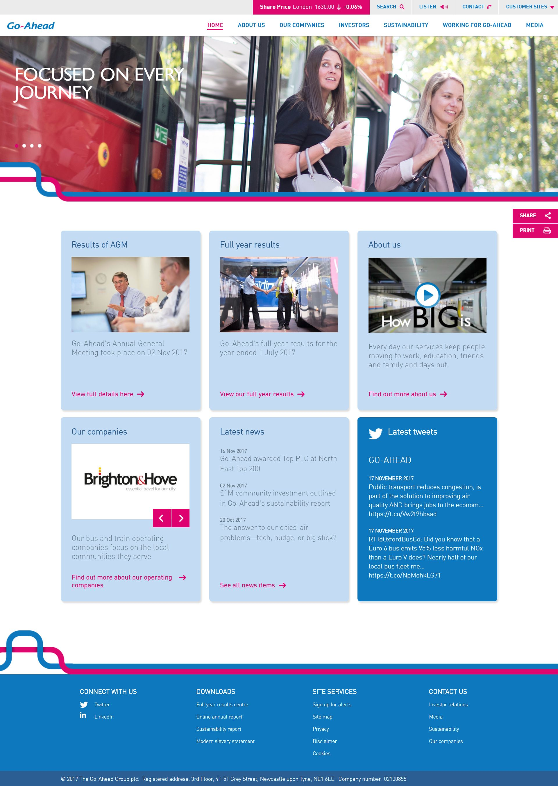

 
  

  
  <h1>Go Ahead (Black Sun Plc.)</h1>

  

    I worked on this project whilst worked for <strong>Black Sun Plc.</strong>, London, between Marc 2015 and October 2017.
  

  
  

    
  

  <h4>
    <a href="https://www.go-ahead.com/"  target="_blank">View the solution</a>
  </h4>
  <h4>
    <a href="#" title="Sorry, it's company secret"  target="_blank"><s>View code (company secret)</s></a>
  </h4>

 

<!-- Table of Contents -->

# :notebook_with_decorative_cover: ToC

- [About the company](#family-about-the-company)
- [About the project](#star2-about-the-project)
  - [Screenshots](#camera-screenshots)
  - [Tech Stack](#space_invader-tech-stack)
  - [Features](#dart-features)
- [License](#warning-license)
- [Contact](#handshake-contact)

<!-- About the company -->

## :family: About the company

<strong>Go‑Ahead Group</strong> is a leading international public transport provider headquartered in Newcastle upon Tyne, UK, serving the UK, Ireland, Singapore, Australia, Sweden, Norway and more with bus and rail services.

Go‑Ahead Group delivers safe, reliable, and sustainable public transport powered by innovation, accessibility, and community engagement—championing zero‑emission ambitions and digital transformation across global networks.

  <h2>Core Services</h2>
  <ul>
    <li><strong>Bus Operations</strong>:  
      Operating over 7,000 buses (including 1,100 zero-emission vehicles) across the UK, Ireland, Singapore, Australia and Nordic countries. Services include London’s largest bus operator (Go‑Ahead London) with 2,300+ buses, accessible and dementia-friendly features, flexible payment options like contactless and smartcard (“The Key”) systems.</li>
    <li><strong>Rail Services</strong>:  
      Operating eight rail networks in the UK and Scandinavia, including Govia Thameslink and commuter routes, managing 300+ stations and 400+ trains with 3,000 daily services. Investments include diesel-free network goals and deployment of solar & EV charging stations.</li>
  </ul>

  <h2>Sustainability & Innovation</h2>
  <ul>
    <li>Committed to net‑zero operations: zero‑emission bus fleet by 2035 and diesel‑free trains by 2035; investing in electric buses and renewable energy at depots.</li>
    <li>Developed award‑winning accessibility initiatives—e.g., dementia‑friendly buses, Helping Hand cards, Taskforce for accessible transport, Demand‑Responsive virtual bus stops, and community outreach “Chatty Buses”.</li>
    <li>Leveraging digital technology: rollout of 17 regional apps with journey planning, ticketing, real-time info and carbon footprint tracking; contactless payments and support for Passenger app partnership.</li>
  </ul>

  <h2>Community & Customer Focus</h2>
  <ul>
    <li>Trains over 1 billion journeys annually across their networks; prioritizing customer experience, staff training, and frontline service ambassadors.</li>
    <li>Supports local economies through hiring, apprenticeships, supplier partnerships, charitable grants (“Your Station, Your Community”), and mental-health initiatives.</li>
  </ul>

  <h2>Corporate Structure</h2>
  <ul>
    <li>Privately owned since 2022 by Kinetic Group (Australia, 51%) and Globalvia (Spain, 49%), focused on international growth and sustainable transport solutions.</li>
    <li>Employs over 30,000 staff globally, operating 7,000 buses and eight rail networks; generated ~£4bn in annual revenue before privatization.</li>
  </ul>

<!-- About the project -->

## :star2: About the project

The task was creating an eye-catching official webpage for Go Ahead.

<!-- Screenshots -->

### :camera: Screenshots

 
  

<!-- TechStack -->

### :space_invader: Tech Stack

<a href="https://builtwith.com/?https%3a%2f%2fwww.go-ahead.com%2f">Full list of used technologies</a>

  
Client

  <ul>
    <li><a href="https://www.w3schools.com/html/html5_semantic_elements.asp" target="_blank">Semantic HTML5</a></li>
    <li><a href="https://www.w3schools.com/css/"  target="_blank">CSS3</a></li>
    <li><a href="https://business.adobe.com/products/experience-manager/adobe-experience-manager.html"  target="_blank">AEM</a></li>
    <li><a href="https://developer.mozilla.org/en-US/docs/Web/JavaScript"  target="_blank">JavaScript</a></li>
    <li><a href="https://jquery.com/"  target="_blank">JQuery</a></li>
    <li><a href="https://gsap.com/">Greensock</a></li>
    <li><a href="https://www.ibm.com/think/topics/rest-apis"  target="_blank">RestAPI</a></li>
    <li><a href="https://www.json.org/">JSON</a></li>
    <li><a href="https://developer.mozilla.org/en-US/docs/Web/XML/Guides/XML_introduction"  target="_blank">XML</a></li>
  </ul>

  
Backend

  <ul>
    <li><a href="#"  target="_blank">Java</a></li>
    <li><a href="https://jade.tilab.com/">Jade</a></li>
    <li><a href="https://docs.oracle.com/cd/E13218_01/wlp/docs70/jsp/templats.htm"  target="_blank">JSP templates</a></li>
  </ul>

Database

  <ul>
    <li><a href="https://www.mysql.com/">MySQL</a></li>
  </ul>

DevOps

  <ul>
    <li><a href="https://tortoisesvn.net/">Tortuise SVN</a></li>
    <li><a href="https://www.eclipse.org/topics/ide/">Eclipse</a></li>
    <li><a href="https://www.jslint.com/">JS Lint</a></li>
    <li><a href="https://www.atlassian.com/software/jira">JIRA</a></li>
    <li><a href="https://www.browserstack.com/">BrowserStack</a></li>
    <li><a href="https://github.com/">GitHub</a></li>
    <li><a href="https://en.wikipedia.org/wiki/Agile_software_development">Agile software development</a></li>
  </ul>

<!-- Features -->

### :dart: Features

- mobile first, full responsive solution
- optimized loading time and assets (compressed files and image assets, GZIP headers, minified scripts)
- pixel perfect result from Adobe Illustrator / Photoshop designs
- wide variation of bespoken teasers and components

<!-- License -->

## :warning: License

Distributed under the Software copyright of <strong>Black Sun Plc.</strong> Any non-authorized usage of their code leads to legal consequences, thank you.

<!-- Contact -->

## :handshake: Contact

Black Sun Plc. - [https://www.blacksun-global.com/](https://www.blacksun-global.com/), Fulham Palace, Bishop's Avenue, London, SW6 6EA, United Kingdom
