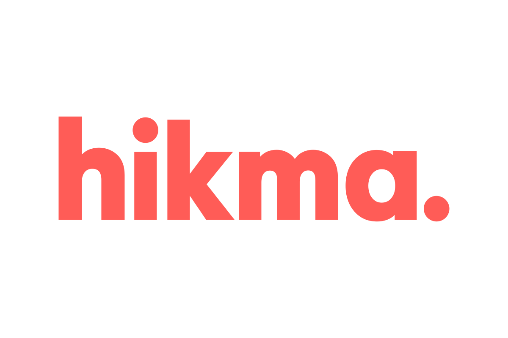
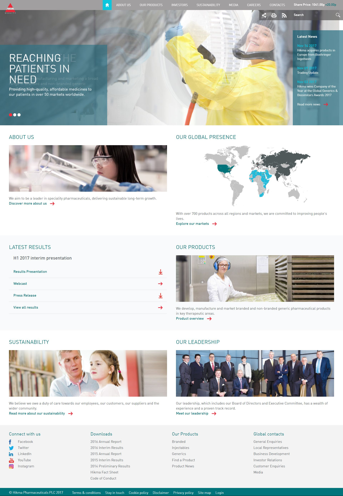

 
  

  
  <h1>Hikma (Black Sun Plc.)</h1>

  

    I worked on this project whilst worked for <strong>Black Sun Plc.</strong>, London, between Marc 2015 and October 2017.
  

  
  

    
  

  <h4>
    <a href="http://www.hikma.com/"  target="_blank">View the solution</a>
  </h4>
  <h4>
    <a href="#" title="Sorry, it's company secret"  target="_blank"><s>View code (company secret)</s></a>
  </h4>

 

<!-- Table of Contents -->

# :notebook_with_decorative_cover: ToC

- [About the company](#family-about-the-company)
- [About the project](#star2-about-the-project)
  - [Screenshots](#camera-screenshots)
  - [Tech Stack](#space_invader-tech-stack)
  - [Features](#dart-features)
- [License](#warning-license)
- [Contact](#handshake-contact)

<!-- About the company -->

## :family: About the company

 
<strong>Hikma Pharmaceuticals</strong> is a London-headquartered multinational pharmaceutical company, founded in Jordan in 1978, that develops, manufactures, and markets a wide range of generic and branded medicines. With over 9,000 employees and 30+ manufacturing sites including FDA and EMA‑inspected facilities, it serves markets across North America, MENA, and Europe.

 
The company delivers comprehensive pharmaceutical services—from sterile hospital injectables and branded generics in MENA, to oral generics and contract manufacturing—backed by strong R&D, quality standards, and global reach.

  <h2>1. Injectables</h2>
  <ul>
    <li>Sterile generic injectable medicines targeting hospitals and acute care providers across the US, Europe, and MENA.</li>
    <li>Portfolio expanded to over 150 products in the US; Hikma is a top‑three supplier by volume.</li>
    <li>Offers specialized sterile compounding services (Hikma 503B) in the US, customizing ready-to-administer injectables for hospital pharmacies.</li>
  </ul>

  <h2>2. Branded Generics & In‑Licensed Products</h2>
  <ul>
    <li>Sells branded generics and in‑licensed patented products through its MENA business, positioning as the second‑largest pharma in the region.</li>
    <li>Operates 20 manufacturing plants in the MENA region, supported by a sales force of ~2,000 professionals.</li>
  </ul>

  <h2>3. Oral & Non‑Injectable Generics</h2>
  <ul>
    <li>Manufactures and markets oral and inhalable generics across therapeutic fields such as cardiovascular, CNS, oncology, diabetes, dermatology, respiratory, and pain management.</li>
    <li>Supplies over 760 generic products globally.</li>
  </ul>

  <h2>4. Contract Manufacturing (CMO/CDMO)</h2>
  <ul>
    <li>Provides high-quality contract manufacturing and sterile compounding services to third-party pharmaceutical partners, leveraging its global manufacturing network.</li>
  </ul>

  <h2>5. Research, Development & Quality</h2>
  <ul>
    <li>Stands on 30+ plants and R&D hubs focused on innovation, regulatory compliance (FDA/EMA), and quality assurance.</li>
    <li>Strong emphasis on accessible, high-quality medicines, with growing oral and injectable pipelines and in‑licensed product partnerships.</li>
  </ul>

  <h2>Impact & Reach</h2>
  <ul>
    <li>Annual revenue of around USD 3.2 billion (2024) with core operating income of US$719 million.</li>
    <li>Market leadership: top‑three US sterile injectables provider, #2 MENA branded generics, #1 US prescription nasal spray supplier.</li>
    <li>Extensive global presence with products available in 50+ countries.</li>
  </ul>

<!-- About the project -->

## :star2: About the project

The task was creating an eye-catching official webpage for Hikma.

<!-- Screenshots -->

### :camera: Screenshots

 
  

<!-- TechStack -->

### :space_invader: Tech Stack

<a href="https://builtwith.com/hikma.com">Full list of used technologies</a>

  
Client

  <ul>
    <li><a href="https://www.w3schools.com/html/html5_semantic_elements.asp" target="_blank">Semantic HTML5</a></li>
    <li><a href="https://www.w3schools.com/css/"  target="_blank">CSS3</a></li>
    <li><a href="https://business.adobe.com/products/experience-manager/adobe-experience-manager.html"  target="_blank">AEM</a></li>
    <li><a href="https://developer.mozilla.org/en-US/docs/Web/JavaScript"  target="_blank">JavaScript</a></li>
    <li><a href="https://jquery.com/"  target="_blank">JQuery</a></li>
    <li><a href="https://gsap.com/">Greensock</a></li>
    <li><a href="https://www.ibm.com/think/topics/rest-apis"  target="_blank">RestAPI</a></li>
    <li><a href="https://www.json.org/">JSON</a></li>
    <li><a href="https://developer.mozilla.org/en-US/docs/Web/XML/Guides/XML_introduction"  target="_blank">XML</a></li>
  </ul>

  
Backend

  <ul>
    <li><a href="#"  target="_blank">Java</a></li>
    <li><a href="https://jade.tilab.com/">Jade</a></li>
    <li><a href="https://docs.oracle.com/cd/E13218_01/wlp/docs70/jsp/templats.htm"  target="_blank">JSP templates</a></li>
  </ul>

Database

  <ul>
    <li><a href="https://www.mysql.com/">MySQL</a></li>
  </ul>

DevOps

  <ul>
    <li><a href="https://tortoisesvn.net/">Tortuise SVN</a></li>
    <li><a href="https://www.eclipse.org/topics/ide/">Eclipse</a></li>
    <li><a href="https://www.jslint.com/">JS Lint</a></li>
    <li><a href="https://www.atlassian.com/software/jira">JIRA</a></li>
    <li><a href="https://www.browserstack.com/">BrowserStack</a></li>
    <li><a href="https://github.com/">GitHub</a></li>
    <li><a href="https://en.wikipedia.org/wiki/Agile_software_development">Agile software development</a></li>
  </ul>

<!-- Features -->

### :dart: Features

- mobile first, full responsive solution
- optimized loading time and assets (compressed files and image assets, GZIP headers, minified scripts)
- pixel perfect result from Adobe Illustrator / Photoshop designs
- wide variation of bespoken teasers and components

<!-- License -->

## :warning: License

Distributed under the Software copyright of <strong>Black Sun Plc.</strong> Any non-authorized usage of their code leads to legal consequences, thank you.

<!-- Contact -->

## :handshake: Contact

Black Sun Plc. - [https://www.blacksun-global.com/](https://www.blacksun-global.com/), Fulham Palace, Bishop's Avenue, London, SW6 6EA, United Kingdom
