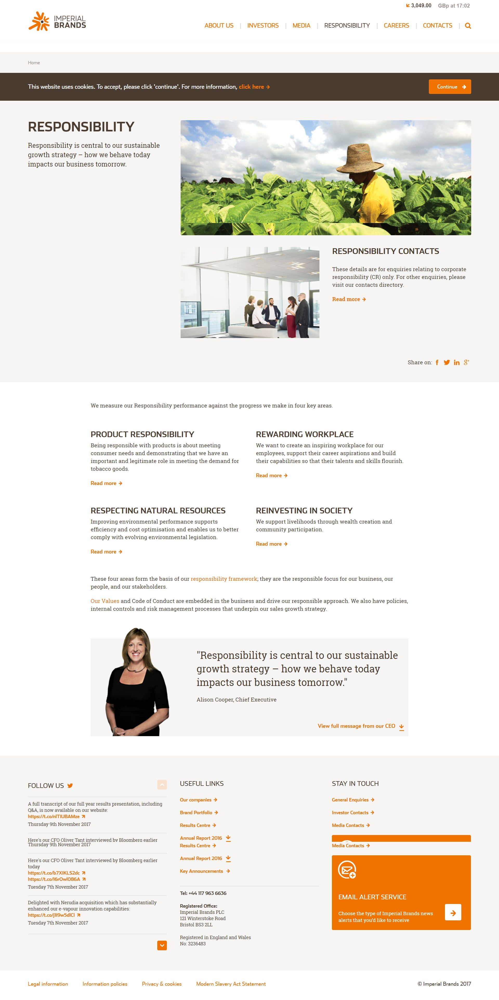

 
  

  
  <h1>Imperial Brands (Black Sun Plc.)</h1>

  

    I worked on this project whilst worked for <strong>Black Sun Plc.</strong>, London, between Marc 2015 and October 2017.
  

  
  

    
  

  <h4>
    <a href="https://www.imperialbrandsplc.com/"  target="_blank">View website</a>
  </h4>
  <h4>
    <a href="#" title="Sorry, it's company secret"  target="_blank"><s>View code (company secret)</s></a>
  </h4>

 

<!-- Table of Contents -->

# :notebook_with_decorative_cover: ToC

- [About the company](#family-about-the-company)
- [About the project](#star2-about-the-project)
  - [Screenshots](#camera-screenshots)
  - [Tech Stack](#space_invader-tech-stack)
  - [Features](#dart-features)
- [License](#warning-license)
- [Contact](#handshake-contact)

<!-- About the company -->

## :family: About the company

<strong>Imperial Brands PLC</strong> is a British multinational tobacco company founded in 1901 and headquartered in Bristol, England. It ranks among the world's largest tobacco manufacturers—4th by international cigarette market share and the largest producer of fine-cut tobacco and rolling papers.

  <h2>Global Reach</h2>
  <ul>
    <li>Operates in roughly 120 countries with around 30 manufacturing sites worldwide.</li>
    <li>Employs about 25,000–27,500 people and achieved revenues approximately £32 billion–£40 billion in 2024.</li>
  </ul>

  <h2>Brand Portfolio & Products</h2>
  <ul>
    <li>Cigarettes and tobacco products: Davidoff, West, Winston, Kool, Gauloises, Drum, Rizla, and more.</li>
    <li>Next‑Generation Products (NGP): blu vapes, Pulze & iD heated tobacco systems, Skruf & Zone oral nicotine pouches.</li>
  </ul>

  <h2>Purpose & Strategy</h2>
  <ul>
    <li>Mission: “Forging a path to a healthier future for moments of relaxation and pleasure” by offering potentially less harmful products.</li>
    <li>Vision: To build a “strong challenger business” through consumer insight, simplicity, agility, and performance.</li>
    <li>2030 strategy: Combine robust presence in combustible tobacco with significant growth in smoke‑free alternatives.</li>
  </ul>

  <h2>Sustainability & ESG</h2>
  <ul>
    <li>Committed to achieving net-zero carbon emissions by 2040, with ongoing efforts in packaging, waste reduction, and emissions control.</li>
    <li>Emphasizes responsible transformation with consumer well-being and environmental sustainability at its core.</li>
  </ul>

  <h2>Financial Position & Shareholder Returns</h2>
  <ul>
    <li>Listed on the London Stock Exchange (Ticker: IMBBY), and a constituent of the FTSE 100.</li>
    <li>2024 financials: revenue ~£32.4 billion, operating income ~£3.55 billion, net income ~£2.75 billion.</li>
    <li>Pursuing shareholder returns via dividends and rolling “evergreen” buyback programs through 2030, fueled by profits from both traditional and next-gen products.</li>
  </ul>

  <h2>Leadership & Culture</h2>
  <ul>
    <li>CEO: Stefan Bomhard (appointed July 2020), former CEO of Inchcape, with prior roles at Diageo, Cadbury, Bacardi, and P&G.</li>
    <li>Characterized by a challenger mindset with strong focus on consumer needs, innovation, inclusion, and high-performance culture.</li>
  </ul>

<!-- About the project -->

## :star2: About the project

The task was creating an eye-catching official webpage for Imperial Brands.

<!-- Screenshots -->

### :camera: Screenshots

 
  

<!-- TechStack -->

### :space_invader: Tech Stack

<a href="https://builtwith.com/?https%3a%2f%2fwww.imperialbrandsplc.com">Full list of used technologies</a>

  
Client

  <ul>
    <li><a href="https://www.w3schools.com/html/html5_semantic_elements.asp" target="_blank">Semantic HTML5</a></li>
    <li><a href="https://www.w3schools.com/css/"  target="_blank">CSS3</a></li>
    <li><a href="https://business.adobe.com/products/experience-manager/adobe-experience-manager.html"  target="_blank">AEM</a></li>
    <li><a href="https://developer.mozilla.org/en-US/docs/Web/JavaScript"  target="_blank">JavaScript</a></li>
    <li><a href="https://jquery.com/"  target="_blank">JQuery</a></li>
    <li><a href="https://gsap.com/">Greensock</a></li>
    <li><a href="https://www.ibm.com/think/topics/rest-apis"  target="_blank">RestAPI</a></li>
    <li><a href="https://www.json.org/">JSON</a></li>
    <li><a href="https://developer.mozilla.org/en-US/docs/Web/XML/Guides/XML_introduction"  target="_blank">XML</a></li>
  </ul>

  
Backend

  <ul>
    <li><a href="#"  target="_blank">Java</a></li>
    <li><a href="https://jade.tilab.com/">Jade</a></li>
    <li><a href="https://docs.oracle.com/cd/E13218_01/wlp/docs70/jsp/templats.htm"  target="_blank">JSP templates</a></li>
  </ul>

Database

  <ul>
    <li><a href="https://www.mysql.com/">MySQL</a></li>
  </ul>

DevOps

  <ul>
    <li><a href="https://tortoisesvn.net/">Tortuise SVN</a></li>
    <li><a href="https://www.eclipse.org/topics/ide/">Eclipse</a></li>
    <li><a href="https://www.jslint.com/">JS Lint</a></li>
    <li><a href="https://www.atlassian.com/software/jira">JIRA</a></li>
    <li><a href="https://www.browserstack.com/">BrowserStack</a></li>
    <li><a href="https://github.com/">GitHub</a></li>
    <li><a href="https://en.wikipedia.org/wiki/Agile_software_development">Agile software development</a></li>
  </ul>

<!-- Features -->

### :dart: Features

- mobile first, full responsive solution
- optimized loading time and assets (compressed files and image assets, GZIP headers, minified scripts)
- pixel perfect result from Adobe Illustrator / Photoshop designs
- wide variation of bespoken teasers and components

<!-- License -->

## :warning: License

Distributed under the Software copyright of <strong>Black Sun Plc.</strong> Any non-authorized usage of their code leads to legal consequences, thank you.

<!-- Contact -->

## :handshake: Contact

Black Sun Plc. - [https://www.blacksun-global.com/](https://www.blacksun-global.com/), Fulham Palace, Bishop's Avenue, London, SW6 6EA, United Kingdom
