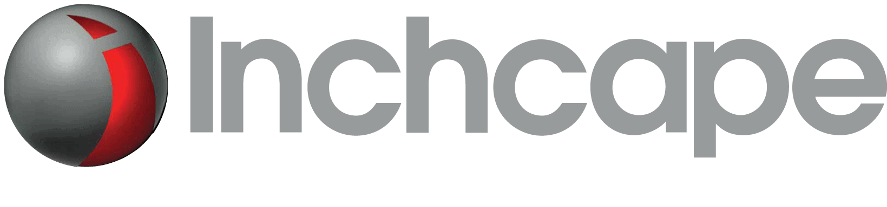
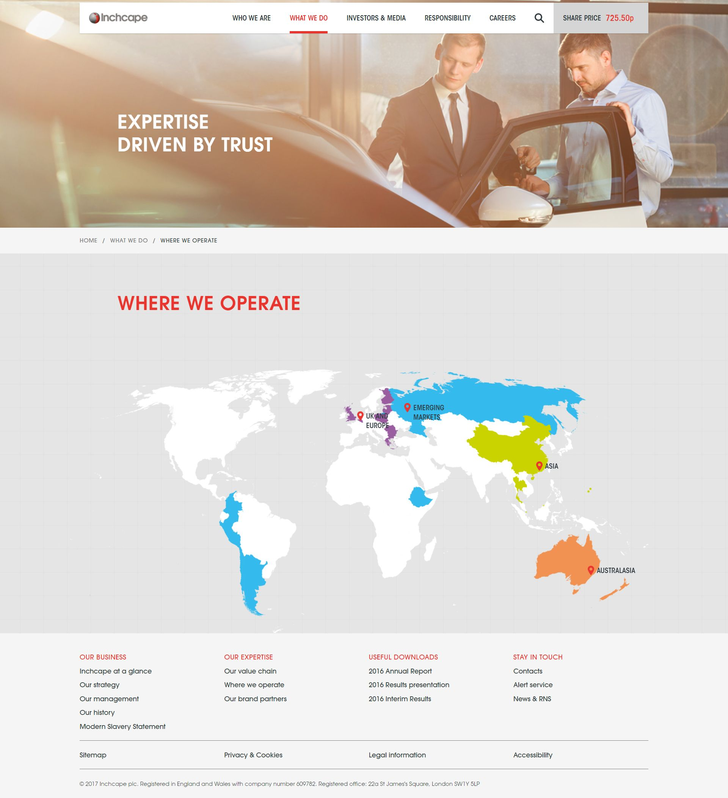
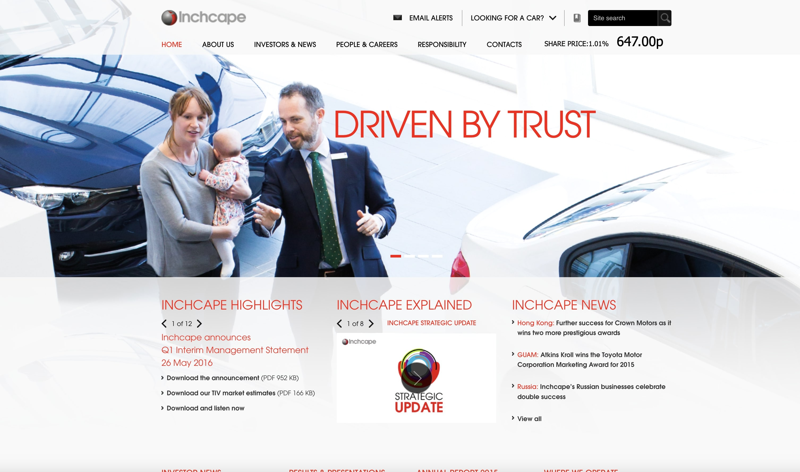
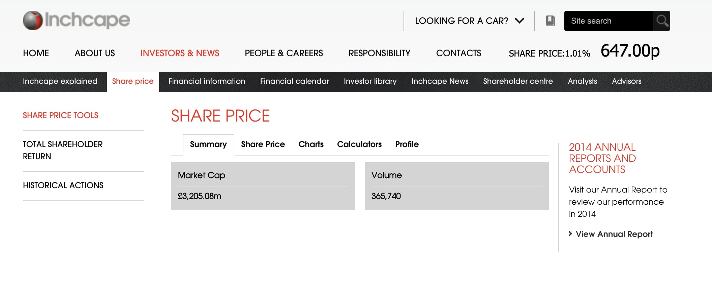
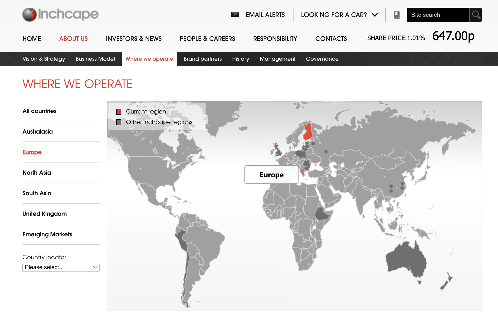
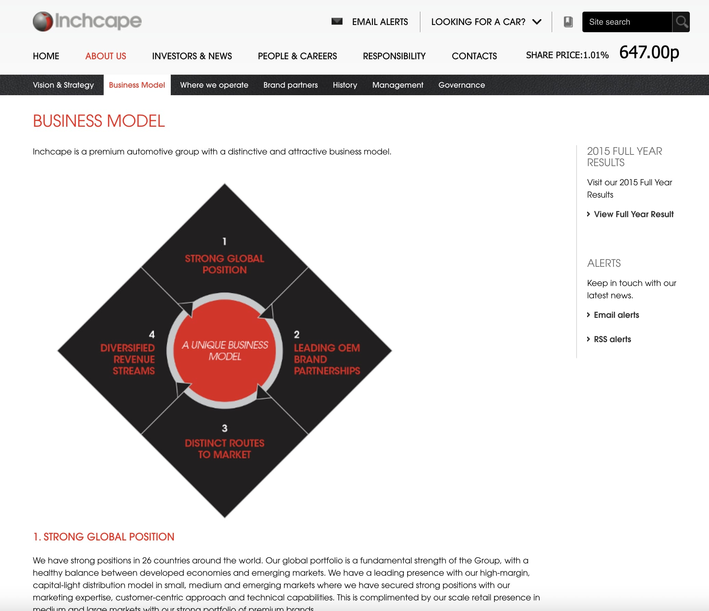

 
  

  
  <h1>Inchcape (Black Sun Plc.)</h1>

  

    I worked on this project whilst worked for <strong>Black Sun Plc.</strong>, London, between Marc 2015 and October 2017.
  

  
  

    
  

  <h4>
    <a href="https://www.inchcape.com/"  target="_blank">View website</a>
  </h4>
  <h4>
    <a href="https://web.archive.org/web/20160612140122/https://www.inchcape.com/"  target="_blank">View website from 2016</a>
  </h4>
  <h4>
    <a href="#" title="Sorry, it's company secret"  target="_blank"><s>View code (company secret)</s></a>
  </h4>

 

<!-- Table of Contents -->

# :notebook_with_decorative_cover: ToC

- [About the company](#family-about-the-company)
- [About the project](#star2-about-the-project)
  - [Screenshots](#camera-screenshots)
  - [Tech Stack](#space_invader-tech-stack)
  - [Features](#dart-features)
- [License](#warning-license)
- [Contact](#handshake-contact)

<!-- About the company -->

## :family: About the company

<strong>Inchcape plc</strong> is a leading independent global automotive distributor headquartered in London, operating in approximately 40 markets across six continents. Its purpose is “Bringing mobility to the world’s communities—for today, for tomorrow and for the better,” focusing on sustainable growth, strong OEM partnerships and improving mobility access through electric vehicles, vehicle sharing, and commercial fleet solutions.

  <h2>Business Model</h2>
  <ul>
    <li><strong>Differentiated Distribution:</strong> Full‑spectrum services including product planning, logistics, brand & marketing, channel management, retail and aftermarket support for OEM partners.</li>
    <li><strong>Brand Partnerships:</strong> Represents over 60–68 major automotive brands (e.g., Toyota, BMW, Audi, Porsche, Jaguar Land Rover).</li>
    <li><strong>Scale & Strategy:</strong> Generated £9.3 billion in revenue in 2024 with around 17,000 employees; executing its “Accelerate+” strategy to expand distribution through acquisitions, new OEM contracts, and digital growth.</li>
  </ul>

  <h2>Global Presence</h2>
  <ul>
    <li>Operations across diverse regions—Asia Pacific, Central & South America, Caribbean, Europe, Africa and Australasia.</li>
    <li>A robust distribution network and capabilities spanning vehicle importation, multi-channel sales, after-sales servicing and financial services.</li>
  </ul>

  <h2>Sustainability & ESG</h2>
  <ul>
    <li>Responsible business practices are embedded in its strategy—four focus areas: Planet, People, Places, Practices.</li>
    <li>Investing in technology and digital platforms to enhance operational efficiency and reduce environmental impact.</li>
  </ul>

  <h2>Recent Developments</h2>
  <ul>
    <li>In April 2024, Inchcape sold its UK motor retail business (≈ 80 dealerships) to Group 1 Automotive for £346 million—streamlining focus on higher-margin global distribution; proceeds partly used for a £100 million share buyback.</li>
  </ul>

  <h2>Leadership & Culture</h2>
  <ul>
    <li>Led by CEO Duncan Tait and CFO Adrian Lewis, Inchcape emphasizes a high-performance, customer-centric culture while scaling capabilities through data analytics and digital platforms (DXP, DAP).</li>
  </ul>

<!-- About the project -->

## :star2: About the project

The task was creating an eye-catching official webpage for Subsea7.

<!-- Screenshots -->

### :camera: Screenshots

 
  

 
  

 
  

 
  

 
  

<!-- TechStack -->

### :space_invader: Tech Stack

<a href="http://builtwith.com/?https%3a%2f%2fwww.inchcape.com">Full list of used technologies</a>

  
Client

  <ul>
    <li><a href="https://www.w3schools.com/html/html5_semantic_elements.asp" target="_blank">Semantic HTML5</a></li>
    <li><a href="https://www.w3schools.com/css/"  target="_blank">CSS3</a></li>
    <li><a href="https://business.adobe.com/products/experience-manager/adobe-experience-manager.html"  target="_blank">AEM</a></li>
    <li><a href="https://developer.mozilla.org/en-US/docs/Web/JavaScript"  target="_blank">JavaScript</a></li>
    <li><a href="https://jquery.com/"  target="_blank">JQuery</a></li>
    <li><a href="https://gsap.com/">Greensock</a></li>
    <li><a href="https://www.ibm.com/think/topics/rest-apis"  target="_blank">RestAPI</a></li>
    <li><a href="https://www.json.org/">JSON</a></li>
    <li><a href="https://developer.mozilla.org/en-US/docs/Web/XML/Guides/XML_introduction"  target="_blank">XML</a></li>
  </ul>

  
Backend

  <ul>
    <li><a href="#"  target="_blank">Java</a></li>
    <li><a href="https://jade.tilab.com/">Jade</a></li>
    <li><a href="https://docs.oracle.com/cd/E13218_01/wlp/docs70/jsp/templats.htm"  target="_blank">JSP templates</a></li>
  </ul>

Database

  <ul>
    <li><a href="https://www.mysql.com/">MySQL</a></li>
  </ul>

DevOps

  <ul>
    <li><a href="https://tortoisesvn.net/">Tortuise SVN</a></li>
    <li><a href="https://www.eclipse.org/topics/ide/">Eclipse</a></li>
    <li><a href="https://www.jslint.com/">JS Lint</a></li>
    <li><a href="https://www.atlassian.com/software/jira">JIRA</a></li>
    <li><a href="https://www.browserstack.com/">BrowserStack</a></li>
    <li><a href="https://github.com/">GitHub</a></li>
    <li><a href="https://en.wikipedia.org/wiki/Agile_software_development">Agile software development</a></li>
  </ul>

<!-- Features -->

### :dart: Features

- mobile first, full responsive solution
- optimized loading time and assets (compressed files and image assets, GZIP headers, minified scripts)
- pixel perfect result from Adobe Illustrator / Photoshop designs
- wide variation of bespoken teasers and components

<!-- License -->

## :warning: License

Distributed under the Software copyright of <strong>Black Sun Plc.</strong> Any non-authorized usage of their code leads to legal consequences, thank you.

<!-- Contact -->

## :handshake: Contact

Black Sun Plc. - [https://www.blacksun-global.com/](https://www.blacksun-global.com/), Fulham Palace, Bishop's Avenue, London, SW6 6EA, United Kingdom
