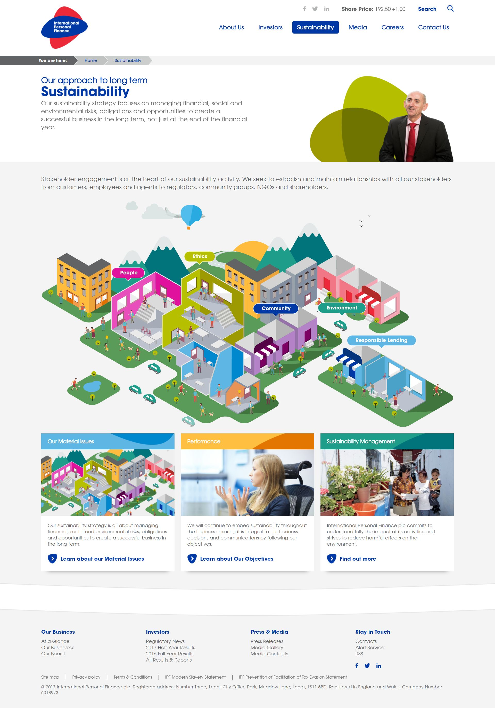
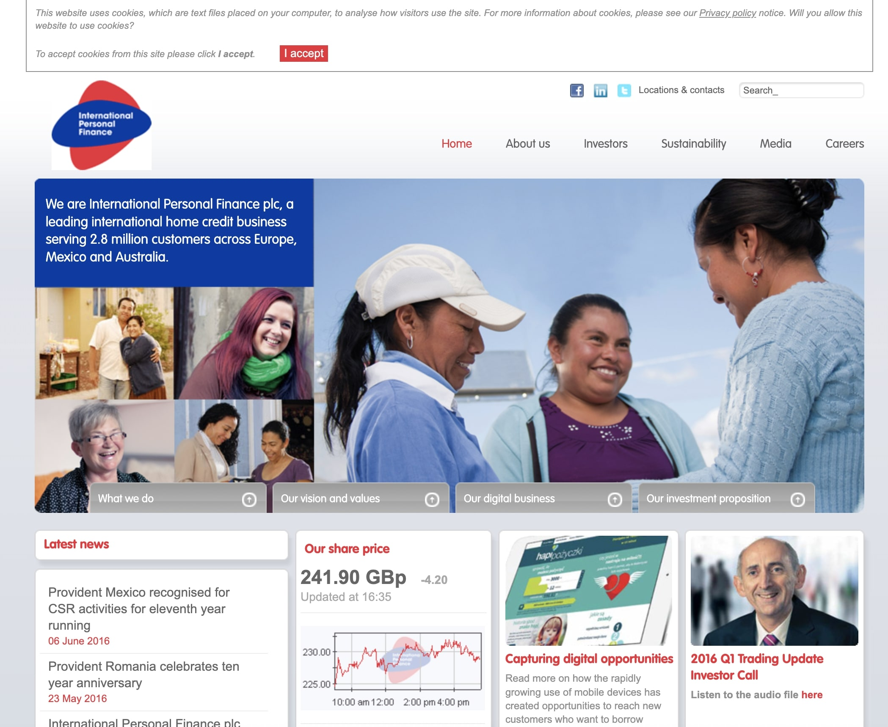
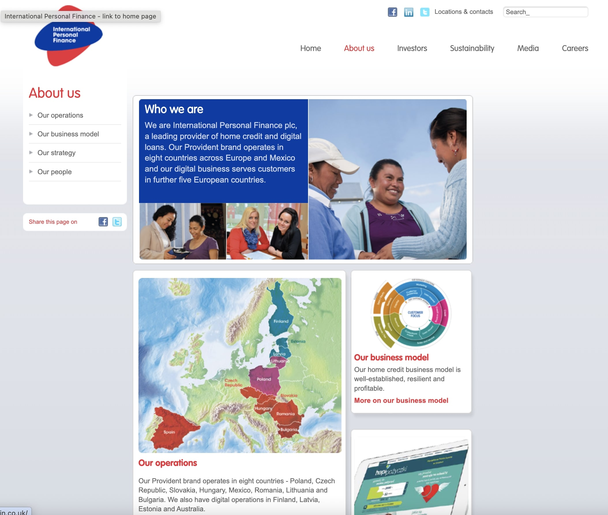
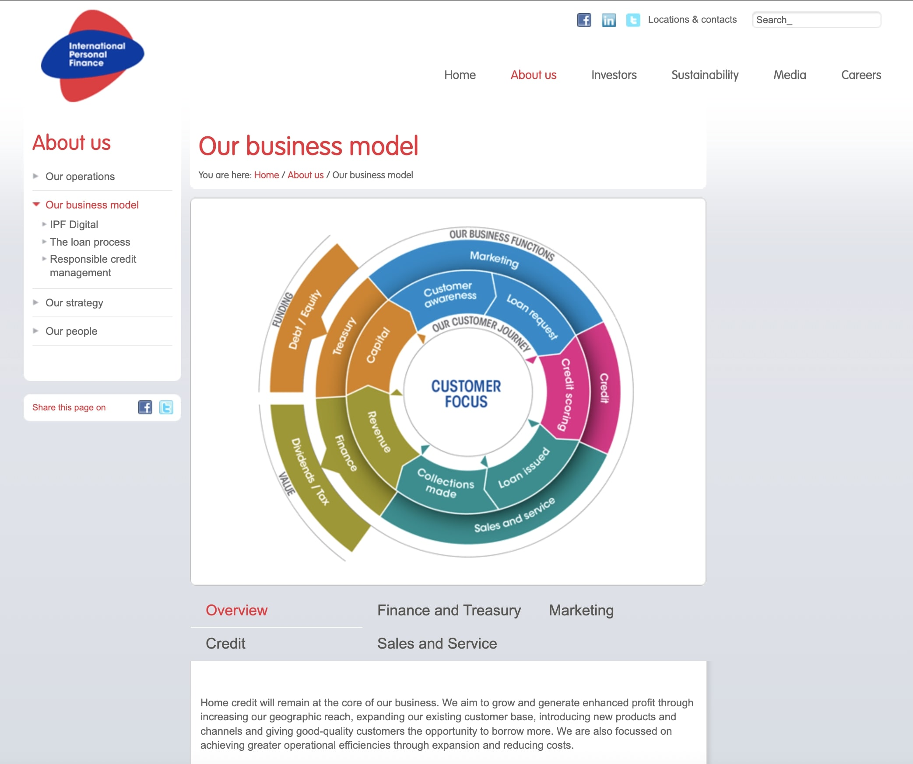

 
  

  
  <h1>International Personal Finance (IPF) (Black Sun Plc.)</h1>

  

    I worked on this project whilst worked for <strong>Black Sun Plc.</strong>, London, between Marc 2015 and October 2017.
  

  
  

    
  

  <h4>
    <a href="https://www.ipfin.co.uk/"  target="_blank">View website</a>
  </h4>
  <h4>
    <a href="https://web.archive.org/web/20160612065523/https://www.ipfin.co.uk/" target="_blank">View website from 2016</a>
  </h4>
  <h4>
    <a href="#" title="Sorry, it's company secret"  target="_blank"><s>View code (company secret)</s></a>
  </h4>

 

<!-- Table of Contents -->

# :notebook_with_decorative_cover: ToC

- [About the company](#family-about-the-company)
- [About the project](#star2-about-the-project)
  - [Screenshots](#camera-screenshots)
  - [Tech Stack](#space_invader-tech-stack)
  - [Features](#dart-features)
- [License](#warning-license)
- [Contact](#handshake-contact)

<!-- About the company -->

## :family: About the company

    <strong>International Personal Finance plc (IPF)</strong> is a British-based global financial services company, founded in 1997 and headquartered in Leeds, UK. IPF plays a vital role in improving financial inclusion by providing unsecured, affordable credit and insurance products to customers often excluded from traditional lenders.
  

  <h2>Scale & Reach</h2>
  <ul>
    <li>Serves around 1.7 million customers across nine markets, including homes in Poland, Hungary, Czech Republic, Romania, Mexico, and digital lending platforms in Australia and the Baltics.</li>
    <li>Operating since 1997, demerged from Provident Financial in 2007, listed on the London Stock Exchange, and was previously second-listed on the Warsaw Stock Exchange until its delisting in 2022.</li>
  </ul>

  <h2>Products & Services</h2>
  <ul>
    <li><strong>Home credit:</strong> Provident-branded unsecured cash loans delivered in-person to clients with limited access to traditional credit.</li>
    <li><strong>Digital credit solutions:</strong> Online loan and revolving credit products accessible via mobile and web platforms in multiple countries.</li>
    <li><strong>Insurance and financial tools:</strong> Supplementary products designed to support customer well-being and financial health.</li>
  </ul>

  <h2>Financial Highlights (2024)</h2>
  <ul>
    <li>Revenue: £726 million; Operating profit: £85.2 million; Net income: £60.9 million.</li>
    <li>Serving 1.7 million customers with total lending of around £1.215 billion.</li>
    <li>Achieved a profit before tax of £85.2 million, with earnings per share of 24.8 pence; declared a dividend of 11.41 pence per share in 2024.</li>
  </ul>

  <h2>Purpose‑Led Strategy</h2>
  <ul>
    <li>“Building a better world through financial inclusion”—with over 15 million customers served to date.</li>
    <li>Pursuing a Next Gen strategy: expanding digital services, introducing credit card offerings (e.g., 150k active users in Poland), launching in new markets (e.g., Mexicali, Mexico), and growing mobile wallet users to 115k.</li>
    <li>ESG progress includes net-zero target by 2050, £920k in community investments, 400+ training programs, AA MSCI ESG rating, and continued inclusion in the FTSE4Good Index.</li>
  </ul>

  <h2>Governance & Leadership</h2>
  <ul>
    <li><strong>Board oversight:</strong> Governed with strict internal controls and UK Corporate Governance Code compliance.</li>
    <li><strong>Key executives:</strong>
      <ul>
        <li>Stuart Sinclair – Independent Non‑Executive Chair</li>
        <li>Gerard Ryan – CEO (since 2012)</li>
        <li>Gary Thompson – CFO (since 2022)</li>
        <li>Supported by experienced non‑executives in finance, digital, risk, and governance.</li>
      </ul>
    </li>
  </ul>

  <h2>Funding & Investor Relations</h2>
  <ul>
    <li>Balanced funding model using debt (bonds and bank facilities totalling approximately £644 million as of March 2025) and equity, with active risk and currency management.</li>
    <li>Investor resources include financial calendar, regulatory news, results, annual reports, and presentations.</li>
  </ul>

<!-- About the project -->

## :star2: About the project

The task was creating an eye-catching official webpage for International Personal Finance (IPF).

<!-- Screenshots -->

### :camera: Screenshots

 
  

 
  

 
  

 
  

<!-- TechStack -->

### :space_invader: Tech Stack

<a href="https://builtwith.com/?https%3a%2f%2fwww.ipfin.co.uk">Full list of used technologies</a>

  
Client

  <ul>
    <li><a href="https://www.w3schools.com/html/html5_semantic_elements.asp" target="_blank">Semantic HTML5</a></li>
    <li><a href="https://www.w3schools.com/css/"  target="_blank">CSS3</a></li>
    <li><a href="https://business.adobe.com/products/experience-manager/adobe-experience-manager.html"  target="_blank">AEM</a></li>
    <li><a href="https://developer.mozilla.org/en-US/docs/Web/JavaScript"  target="_blank">JavaScript</a></li>
    <li><a href="https://jquery.com/"  target="_blank">JQuery</a></li>
    <li><a href="https://gsap.com/">Greensock</a></li>
    <li><a href="https://www.ibm.com/think/topics/rest-apis"  target="_blank">RestAPI</a></li>
    <li><a href="https://www.json.org/">JSON</a></li>
    <li><a href="https://developer.mozilla.org/en-US/docs/Web/XML/Guides/XML_introduction"  target="_blank">XML</a></li>
  </ul>

  
Backend

  <ul>
    <li><a href="#"  target="_blank">Java</a></li>
    <li><a href="https://jade.tilab.com/">Jade</a></li>
    <li><a href="https://docs.oracle.com/cd/E13218_01/wlp/docs70/jsp/templats.htm"  target="_blank">JSP templates</a></li>
  </ul>

Database

  <ul>
    <li><a href="https://www.mysql.com/">MySQL</a></li>
  </ul>

DevOps

  <ul>
    <li><a href="https://tortoisesvn.net/">Tortuise SVN</a></li>
    <li><a href="https://www.eclipse.org/topics/ide/">Eclipse</a></li>
    <li><a href="https://www.jslint.com/">JS Lint</a></li>
    <li><a href="https://www.atlassian.com/software/jira">JIRA</a></li>
    <li><a href="https://www.browserstack.com/">BrowserStack</a></li>
    <li><a href="https://github.com/">GitHub</a></li>
    <li><a href="https://en.wikipedia.org/wiki/Agile_software_development">Agile software development</a></li>
  </ul>

<!-- Features -->

### :dart: Features

- mobile first, full responsive solution
- optimized loading time and assets (compressed files and image assets, GZIP headers, minified scripts)
- pixel perfect result from Adobe Illustrator / Photoshop designs
- wide variation of bespoken teasers and components

<!-- License -->

## :warning: License

Distributed under the Software copyright of <strong>Black Sun Plc.</strong> Any non-authorized usage of their code leads to legal consequences, thank you.

<!-- Contact -->

## :handshake: Contact

Black Sun Plc. - [https://www.blacksun-global.com/](https://www.blacksun-global.com/), Fulham Palace, Bishop's Avenue, London, SW6 6EA, United Kingdom
