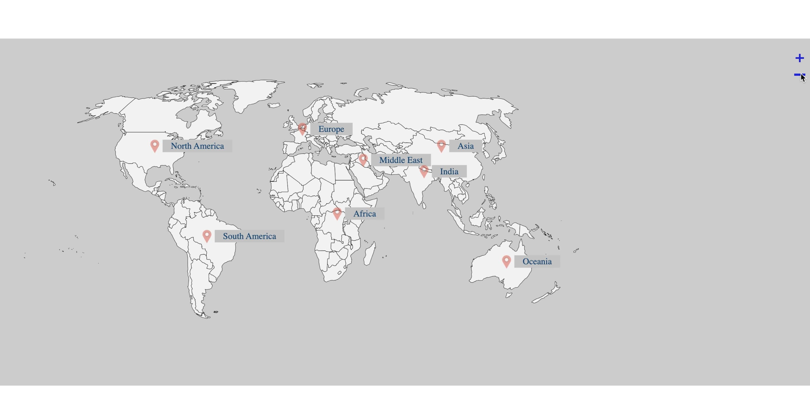

  
  <h1>jQuery zoom plugin (Black Sun Plc.)</h1>

  

    I created this plugin for <strong>Black Sun Plc.</strong>, London.
  

  

    
  

   
  <h4>
    <a href=https://www.vesuvius.com/en/about-us/where-we-operate.html"  target="_blank">View solution on a live site</a>
  </h4>
  <h4>
    <a href="https://github.com/kotelesroberto/zoom.jquery" title="program code"  target="_blank">View code</a>
  </h4>

  <h4>Video</h4>
<!-- BEGIN YOUTUBE-CARDS -->

  <!-- END YOUTUBE-CARDS -->

 

<!-- Table of Contents -->

# :notebook_with_decorative_cover: ToC

- [About the project](#star2-about-the-project)
  - [Screenshots](#camera-screenshots)
  - [Tech Stack](#space_invader-tech-stack)
- [License](#warning-license)
- [Contact](#handshake-contact)

<!-- About the project -->

## :star2: About the project

The task was creating a general zoom plugin that is user friendly and controllable from keyboard, by mouse and touchpad. Zoomed content is draggable in any directions.

Properties of the solution:

<ul>
  <li>mobile first, full responsive solution</li>
  <li>optimized loading time and assets (compressed files, minified scripts)</li>
  <li>plugin initialization on any kinda content with container</li>
</ul>

<!-- Screenshots -->

### :camera: Screenshots

 
  

<!-- TechStack -->

### :space_invader: Tech Stack

  <ul>
    <li><a href="https://developer.mozilla.org/en-US/docs/Web/JavaScript"  target="_blank">JavaScript</a></li>
    <li><a href="https://jquery.com/"  target="_blank">JQuery</a></li>
    <li><a href="https://www.w3schools.com/html/html5_semantic_elements.asp" target="_blank">Semantic HTML5</a></li>
    <li><a href="https://www.w3schools.com/css/"  target="_blank">CSS3</a></li>
  </ul>

<!-- License -->

## :warning: License

Distributed under the Software copyright of <strong>Black Sun Plc.</strong> Any non-authorized usage of their code leads to legal consequences, thank you.

<!-- Contact -->

## :handshake: Contact

Black Sun Plc. - [https://www.blacksun-global.com/](https://www.blacksun-global.com/), Fulham Palace, Bishop's Avenue, London, SW6 6EA, United Kingdom
