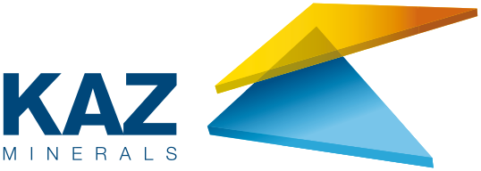
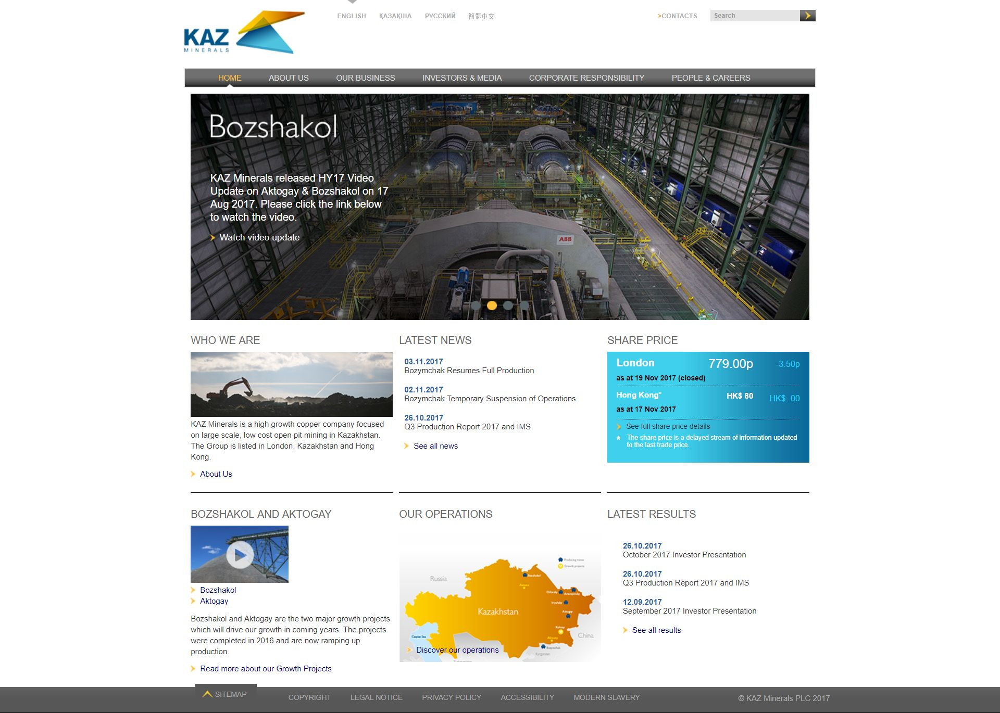

 
  

 

  
  <h1>KAZ Mineral</h1>

  

    I worked on this project whilst worked for <strong>Black Sun Plc.</strong>, London, between Marc 2015 and October 2017.
  

  
  

    
  

  <h4>
    <a href="http://www.kazminerals.com/en/"  target="_blank">View website</a>
  </h4>

  <h4>
    <a href="#" title="Sorry, it's company secret"  target="_blank"><s>View code (company secret)</s></a>
  </h4>

 

<!-- Table of Contents -->

# :notebook_with_decorative_cover: ToC

- [About the company](#family-about-the-company)
- [About the project](#star2-about-the-project)
  - [Screenshots](#camera-screenshots)
  - [Tech Stack](#space_invader-tech-stack)
  - [Features](#dart-features)
- [License](#warning-license)
- [Contact](#handshake-contact)

<!-- About the company -->

## :family: About the company

<strong>KAZ Minerals</strong> is a high‑growth copper producer headquartered in London, operating large-scale, low-cost open pit and underground mining operations across Kazakhstan and Kyrgyzstan. The company focuses on developing major copper assets and plays a vital role in supplying copper for global infrastructure and clean energy needs.

  <h3>Key Operations & Assets</h3>
  <ul>
    <li><strong>Bozshakol Mine</strong>: One of the world’s largest open pit copper mines, producing approximately 105 kt of copper in 2024, along with gold and molybdenum by-products.</li>
    <li><strong>Aktogay Mine</strong>: A major open pit operation where an expansion completed in 2021 doubled sulphide processing capacity. Produced ~229 kt of copper in 2024.</li>
    <li><strong>East Region & Bozymchak</strong>: Includes underground mines in eastern Kazakhstan and the Bozymchak copper-gold mine in Kyrgyzstan, producing around 46 kt of copper and 40 koz of gold in 2024.</li>
  </ul>

  <h3>Production & Resources</h3>
  <ul>
    <li>Total copper production in 2024 reached ~380 kt, representing a compound annual growth rate of ~16% since 2015.</li>
    <li>The company manages seven concentrators, processes over 90 Mt of sulphide ore annually, and holds nearly 3 billion tonnes of mineral resources averaging ~0.35% copper grade.</li>
  </ul>

  <h3>Business Approach & Value Creation</h3>
  <ul>
    <li>KAZ Minerals operates on a low-cost, vertically integrated model—owning mines, concentrators, smelting, and logistics networks to supply primarily China and Europe.</li>
    <li>Strong integration into regional infrastructure: access to competitive power, water, and rail networks supports cost efficiency.</li>
    <li>Delivers value to stakeholders—including local communities, governments, employees, financiers, and shareholders—through economic contributions, employment, and sustainable practices.</li>
  </ul>

  <h3>History & Corporate Structure</h3>
  <ul>
    <li>The company originated from Kazakhmys, listing in London in 2005, and restructured into a pure-play copper miner in October 2014, rebranding as KAZ Minerals.</li>
    <li>Acquired by Nova Resources in April 2021 and now operates as a privately held subsidiary.</li>
  </ul>

  <h3>Employees & Reach</h3>
  <ul>
    <li>Employs around 14,000 to 15,000 people across Kazakhstan, Kyrgyzstan, and international offices in Dubai and London.</li>
    <li>Operates six R&D, concentrators, and multiple underground and open pit mines.</li>
  </ul>

  <h3>Strategic Outlook</h3>
  <ul>
    <li>Focused on continued copper growth via expansions like Aktogay sulphide processing, with an emphasis on capital discipline and low-cost operations.</li>
    <li>Reinvests in greenfield projects such as Peschanka/Baimskaya and values strong ESG performance, safety, community engagement, and governance standards.</li>
  </ul>

<!-- About the project -->

## :star2: About the project

The task was creating an eye-catching official webpage for KAZ Mineral.

<!-- Screenshots -->

### :camera: Screenshots

 
  

<!-- TechStack -->

### :space_invader: Tech Stack

<a href="https://builtwith.com/?http%3a%2f%2fwww.kazminerals.com%2fen%2f">Full list of used technologies</a>

  
Client

  <ul>
    <li><a href="https://www.w3schools.com/html/html5_semantic_elements.asp" target="_blank">Semantic HTML5</a></li>
    <li><a href="https://www.w3schools.com/css/"  target="_blank">CSS3</a></li>
    <li><a href="https://business.adobe.com/products/experience-manager/adobe-experience-manager.html"  target="_blank">AEM</a></li>
    <li><a href="https://developer.mozilla.org/en-US/docs/Web/JavaScript"  target="_blank">JavaScript</a></li>
    <li><a href="https://jquery.com/"  target="_blank">JQuery</a></li>
    <li><a href="https://gsap.com/">Greensock</a></li>
    <li><a href="https://www.ibm.com/think/topics/rest-apis"  target="_blank">RestAPI</a></li>
    <li><a href="https://www.json.org/">JSON</a></li>
    <li><a href="https://developer.mozilla.org/en-US/docs/Web/XML/Guides/XML_introduction"  target="_blank">XML</a></li>
  </ul>

  
Backend

  <ul>
    <li><a href="#"  target="_blank">Java</a></li>
    <li><a href="https://jade.tilab.com/">Jade</a></li>
    <li><a href="https://docs.oracle.com/cd/E13218_01/wlp/docs70/jsp/templats.htm"  target="_blank">JSP templates</a></li>
  </ul>

Database

  <ul>
    <li><a href="https://www.mysql.com/">MySQL</a></li>
  </ul>

DevOps

  <ul>
    <li><a href="https://tortoisesvn.net/">Tortuise SVN</a></li>
    <li><a href="https://www.eclipse.org/topics/ide/">Eclipse</a></li>
    <li><a href="https://www.jslint.com/">JS Lint</a></li>
    <li><a href="https://www.atlassian.com/software/jira">JIRA</a></li>
    <li><a href="https://www.browserstack.com/">BrowserStack</a></li>
    <li><a href="https://github.com/">GitHub</a></li>
    <li><a href="https://en.wikipedia.org/wiki/Agile_software_development">Agile software development</a></li>
  </ul>

<!-- Features -->

### :dart: Features

- mobile first, full responsive solution
- optimized loading time and assets (compressed files and image assets, GZIP headers, minified scripts)
- pixel perfect result from Adobe Illustrator / Photoshop designs
- wide variation of bespoken teasers and components

<!-- License -->

## :warning: License

Distributed under the Software copyright of <strong>Black Sun Plc.</strong> Any non-authorized usage of their code leads to legal consequences, thank you.

<!-- Contact -->

## :handshake: Contact

Black Sun Plc. - [https://www.blacksun-global.com/](https://www.blacksun-global.com/), Fulham Palace, Bishop's Avenue, London, SW6 6EA, United Kingdom
