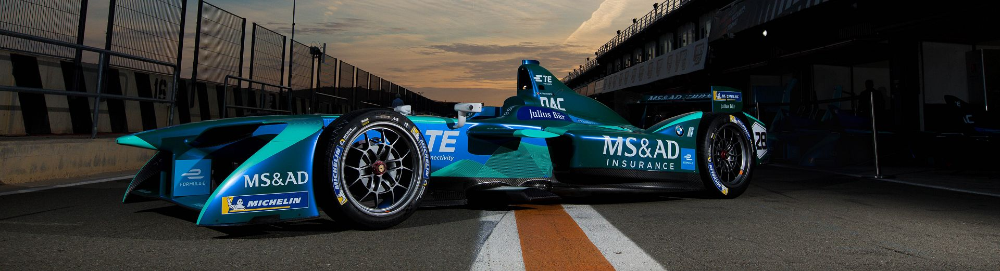
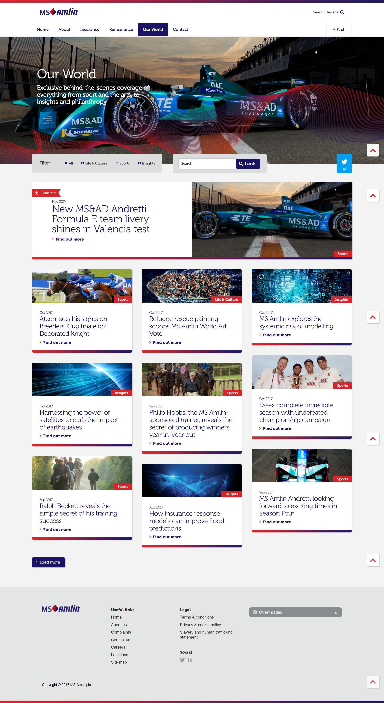

 
  

 
  

  
  <h1>MS Amlin (Black Sun Plc.)</h1>

  

    I worked on this project whilst worked for <strong>Black Sun Plc.</strong>, London, between Marc 2015 and October 2017.
  

  
  

    
  

  <h4>
    <a href="https://www.msamlin.com/en/"  target="_blank">View website</a>
  </h4>

  <h4>
    <a href="#" title="Sorry, it's company secret"  target="_blank"><s>View code (company secret)</s></a>
  </h4>

 

<!-- Table of Contents -->

# :notebook_with_decorative_cover: ToC

- [About the company](#family-about-the-company)
- [About the project](#star2-about-the-project)
  - [Screenshots](#camera-screenshots)
  - [Tech Stack](#space_invader-tech-stack)
  - [Features](#dart-features)
- [License](#warning-license)
- [Contact](#handshake-contact)

<!-- About the company -->

## :family: About the company

    <strong>MS Amlin</strong> is a London-based global specialty commercial insurer and reinsurer, operating through Lloyd’s, UK, Continental Europe, Bermuda and more. It is part of the MS & AD Insurance Group, tracing origins back over 400 years via predecessor firms and, in its current form, established in 1998.
  

  <h3>Core Business Segments</h3>
  <ul>
    <li><strong>Property &amp; Casualty (P&amp;C):</strong> Insurance for property, casualty, motor, crisis management, agriculture, and natural resources across UK and Europe.</li>
    <li><strong>Marine &amp; Aviation:</strong> Specialty coverage via MS Amlin Marine NV in the Netherlands, Belgium, France, Germany, and beyond.</li>
    <li><strong>Reinsurance:</strong> Treaty solutions across credit, surety, political risks, agriculture, aviation, cyber, engineering, and structured products, including widespread use of Syndicate 2001 at Lloyd’s.</li>
  </ul>

  <h3>Financial Performance & Scale</h3>
  <ul>
    <li>2023 gross written premiums: approx £1.75 billion; operating profit of £257 million, up from a £47 million loss in 2022.</li>
    <li>Combined ratio improved to ~86.6 %, best underwriting performance in a decade.</li>
    <li>Global footprint includes 20+ offices and ~1,800 employees in markets such as USA, Bermuda, UK, Netherlands, Germany, France, Switzerland, Dubai, Hong Kong, Malaysia, and Singapore.</li>
  </ul>

  <h3>Strategy & Vision (“Our Vision”)</h3>
  <ul>
    <li>Pillars of strategy include: being attractive to clients, staying close via broker networks and digital engagement, being the reference through technical underwriting excellence, and maintaining sustainability in all operations.</li>
    <li>Investing in digital platforms for underwriting and claims workflows under the “Go Digital” initiative, driving efficiency and self-service for brokers.</li>
    <li>Targeting sustainable practices aligned to climate resilience and environmental responsibility across all business areas.</li>
  </ul>

  <h3>Culture & People</h3>
  <ul>
    <li>Values include continuous improvement (“Kaizen”), client focus, teamwork, respect, integrity, and courage to challenge.</li>
    <li>Strong emphasis on equity, diversity, inclusion, and high employee engagement across global locations.</li>
    <li>Employee benefits range from private medical, lifestyle funds, generous leave, flexible work, to career development and graduate/apprentice programs.</li>
  </ul>

  <h3>Market Expansion & Offerings</h3>
  <ul>
    <li>Expanding specialty lines: launched Financial Lines coverage in the Middle East to support rising M&A and IPO activity.</li>
    <li>Continuing underwriting growth in marine, liability, and complex-risk sectors globally.</li>
  </ul>

<!-- About the project -->

## :star2: About the project

The task was creating an eye-catching official webpage for MS Amlin.

<!-- Screenshots -->

### :camera: Screenshots

 
  

<!-- TechStack -->

### :space_invader: Tech Stack

<a href="https://builtwith.com/?https%3a%2f%2fwww.msamlin.com">Full list of used technologies</a>

  
Client

  <ul>
    <li><a href="https://www.w3schools.com/html/html5_semantic_elements.asp" target="_blank">Semantic HTML5</a></li>
    <li><a href="https://www.w3schools.com/css/"  target="_blank">CSS3</a></li>
    <li><a href="https://business.adobe.com/products/experience-manager/adobe-experience-manager.html"  target="_blank">AEM</a></li>
    <li><a href="https://developer.mozilla.org/en-US/docs/Web/JavaScript"  target="_blank">JavaScript</a></li>
    <li><a href="https://jquery.com/"  target="_blank">JQuery</a></li>
    <li><a href="https://gsap.com/">Greensock</a></li>
    <li><a href="https://www.ibm.com/think/topics/rest-apis"  target="_blank">RestAPI</a></li>
    <li><a href="https://www.json.org/">JSON</a></li>
    <li><a href="https://developer.mozilla.org/en-US/docs/Web/XML/Guides/XML_introduction"  target="_blank">XML</a></li>
  </ul>

  
Backend

  <ul>
    <li><a href="#"  target="_blank">Java</a></li>
    <li><a href="https://jade.tilab.com/">Jade</a></li>
    <li><a href="https://docs.oracle.com/cd/E13218_01/wlp/docs70/jsp/templats.htm"  target="_blank">JSP templates</a></li>
  </ul>

Database

  <ul>
    <li><a href="https://www.mysql.com/">MySQL</a></li>
  </ul>

DevOps

  <ul>
    <li><a href="https://tortoisesvn.net/">Tortuise SVN</a></li>
    <li><a href="https://www.eclipse.org/topics/ide/">Eclipse</a></li>
    <li><a href="https://www.jslint.com/">JS Lint</a></li>
    <li><a href="https://www.atlassian.com/software/jira">JIRA</a></li>
    <li><a href="https://www.browserstack.com/">BrowserStack</a></li>
    <li><a href="https://github.com/">GitHub</a></li>
    <li><a href="https://en.wikipedia.org/wiki/Agile_software_development">Agile software development</a></li>
  </ul>

<!-- Features -->

### :dart: Features

- mobile first, full responsive solution
- optimized loading time and assets (compressed files and image assets, GZIP headers, minified scripts)
- pixel perfect result from Adobe Illustrator / Photoshop designs
- wide variation of bespoken teasers and components

<!-- License -->

## :warning: License

Distributed under the Software copyright of <strong>Black Sun Plc.</strong> Any non-authorized usage of their code leads to legal consequences, thank you.

<!-- Contact -->

## :handshake: Contact

Black Sun Plc. - [https://www.blacksun-global.com/](https://www.blacksun-global.com/), Fulham Palace, Bishop's Avenue, London, SW6 6EA, United Kingdom
