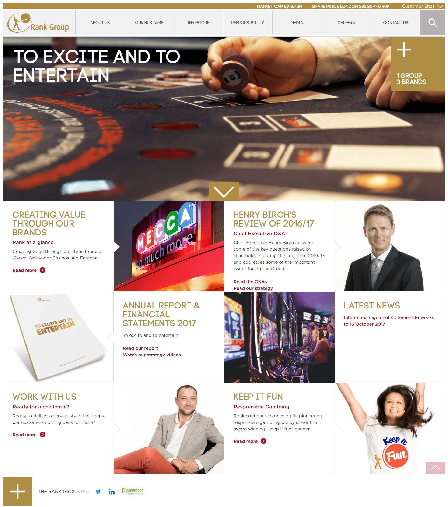
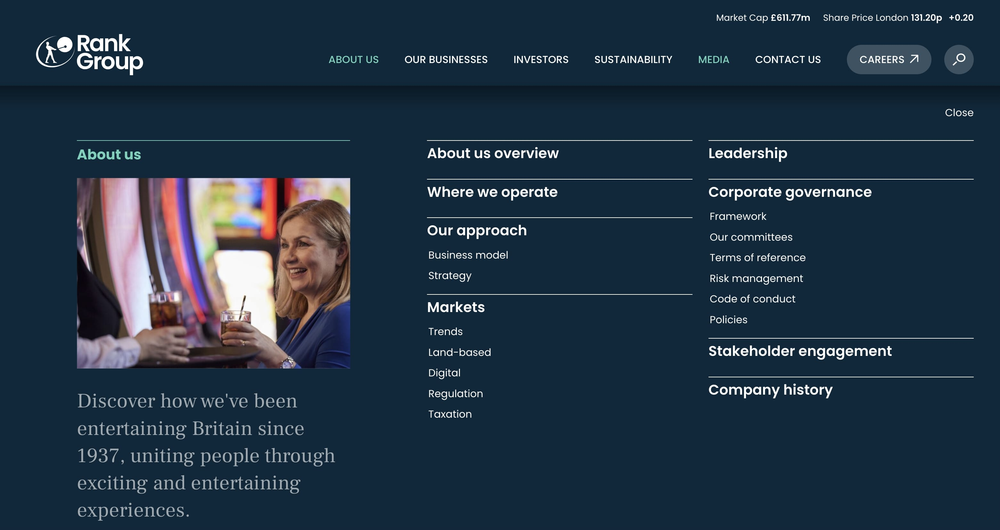
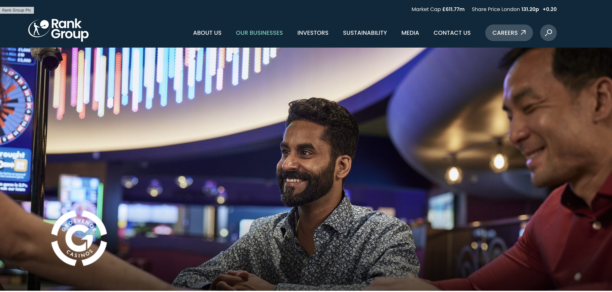
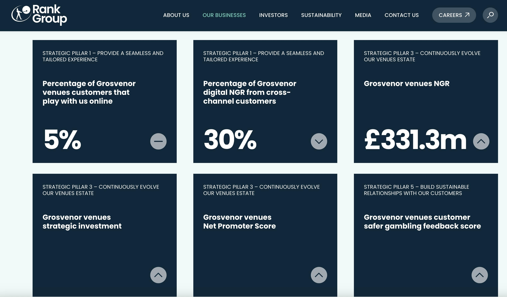
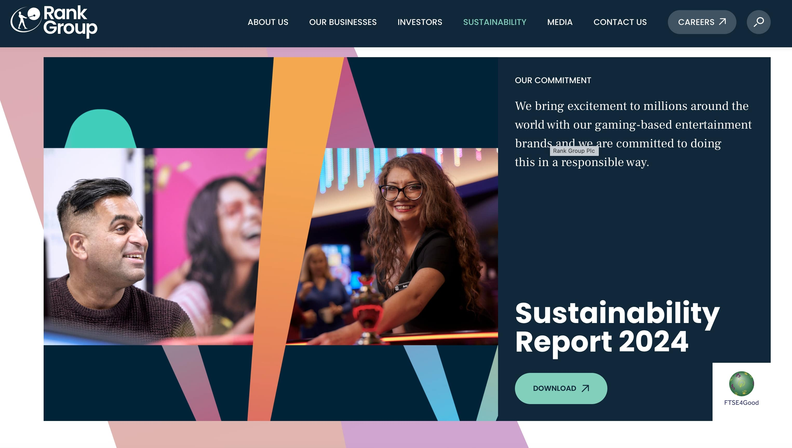
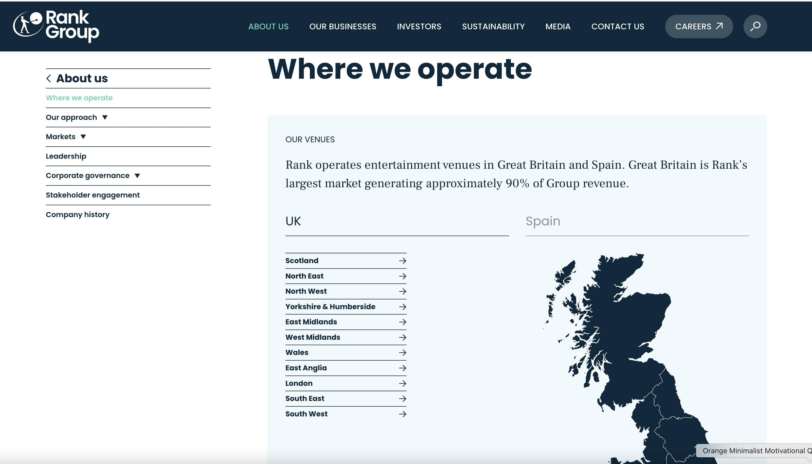
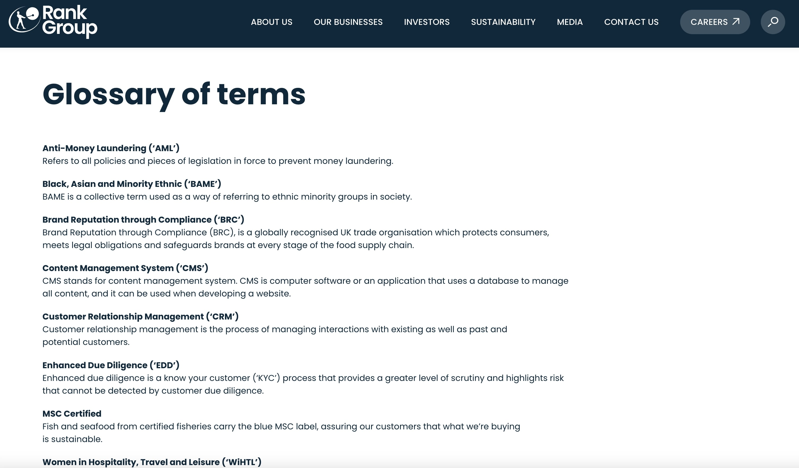
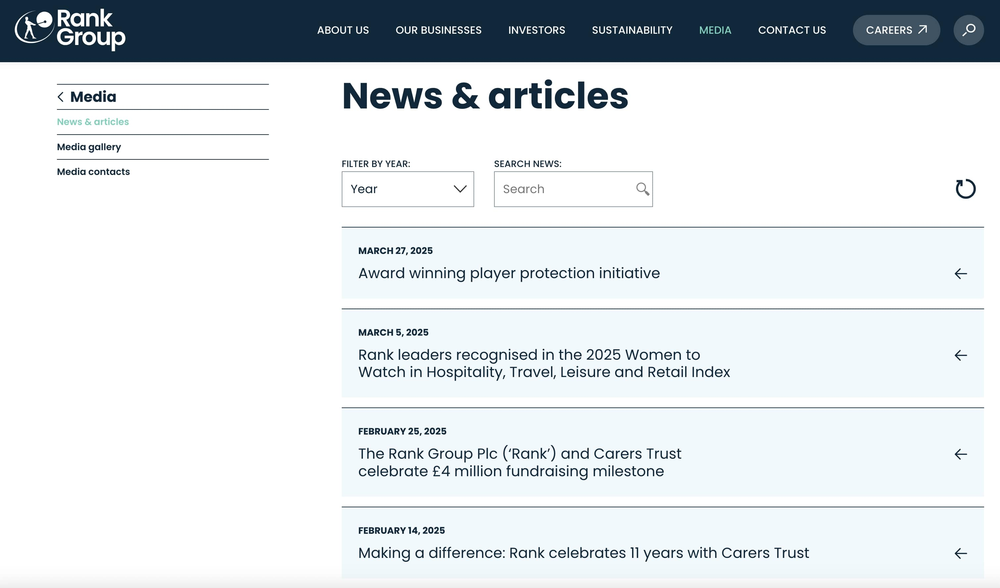
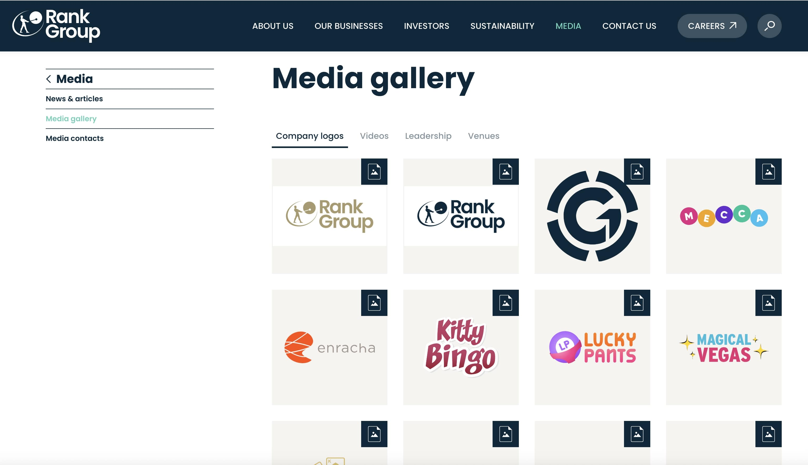

 
  

 

  
  <h1>Rank Group (Black Sun Plc.)</h1>

  

    I worked on this project whilst worked for <strong>Black Sun Plc.</strong>, London, between Marc 2015 and October 2017.
  

  
  

    
  

  <h4>
    <a href="https://www.rank.com/en/"  target="_blank">View website</a>
  </h4>

  <h4>
    <a href="#" title="Sorry, it's company secret"  target="_blank"><s>View code (company secret)</s></a>
  </h4>

 

<!-- Table of Contents -->

# :notebook_with_decorative_cover: ToC

- [About the company](#family-about-the-company)
- [About the project](#star2-about-the-project)
  - [Screenshots](#camera-screenshots)
  - [Tech Stack](#space_invader-tech-stack)
  - [Features](#dart-features)
- [License](#warning-license)
- [Contact](#handshake-contact)

<!-- About the company -->

## :family: About the company

    <strong>The Rank Group plc</strong> is a UK-based leading international gaming, leisure, and entertainment company, established in 1995 and headquartered in Maidenhead, Berkshire. It operates through both physical venues and online platforms, delivering entertainment experiences under brands like Grosvenor Casinos, Mecca Bingo, and Enracha.
  

  <h3>Key Facts (as of June 2024)</h3>
  <ul>
    <li>112 venue locations (casinos & bingo halls), serving ~3.1 million active customers.</li>
    <li>More than 80 digital brands, reaching customers via apps and web platforms.</li>
    <li>Approximately 7,600 employees worldwide.</li>
  </ul>

  <h3>Brands & Channels</h3>
  <ul>
    <li><strong>Grosvenor Casinos</strong>: With around 51–56 venues, it is the UK's largest multi-channel casino operator offering table games, slots, live poker, and sports betting.</li>
    <li><strong>Mecca Bingo</strong>: Over 50 bingo halls in the UK, with live entertainment, food & drink offerings, and complementary digital channels.</li>
    <li><strong>Enracha</strong>: Operates nine community gaming venues in Spain and complementary online gaming brands.</li>
    <li><strong>Digital Brands</strong>: Includes Mecca Bingo, Grosvenor Casinos online, YoBingo, BellaCasino, YoCasino, RummyPassion and more — powered by proprietary and third-party platforms.</li>
  </ul>

  <h3>Financial Performance (2023–24)</h3>
  <ul>
    <li>Like‑for‑like gross gaming revenue: £734 million; Group operating profit: ~£46 million.</li>
    <li>Venues generated £508 million NGR and £37 million operating profit; digital channel achieved £226 million NGR and £23 million operating profit.</li>
  </ul>

  <h3>Business Model & Strategy</h3>
  <ul>
    <li>Combines land-based and digital channels to create a seamless, cross-channel customer experience.</li>
    <li>Puts safer gambling at its core, with continuous investment in responsible gaming technology and colleague training.</li>
    <li>Values-driven culture based on STARS: Service, Teamwork, Ambition, Responsibility, and Solutions.</li>
    <li>Committed to sustainability with a path to net-zero carbon by 2050, focused on reducing energy use and emissions.</li>
  </ul>

  <h3>History & Heritage</h3>
  <ul>
    <li>Originating from the 1937 Rank Organisation (film and leisure), the modern Rank Group plc was established in 1995 and refocused on gaming by divesting non-gambling assets in the 2000s.</li>
    <li>Significant growth via acquisitions: Mecca Leisure Group (1990), Blue Square (2003), Gala Coral casinos (2012–13), YoBingo (2018), Stride Gaming (2019).</li>
  </ul>

  <h3>Leadership & Governance</h3>
  <ul>
    <li>Key leadership includes Chairman Ian Burke and CEO John O’Reilly, with a skilled executive team overseeing venue, digital, and support operations.</li>
    <li>Publicly listed on the London Stock Exchange and part of the FTSE 250 index (since May 2025).</li>
  </ul>

<!-- About the project -->

## :star2: About the project

The task was creating an eye-catching official webpage for Rank Group.

<!-- Screenshots -->

### :camera: Screenshots

 
  

 
  

 
  

 
  

 
  

 
  

 
  

 
  

 
  

<!-- TechStack -->

### :space_invader: Tech Stack

<a href="https://builtwith.com/?https%3a%2f%2fwww.rank.com%2f">Full list of used technologies</a>

  
Client

  <ul>
    <li><a href="https://www.w3schools.com/html/html5_semantic_elements.asp" target="_blank">Semantic HTML5</a></li>
    <li><a href="https://www.w3schools.com/css/"  target="_blank">CSS3</a></li>
    <li><a href="https://business.adobe.com/products/experience-manager/adobe-experience-manager.html"  target="_blank">AEM</a></li>
    <li><a href="https://developer.mozilla.org/en-US/docs/Web/JavaScript"  target="_blank">JavaScript</a></li>
    <li><a href="https://jquery.com/"  target="_blank">JQuery</a></li>
    <li><a href="https://gsap.com/">Greensock</a></li>
    <li><a href="https://www.ibm.com/think/topics/rest-apis"  target="_blank">RestAPI</a></li>
    <li><a href="https://www.json.org/">JSON</a></li>
    <li><a href="https://developer.mozilla.org/en-US/docs/Web/XML/Guides/XML_introduction"  target="_blank">XML</a></li>
  </ul>

  
Backend

  <ul>
    <li><a href="#"  target="_blank">Java</a></li>
    <li><a href="https://jade.tilab.com/">Jade</a></li>
    <li><a href="https://docs.oracle.com/cd/E13218_01/wlp/docs70/jsp/templats.htm"  target="_blank">JSP templates</a></li>
  </ul>

Database

  <ul>
    <li><a href="https://www.mysql.com/">MySQL</a></li>
  </ul>

DevOps

  <ul>
    <li><a href="https://tortoisesvn.net/">Tortuise SVN</a></li>
    <li><a href="https://www.eclipse.org/topics/ide/">Eclipse</a></li>
    <li><a href="https://www.jslint.com/">JS Lint</a></li>
    <li><a href="https://www.atlassian.com/software/jira">JIRA</a></li>
    <li><a href="https://www.browserstack.com/">BrowserStack</a></li>
    <li><a href="https://github.com/">GitHub</a></li>
    <li><a href="https://en.wikipedia.org/wiki/Agile_software_development">Agile software development</a></li>
  </ul>

<!-- Features -->

### :dart: Features

- mobile first, full responsive solution
- optimized loading time and assets (compressed files and image assets, GZIP headers, minified scripts)
- pixel perfect result from Adobe Illustrator / Photoshop designs
- wide variation of bespoken teasers and components

<!-- License -->

## :warning: License

Distributed under the Software copyright of <strong>Black Sun Plc.</strong> Any non-authorized usage of their code leads to legal consequences, thank you.

<!-- Contact -->

## :handshake: Contact

Black Sun Plc. - [https://www.blacksun-global.com/](https://www.blacksun-global.com/), Fulham Palace, Bishop's Avenue, London, SW6 6EA, United Kingdom
