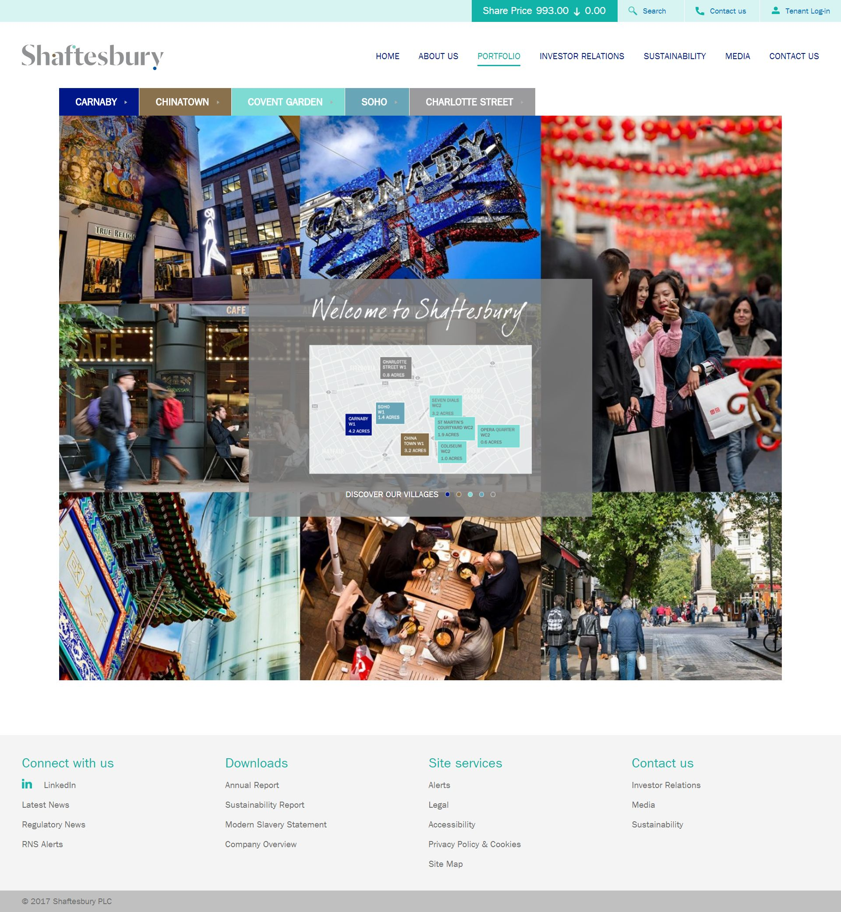

 
  

 

  
  <h1>Shaftesbury</h1>

  

    I worked on this project whilst worked for <strong>Black Sun Plc.</strong>, London, between Marc 2015 and October 2017.
  

  
  

    
  

  <h4>
    <a href="https://www.shaftesbury.co.uk/"  target="_blank">View website</a>
  </h4>

  <h4>
    <a href="#" title="Sorry, it's company secret"  target="_blank"><s>View code (company secret)</s></a>
  </h4>

 

<!-- Table of Contents -->

# :notebook_with_decorative_cover: ToC

- [About the company](#family-about-the-company)
- [About the project](#star2-about-the-project)
  - [Screenshots](#camera-screenshots)
  - [Tech Stack](#space_invader-tech-stack)
  - [Features](#dart-features)
- [License](#warning-license)
- [Contact](#handshake-contact)

<!-- About the company -->

## :family: About the company

 

    <strong>Shaftesbury Capital plc</strong> is a London-based real estate investment trust (REIT) focused exclusively on mixed‑use properties in London's West End — notably Covent Garden, Carnaby Street, Soho and Chinatown. The company aims to create vibrant, thriving destinations where people live, work and visit.
  

  <h3>Portfolio & Scale</h3>
  <ul>
    <li>Manages approximately 2.7 million sq ft of lettable space across around 635 buildings.</li>
    <li>Owns nearly 600 mixed-use buildings comprising 600+ restaurants, cafés, shops, pubs, around 0.4 million sq ft of office space, and over 600 residential apartments.</li>
    <li>Holds a 50% interest in the Longmartin joint venture in St Martin’s Courtyard, Covent Garden (~1.9 acres).</li>
  </ul>

  <h3>Heritage & Formation</h3>
  <ul>
    <li>Founded in 1986 by the Levy family; publicly listed in 1987.</li>
    <li>Became a REIT in 2007 and, in March 2023, merged with Capital & Counties Properties, adopting the name Shaftesbury Capital plc.</li>
  </ul>

  <h3>Financials & Market Presence</h3>
  <ul>
    <li>Revenue was £123–£227 million in recent years; independently valued property portfolio ranges from ~£3–5 billion.</li>
    <li>Listed on the London Stock Exchange as a FTSE 250 constituent, with ticker SHB.</li>
  </ul>

  <h3>Strategy & Competitive Strengths</h3>
  <ul>
    <li>Focused on high-footfall, low-obsolescence locations in West End’s cultural and leisure districts.</li>
    <li>Portfolio curation emphasizes sustainable rental income, capital growth, and creating “distinctive, attractive and prosperous locations”.</li>
    <li>Post-merger, benefited from strong leasing demand, near-full occupancy (~98%), and rent renewals averaging 7–9% above previous levels.</li>
  </ul>

  <h3>Leadership & Governance</h3>
  <ul>
    <li>Key directors include CEO Brian Bickell, Property Directors Simon Quayle and Tom Welton, CFO Chris Ward, and Chairman Jonathan Nicholls.</li>
  </ul>

  <h3>Community & Location</h3>
  <ul>
    <li>Assets are in the heart of London’s cultural and tourist districts, within easy reach of major transport hubs like Tottenham Court Road and Bond Street.</li>
  </ul>

<!-- About the project -->

## :star2: About the project

The task was creating an eye-catching official webpage for Rank Group.

<!-- Screenshots -->

### :camera: Screenshots

 
  

<!-- TechStack -->

### :space_invader: Tech Stack

<a href="https://builtwith.com/?https%3a%2f%2fwww.rank.com%2f">Full list of used technologies</a>

  
Client

  <ul>
    <li><a href="https://www.w3schools.com/html/html5_semantic_elements.asp" target="_blank">Semantic HTML5</a></li>
    <li><a href="https://www.w3schools.com/css/"  target="_blank">CSS3</a></li>
    <li><a href="https://business.adobe.com/products/experience-manager/adobe-experience-manager.html"  target="_blank">AEM</a></li>
    <li><a href="https://developer.mozilla.org/en-US/docs/Web/JavaScript"  target="_blank">JavaScript</a></li>
    <li><a href="https://jquery.com/"  target="_blank">JQuery</a></li>
    <li><a href="https://gsap.com/">Greensock</a></li>
    <li><a href="https://www.ibm.com/think/topics/rest-apis"  target="_blank">RestAPI</a></li>
    <li><a href="https://www.json.org/">JSON</a></li>
    <li><a href="https://developer.mozilla.org/en-US/docs/Web/XML/Guides/XML_introduction"  target="_blank">XML</a></li>
  </ul>

  
Backend

  <ul>
    <li><a href="#"  target="_blank">Java</a></li>
    <li><a href="https://jade.tilab.com/">Jade</a></li>
    <li><a href="https://docs.oracle.com/cd/E13218_01/wlp/docs70/jsp/templats.htm"  target="_blank">JSP templates</a></li>
  </ul>

Database

  <ul>
    <li><a href="https://www.mysql.com/">MySQL</a></li>
  </ul>

DevOps

  <ul>
    <li><a href="https://tortoisesvn.net/">Tortuise SVN</a></li>
    <li><a href="https://www.eclipse.org/topics/ide/">Eclipse</a></li>
    <li><a href="https://www.jslint.com/">JS Lint</a></li>
    <li><a href="https://www.atlassian.com/software/jira">JIRA</a></li>
    <li><a href="https://www.browserstack.com/">BrowserStack</a></li>
    <li><a href="https://github.com/">GitHub</a></li>
    <li><a href="https://en.wikipedia.org/wiki/Agile_software_development">Agile software development</a></li>
  </ul>

<!-- Features -->

### :dart: Features

- mobile first, full responsive solution
- optimized loading time and assets (compressed files and image assets, GZIP headers, minified scripts)
- pixel perfect result from Adobe Illustrator / Photoshop designs
- wide variation of bespoken teasers and components

<!-- License -->

## :warning: License

Distributed under the Software copyright of <strong>Black Sun Plc.</strong> Any non-authorized usage of their code leads to legal consequences, thank you.

<!-- Contact -->

## :handshake: Contact

Black Sun Plc. - [https://www.blacksun-global.com/](https://www.blacksun-global.com/), Fulham Palace, Bishop's Avenue, London, SW6 6EA, United Kingdom
