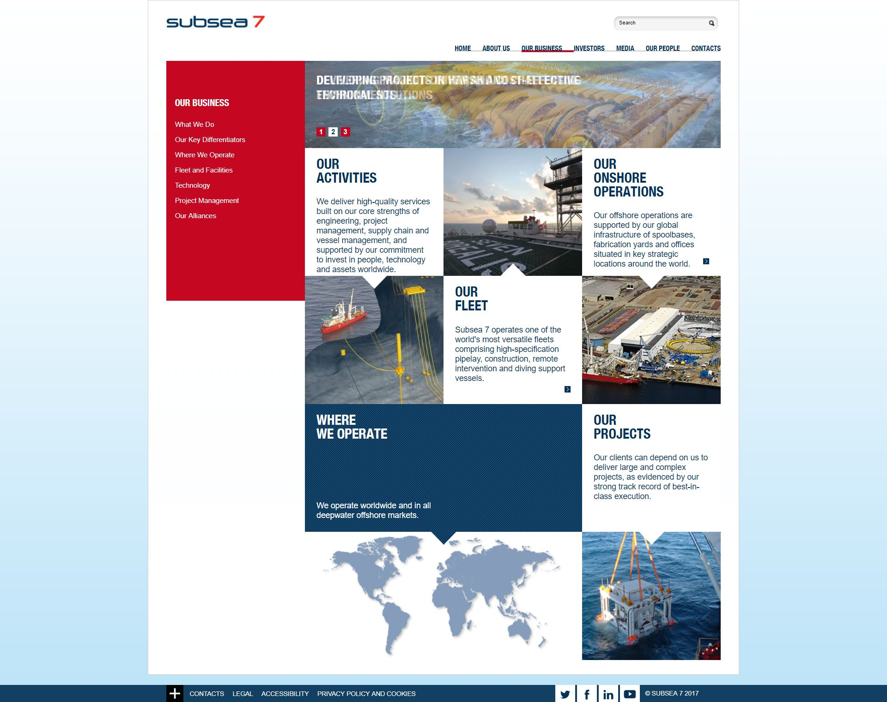

 
  

  
  <h1>Subsea7 (Black Sun Plc.)</h1>

  

    I worked on this project whilst worked for <strong>Black Sun Plc.</strong>, London, between Marc 2015 and October 2017.
  

  
  

    
  

  <h4>
    <a href="https://www.subsea7.com/"  target="_blank">View website</a>
  </h4>
  <h4>
    <a href="#" title="Sorry, it's company secret"  target="_blank"><s>View code (company secret)</s></a>
  </h4>

 

<!-- Table of Contents -->

# :notebook_with_decorative_cover: ToC

- [About the company](#family-about-the-company)
- [About the project](#star2-about-the-project)
  - [Screenshots](#camera-screenshots)
  - [Tech Stack](#space_invader-tech-stack)
  - [Features](#dart-features)
- [License](#warning-license)
- [Contact](#handshake-contact)

<!-- About the company -->

## :family: About the company

<strong>Subsea7 S.A.</strong> is a Luxembourg-registered, London-headquartered global leader in offshore engineering, construction, and subsea services for the energy industry. It employs around 15,000 people across 30+ countries, completing over 1,000 projects worldwide.

The company provides end‑to‑end offshore solutions—from concept and engineering to installation, maintenance, and decommissioning—across oil, gas, renewables, and emerging energy, supported by advanced technology, robust assets, and a global network.

  <h3>Full Energy Lifecycle Solutions</h3>
  <ul>
    <li><strong>Concept, FEED & Engineering</strong>: Early involvement to optimise project design and forecasting accuracy.</li>
    <li><strong>Procurement & Fabrication</strong>: Supply chain efficiency and onshore fabrication at strategic yard and spoolbase locations.</li>
    <li><strong>Installation & Commissioning</strong>: Offshore execution using a modern fleet of vessels for safe, on-schedule delivery.</li>
    <li><strong>Maintenance, IRM & Decommissioning</strong>: Through Xodus and i‑Tech, Subsea7 offers inspection, repair, monitoring, integrity management, and decommissioning support.</li>
    <li><strong>Field Life Extension & Re-use</strong>: Includes electrification, hook‑ups, and life‑extension technologies.</li>
  </ul>

  <h3>SURF & Conventional Installations</h3>
  <ul>
    <li>Specialists in subsea umbilicals, risers, and flowlines (SURF), pipelines, and associated equipment across deep and shallow waters.</li>
    <li>Integrated EPCI capabilities, including tie-ins, flexible flowlines, moorings, and floating production systems (FPS).</li>
  </ul>

  <h3>Renewables & Emerging Energy</h3>
  <ul>
    <li>Through its Seaway7 subsidiary, Subsea7 supports offshore wind projects, delivering wind turbine foundations, cables, heavy lifting, and installation via jack-up and heavy‑lift vessels.</li>
    <li>Also active in carbon capture & storage, hydrogen, and lower-carbon oil and gas, including biofuel trials and system electrification.</li>
  </ul>

  <h3>Enabling Products & Innovation</h3>
  <ul>
    <li>Offers an advanced portfolio of enabling technologies: spoolbases, highly capable fleet, ROVs/tooling, and digital platforms.</li>
    <li>Invests in tech: nano‑engineered sensor platforms (award‑winning), remote monitoring, data‑driven decision support via 4Subsea, OneSubsea JV.</li>
  </ul>

  <h3>Global Reach & Partnerships</h3>
  <ul>
    <li>Operates worldwide, with offices, yards, and joint ventures in major offshore energy regions.</li>
    <li>Active in major projects in Gulf of Mexico, North Sea, Brazil, Trinidad & Tobago, etc., delivering SURF, FPS installation, EPCI contracts.</li>
    <li>Collaborates through alliances/JVs (OneSubsea, Subsea Integration Alliance, partnerships with SLB/Aker), enhancing scale and digital integration.</li>
  </ul>

<!-- About the project -->

## :star2: About the project

The task was creating an eye-catching official webpage for Subsea7.

<!-- Screenshots -->

### :camera: Screenshots

 
  

<!-- TechStack -->

### :space_invader: Tech Stack

<a href="https://builtwith.com/?https%3a%2f%2fwww.subsea7.com%2f">Full list of used technologies</a>

  
Client

  <ul>
    <li><a href="https://www.w3schools.com/html/html5_semantic_elements.asp" target="_blank">Semantic HTML5</a></li>
    <li><a href="https://www.w3schools.com/css/"  target="_blank">CSS3</a></li>
    <li><a href="https://business.adobe.com/products/experience-manager/adobe-experience-manager.html"  target="_blank">AEM</a></li>
    <li><a href="https://developer.mozilla.org/en-US/docs/Web/JavaScript"  target="_blank">JavaScript</a></li>
    <li><a href="https://jquery.com/"  target="_blank">JQuery</a></li>
    <li><a href="https://gsap.com/">Greensock</a></li>
    <li><a href="https://www.ibm.com/think/topics/rest-apis"  target="_blank">RestAPI</a></li>
    <li><a href="https://www.json.org/">JSON</a></li>
    <li><a href="https://developer.mozilla.org/en-US/docs/Web/XML/Guides/XML_introduction"  target="_blank">XML</a></li>
  </ul>

  
Backend

  <ul>
    <li><a href="#"  target="_blank">Java</a></li>
    <li><a href="https://jade.tilab.com/">Jade</a></li>
    <li><a href="https://docs.oracle.com/cd/E13218_01/wlp/docs70/jsp/templats.htm"  target="_blank">JSP templates</a></li>
  </ul>

Database

  <ul>
    <li><a href="https://www.mysql.com/">MySQL</a></li>
  </ul>

DevOps

  <ul>
    <li><a href="https://tortoisesvn.net/">Tortuise SVN</a></li>
    <li><a href="https://www.eclipse.org/topics/ide/">Eclipse</a></li>
    <li><a href="https://www.jslint.com/">JS Lint</a></li>
    <li><a href="https://www.atlassian.com/software/jira">JIRA</a></li>
    <li><a href="https://www.browserstack.com/">BrowserStack</a></li>
    <li><a href="https://github.com/">GitHub</a></li>
    <li><a href="https://en.wikipedia.org/wiki/Agile_software_development">Agile software development</a></li>
  </ul>

<!-- Features -->

### :dart: Features

- mobile first, full responsive solution
- optimized loading time and assets (compressed files and image assets, GZIP headers, minified scripts)
- pixel perfect result from Adobe Illustrator / Photoshop designs
- wide variation of bespoken teasers and components

<!-- License -->

## :warning: License

Distributed under the Software copyright of <strong>Black Sun Plc.</strong> Any non-authorized usage of their code leads to legal consequences, thank you.

<!-- Contact -->

## :handshake: Contact

Black Sun Plc. - [https://www.blacksun-global.com/](https://www.blacksun-global.com/), Fulham Palace, Bishop's Avenue, London, SW6 6EA, United Kingdom
