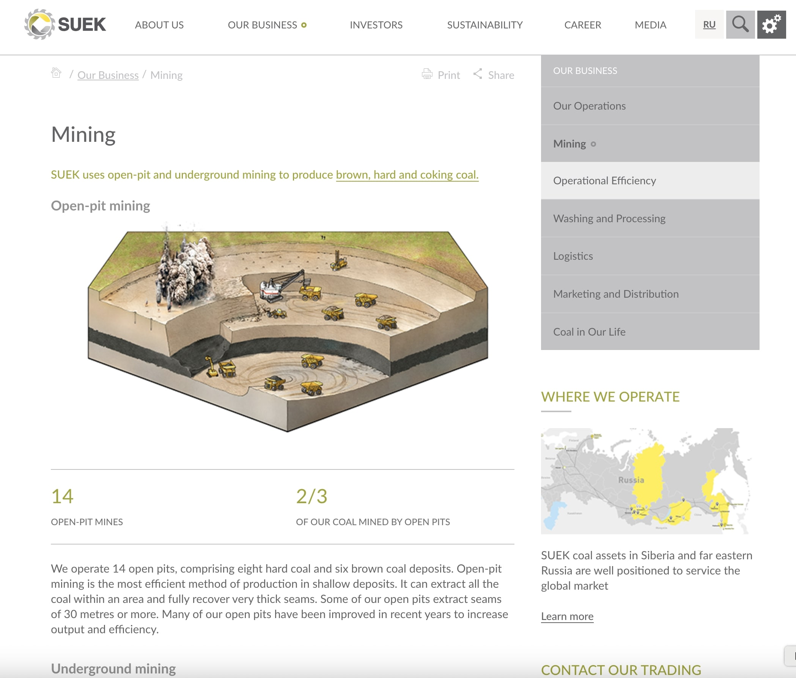

 
  

  
  <h1>SUEK (Black Sun Plc.)</h1>

  

    I worked on this project whilst worked for <strong>Black Sun Plc.</strong>, London, between Marc 2015 and October 2017.
  

  
  

    
  

  <h4>
    <a href="http://www.suek.com/"  target="_blank">View website</a>
  </h4>
  <h4>
    <a href="https://web.archive.org/web/20171108193343/http://www.suek.com/"  target="_blank">View website from 2017</a>
  </h4>
  <h4>
    <a href="#" title="Sorry, it's company secret"  target="_blank"><s>View code (company secret)</s></a>
  </h4>

 

<!-- Table of Contents -->

# :notebook_with_decorative_cover: ToC

- [About the company](#family-about-the-company)
- [About the project](#star2-about-the-project)
  - [Screenshots](#camera-screenshots)
  - [Tech Stack](#space_invader-tech-stack)
  - [Features](#dart-features)
- [License](#warning-license)
- [Contact](#handshake-contact)

<!-- About the company -->

## :family: About the company

<strong>SUEK</strong>, founded in 2001 and headquartered in Moscow, is Russia’s largest coal producer and one of the world’s leading coal mining and energy companies. Operating primarily across Siberia and the Far East, it maintains a significant global presence :contentReference[oaicite:0]{index=0}.

  <h2>Operations & Capacity</h2>
  <ul>
    <li>Owns 27 open-pit and underground mines, plus 27 power plants across Siberia and the Far East :contentReference[oaicite:1]{index=1}.</li>
    <li>Produces over 100 million tons of high-calorific, low-sulphur coal annually, with proven reserves of ~7.5–7.6 billion tonnes :contentReference[oaicite:2]{index=2}.</li>
    <li>Operates extensive logistics via bulk terminals and seaports (Vanino, Murmansk), delivering coal to over 40 countries :contentReference[oaicite:3]{index=3}.</li>
  </ul>

  <h2>Employees & Scale</h2>
  <ul>
    <li>Employs approximately 70,000 people across 12–14 Russian regions :contentReference[oaicite:4]{index=4}.</li>
    <li>Accounts for roughly 24–28% of Russia’s coal output, ranking among the top five coal companies globally :contentReference[oaicite:5]{index=5}.</li>
  </ul>

  <h2>Products & Technologies</h2>
  <ul>
    <li>Focuses on high-quality thermal coal suitable for HELE (High-Efficiency, Low-Emission) power plants :contentReference[oaicite:6]{index=6}.</li>
    <li>Invests heavily in coal washing, flotation, methane capture for power, digitalization, and automated mining :contentReference[oaicite:7]{index=7}.</li>
  </ul>

  <h2>Environmental & Safety Initiatives</h2>
  <ul>
    <li>Invested over US$400 million in clean-coal technologies: washing plants, water treatment, dust control, land reclamation :contentReference[oaicite:8]{index=8}.</li>
    <li>Operates Russia’s first coal-mine methane power station and modernizes environmental controls at ports and facilities :contentReference[oaicite:9]{index=9}.</li>
    <li>Achieved strong ESG ratings for coal quality, lower emissions, and board governance; ranked 11th of 110 in Russia by RAEX :contentReference[oaicite:10]{index=10}.</li>
  </ul>

  <h2>Global Market & Export</h2>
  <ul>
    <li>Exports coal to 48 countries across five continents, with Asia-Pacific as a key market; exports account for ~67% of volumes toward Asia-Pacific :contentReference[oaicite:11]{index=11}.</li>
    <li>Registered Black Sand Commodities FZ-LLC in UAE (2022) to expand and diversify global trading :contentReference[oaicite:12]{index=12}.</li>
    <li>Member of the World Coal Association, signaling commitment to global cooperation and coal-sector standards :contentReference[oaicite:13]{index=13}.</li>
  </ul>

<!-- About the project -->

## :star2: About the project

The task was creating an eye-catching official webpage for Subsea7.

<!-- Screenshots -->

### :camera: Screenshots

 
  

 
  

 
  

 
  

 
  

<!-- TechStack -->

### :space_invader: Tech Stack

<a href="https://builtwith.com/suek.com">Full list of used technologies</a>

  
Client

  <ul>
    <li><a href="https://www.w3schools.com/html/html5_semantic_elements.asp" target="_blank">Semantic HTML5</a></li>
    <li><a href="https://www.w3schools.com/css/"  target="_blank">CSS3</a></li>
    <li><a href="https://business.adobe.com/products/experience-manager/adobe-experience-manager.html"  target="_blank">AEM</a></li>
    <li><a href="https://developer.mozilla.org/en-US/docs/Web/JavaScript"  target="_blank">JavaScript</a></li>
    <li><a href="https://jquery.com/"  target="_blank">JQuery</a></li>
    <li><a href="https://gsap.com/">Greensock</a></li>
    <li><a href="https://www.ibm.com/think/topics/rest-apis"  target="_blank">RestAPI</a></li>
    <li><a href="https://www.json.org/">JSON</a></li>
    <li><a href="https://developer.mozilla.org/en-US/docs/Web/XML/Guides/XML_introduction"  target="_blank">XML</a></li>
  </ul>

  
Backend

  <ul>
    <li><a href="#"  target="_blank">Java</a></li>
    <li><a href="https://jade.tilab.com/">Jade</a></li>
    <li><a href="https://docs.oracle.com/cd/E13218_01/wlp/docs70/jsp/templats.htm"  target="_blank">JSP templates</a></li>
  </ul>

Database

  <ul>
    <li><a href="https://www.mysql.com/">MySQL</a></li>
  </ul>

DevOps

  <ul>
    <li><a href="https://tortoisesvn.net/">Tortuise SVN</a></li>
    <li><a href="https://www.eclipse.org/topics/ide/">Eclipse</a></li>
    <li><a href="https://www.jslint.com/">JS Lint</a></li>
    <li><a href="https://www.atlassian.com/software/jira">JIRA</a></li>
    <li><a href="https://www.browserstack.com/">BrowserStack</a></li>
    <li><a href="https://github.com/">GitHub</a></li>
    <li><a href="https://en.wikipedia.org/wiki/Agile_software_development">Agile software development</a></li>
  </ul>

<!-- Features -->

### :dart: Features

- mobile first, full responsive solution
- optimized loading time and assets (compressed files and image assets, GZIP headers, minified scripts)
- pixel perfect result from Adobe Illustrator / Photoshop designs
- wide variation of bespoken teasers and components

<!-- License -->

## :warning: License

Distributed under the Software copyright of <strong>Black Sun Plc.</strong> Any non-authorized usage of their code leads to legal consequences, thank you.

<!-- Contact -->

## :handshake: Contact

Black Sun Plc. - [https://www.blacksun-global.com/](https://www.blacksun-global.com/), Fulham Palace, Bishop's Avenue, London, SW6 6EA, United Kingdom
