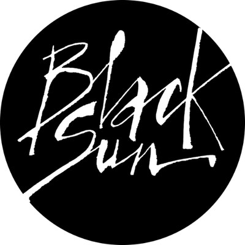
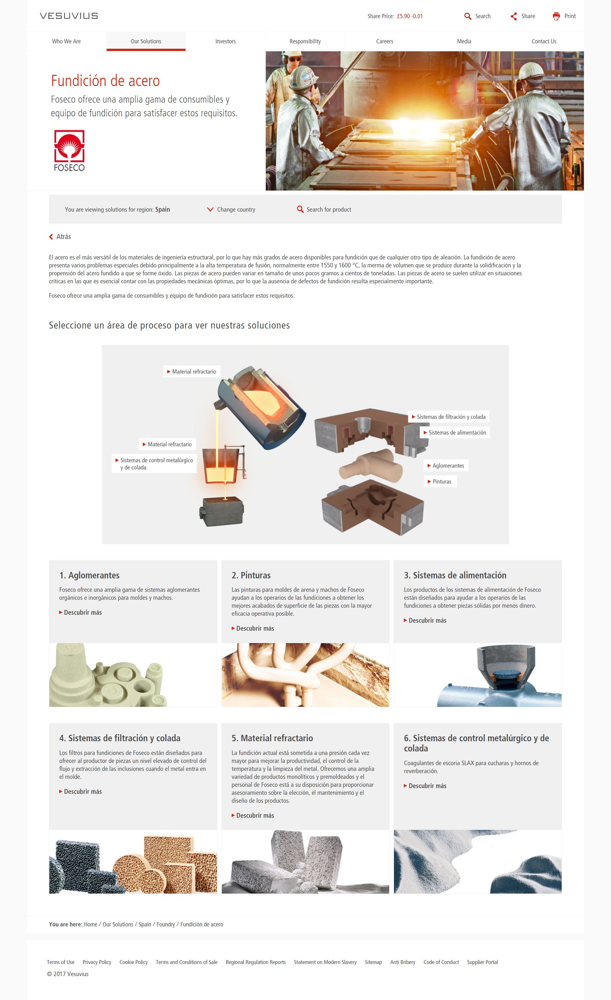

 
  

  
  <h1>Vesuvius Plc.</h1>

  

    I worked on this project whilst worked for <strong>Black Sun Plc.</strong>, London, between Marc 2015 and October 2017.
  

  

    
  

   
  <h4>
    <a href="https://www.vesuvius.com/en"  target="_blank">View site</a>
  </h4>
  <h4>
    <a href="#" title="Sorry, it's company secret"  target="_blank"><s>View code (company secret)</s></a>
  </h4>

 

<!-- Table of Contents -->

# :notebook_with_decorative_cover: ToC

- [About the company](#family-about-the-company)
- [About the project](#star2-about-the-project)
  - [Screenshots](#camera-screenshots)
  - [Tech Stack](#space_invader-tech-stack)
  - [Features](#dart-features)
- [License](#warning-license)
- [Contact](#handshake-contact)

<!-- About the company -->

## :family: About the company

<!-- About the project -->

    <strong>Vesuvius Plc</strong> is a British-engineered ceramics and metal flow engineering company, headquartered in London and listed on the London Stock Exchange (FTSE 250). Its products and services support steelmakers, foundries, and industries such as glass, solar, aluminium, and cement.
  

  

    Vesuvius is a global leader in engineered ceramics and flow-control solutions, enabling high-temperature industrial processes with innovative, customer-centric offerings and robust financial performance.
  

  <h2>Heritage & Formation</h2>
  <ul>
    <li>Founded in 1704 (as Cookson Group) and rebranded to Vesuvius plc in December 2012 following a demerger.</li>
    <li>Historical acquisitions include Foseco (2008), forming the Foundry Technologies division, and additional ceramic-focused integrations.</li>
  </ul>

  <h2>Global Reach & Scale</h2>
  <ul>
    <li>Operates in over 40 countries with 54 production sites and six R&D centres across six continents.</li>
    <li>Employs around 11,000 people from more than 70 nationalities.</li>
  </ul>

  <h2>Business Segments</h2>
  <ul>
    <li><strong>Steel Flow Control & Advanced Refractories:</strong> Consumable ceramics, nozzles, stoppers, sensors, probes, and refractory linings that optimize molten metal flow in steelmaking.</li>
    <li><strong>Foundry Technologies (Foseco):</strong> Consumables like binders, coatings, filters, crucibles, and feeding systems for ferrous and non-ferrous foundries.</li>
    <li><strong>Precious Metals Processing:</strong> Specialized ceramic solutions catering to the precious metals industry.</li>
  </ul>

  <h2>Financials (2024)</h2>
  <ul>
    <li>Revenue: ~£1.82 billion; Operating income: £188 million; Net income: £100 million.</li>
  </ul>

  <h2>Innovation & Customer Service</h2>
  <ul>
    <li>Close collaboration with customers via embedded industry experts to develop tailored high-end solutions.</li>
    <li>Six global R&D innovation centres focused on improving manufacturing efficiency, quality, safety, and sustainability.</li>
  </ul>

  <h2>Governance, Values & ESG</h2>
  <ul>
    <li>Strong governance standards and ethical conduct are core to operations.</li>
    <li>Championing values of Courage, Ownership, Respect, and Energy; committed to diversity—21% female in senior roles; operating across 23 countries.</li>
  </ul>

## :star2: About the project

The task was building a corporate website for Vesuvius Plc.

Three types of pages were usually created:

<ul>
  <li>Static layout with editable content</li>
  <li>Dynamic layout with dynamic content, fetched from RESTful API sources</li>
  <li>Functional pages with mixed type of contents, such as contact us page, insights, map locations, </li>
</ul>

<!-- Screenshots -->

### :camera: Screenshots

 
  

<!-- TechStack -->

### :space_invader: Tech Stack

<a href="https://builtwith.com/?https%3a%2f%2fwww.vesuvius.com%2fen%2findex.html">Full list of used technologies</a>

  
Client

  <ul>
    <li><a href="https://developer.mozilla.org/en-US/docs/Web/JavaScript"  target="_blank">JavaScript</a></li>
    <li><a href="https://jquery.com/"  target="_blank">JQuery</a></li>
    <li><a href="https://www.w3schools.com/html/html5_semantic_elements.asp" target="_blank">Semantic HTML5</a></li>
    <li><a href="https://www.w3schools.com/css/"  target="_blank">CSS3</a></li>
    <li><a href="https://business.adobe.com/products/experience-manager/adobe-experience-manager.html"  target="_blank">AEM</a></li>
  </ul>

  
Backend

  <ul>
    <li><a href="#"  target="_blank">Java</a></li>
    <li><a href="https://docs.oracle.com/cd/E13218_01/wlp/docs70/jsp/templats.htm"  target="_blank">JSP templates</a></li>
  </ul>

Database

  <ul>
    <li><a href="https://www.mysql.com/">MySQL</a></li>
  </ul>

DevOps

  <ul>
    <li><a href="https://tortoisesvn.net/">Tortuise SVN</a></li>
    <li><a href="https://www.eclipse.org/topics/ide/">Eclipse</a></li>
    <li><a href="https://www.jslint.com/">JS Lint</a></li>
  </ul>

<!-- Features -->

### :dart: Features

- mobile first, full responsive solution
- optimized loading time and assets (compressed files and image assets, GZIP headers, minified scripts)
- user friendly CMS solution
- pixel perfect result from Adobe Illustrator / Photoshop designs
- wide variation of bespoken teasers and components

<!-- License -->

## :warning: License

Distributed under the Software copyright of <strong>Black Sun Plc.</strong> Any non-authorized usage of their code leads to legal consequences, thank you.

<!-- Contact -->

## :handshake: Contact

Black Sun Plc. - [https://www.blacksun-global.com/](https://www.blacksun-global.com/), Fulham Palace, Bishop's Avenue, London, SW6 6EA, United Kingdom
