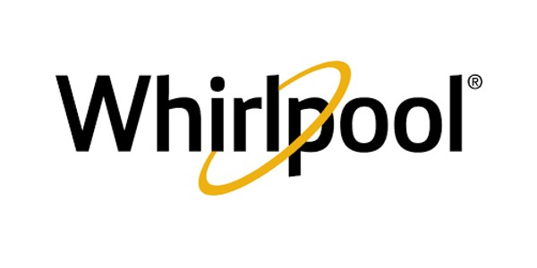
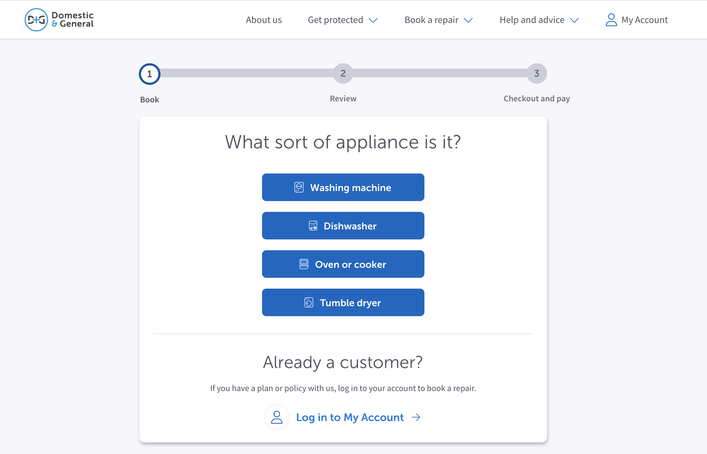
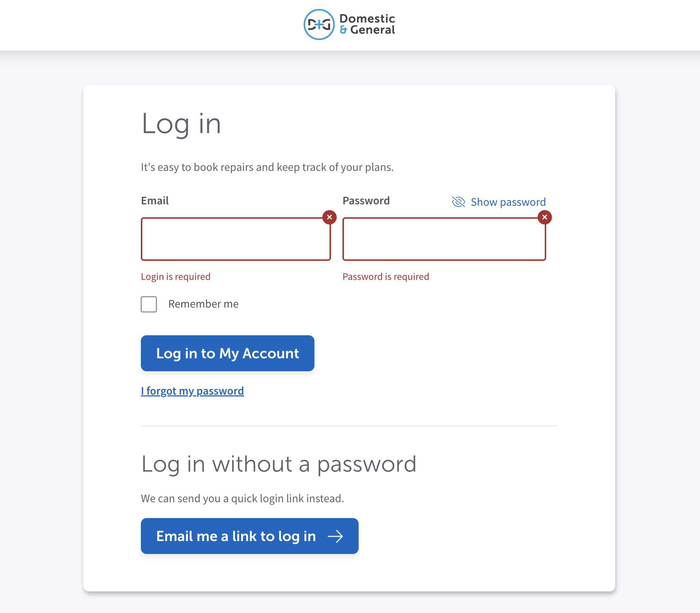
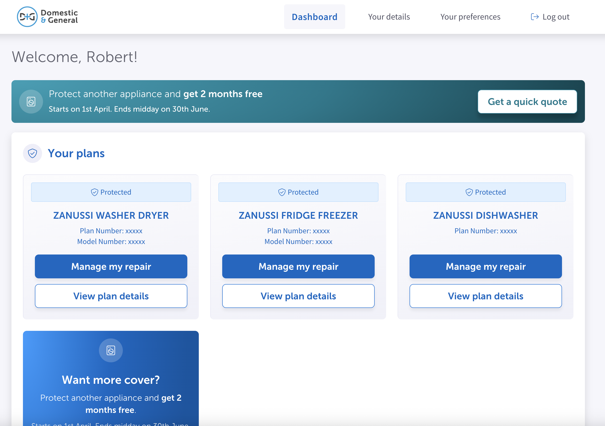

<!--
Hey, thanks for using the awesome-readme-template template.
If you have any enhancements, then fork this project and create a pull request
or just open an issue with the label "enhancement".

Don't forget to give this project a star for additional support ;)
Maybe you can mention me or this repo in the acknowledgements too
-->

  

  <h1>Whirpool Care (D&G)</h1>
  
  

    I worked on this project whilst worked for Domestic & General, London
  

   
<h4>
  <a href="https://www.domesticandgeneral.com/repair-care/brands/whirlpool">View Demo</a>
</h4>

 

<!-- Table of Contents -->

# :notebook_with_decorative_cover: ToC

- [About the Project](#star2-about-the-project)
  - [Screenshots](#camera-screenshots)
  - [Tech Stack](#space_invader-tech-stack)
  - [Features](#dart-features)
  - [Environment Variables](#key-environment-variables)
- [License](#warning-license)
- [Contact](#handshake-contact)

<!-- About the Project -->

## :star2: About the Project

The project itself was about creating and managing the codebase of a user-focused, secure and easy-to-use solution where visitors easily could get a quote on their appliances instantly and also manage their already owned plans.

<!-- Screenshots -->

### :camera: Screenshots

 
  

 
  

 
  

<!-- TechStack -->

### :space_invader: Tech Stack

  
Client

  <ul>
    <li><a href="https://www.typescriptlang.org/">Typescript</a></li>
    <li><a href="https://tailwindcss.com/">TailwindCSS</a></li>
    <li><a href="https://reactjs.org/">React.js</a></li>
    <li><a href="https://www.npmjs.com/package/react-dom">ReactDOM</a></li>
    <li><a href="https://graphql.org/">GraphQL</a></li>
    <li><a href="https://www.npmjs.com/">NPM packages</a></li>
    <li><a href="#">In-house React components</a></li>
  </ul>

Database

  <ul>
    <li><a href="https://www.mongodb.com/">MongoDB</a></li>
  </ul>

DevOps

  <ul>
    <li><a href="https://www.docker.com/">Docker</a></li>
    <li><a href="https://www.jenkins.io/">Jenkins</a></li>
    <li><a href="https://www.sonarsource.com/products/sonarqube/">SonarQube</a></li>
    <li><a href="https://www.jslint.com/">JS Lint</a></li>
    <li><a href="https://github.com/features/actions">GitHub Actions</a></li>
    <li><a href="https://docs.github.com/en/actions/writing-workflows/about-workflows">GitHub Workflow</a></li>
  </ul>

<!-- Features -->

### :dart: Features

- Accessibility level: AA
- Mobile first, full responsive solution
- User friendly customer portal as a web app
- Wide selection of actions on the page: get a quote, compare plans, manage user data, secure login/logout, etc.
- It follows the CBG (Company Brand Guideline)

<!-- License -->

## :warning: License

Distributed under the Software copyright of D&G. Any non-authorized usage of their code leads to legal consequences, thank you.

<!-- Contact -->

## :handshake: Contact

Domestic and General - [https://www.domesticandgeneral.com/](https://www.domesticandgeneral.com/)

Project Link: [https://www.domesticandgeneral.com/repair-care/brands/whirlpool](https://www.domesticandgeneral.com/repair-care/brands/whirlpool)
