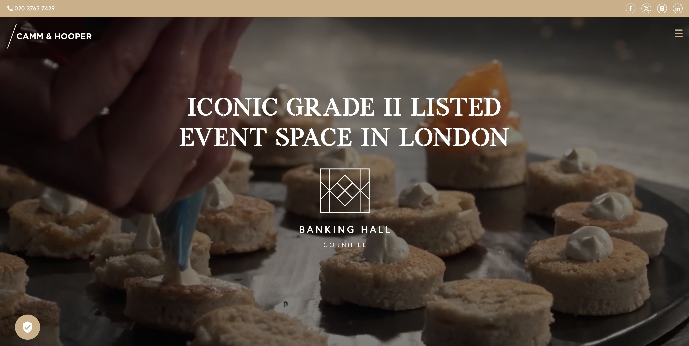
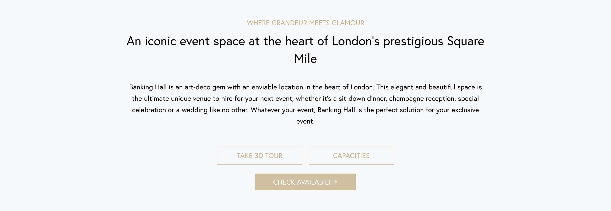
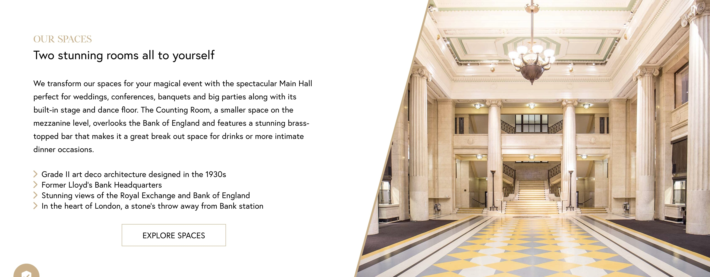
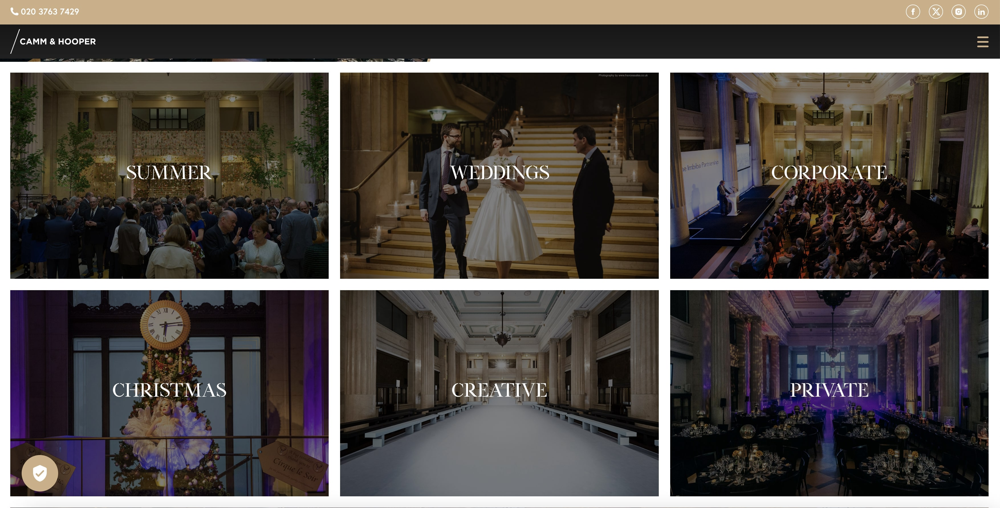
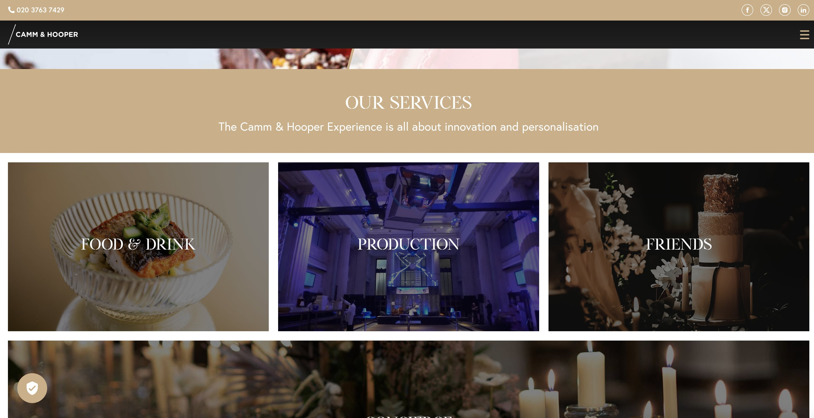
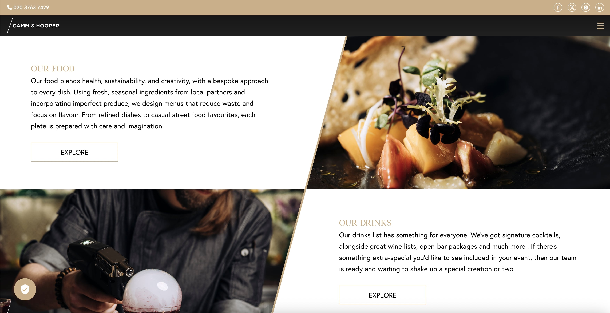

  

 

  <h1>Banking Hall (Elixirr)</h1>
  

    I worked on this project whilst worked at Elixirr, London.
  

   
  <h4>
    <a href="https://www.bankinghall.com/" target="_blank">View site</a>
  </h4>
  <h4>
    <a href="https://web.archive.org/web/20200804080806/https://www.bankinghall.com/" target="_blank">View site from 2018</a>
  </h4>
  <h4>
    <a href="#" title="Sorry, it's company secret"  target="_blank"><s>View code (company secret)</s></a>
  </h4>

 

<!-- Table of Contents -->

# :notebook_with_decorative_cover: ToC

- [About the company](#family-about-the-company)
- [About the project](#star2-about-the-project)
  - [Screenshots](#camera-screenshots)
  - [Tech Stack](#space_invader-tech-stack)
  - [Features](#dart-features)
- [My contribution to the project](#white_check_mark-my-contribution-to-the-project)
- [License](#warning-license)
- [Contact](#handshake-contact)

<!-- About the company -->

## :family: About the company

<strong>Elixirr</strong> is a globally recognised "challenger consultancy" founded in <em>2009</em> and headquartered in the UK. They specialise in delivering bold, tailored solutions—from boardroom strategy to full-scale execution—across industries including finance, retail, manufacturing, healthcare, automotive, energy, insurance, media & tech, luxury & fashion, travel, and more.

Elixirr is a forward-thinking consultancy that combines bold strategy, operational excellence, data and digital innovation, and deep industry expertise to help clients challenge norms and achieve lasting impact.

  <h3>Core Capabilities</h3>
  <ul>
    <li><strong>Strategy & Transformation</strong> – Define vision, rebuild operating models, and align people, process & technology to deliver on ambitious goals.</li>
    <li><strong>Operational Excellence</strong> – Optimise operations, teams, and systems for greater efficiency and effectiveness.</li>
    <li><strong>Data & Technology</strong> – Harness data, analytics, cloud, AI, and cutting-edge tech to drive innovation and performance.</li>
    <li><strong>Digital Experience</strong> – Craft and launch digital products and experiences built for future markets and user needs.</li>
    <li><strong>Research & Insights</strong> – Provide tailored, data-driven market research and thought leadership to inform strategic decisions.</li>
  </ul>

  <h3>Sector Expertise</h3>
  
Elixirr works across a diverse range of industries, providing bespoke solutions to:

  <ul>
    <li>Financial Services & Insurance</li>
    <li>Retail & Consumer Goods</li>
    <li>Luxury, Fashion & Media/Technology</li>
    <li>Life Sciences & Healthcare</li>
    <li>Manufacturing & Automotive</li>
    <li>Energy & Utilities</li>
    <li>Travel & Leisure</li>
    <li>Business & Professional Services</li>
    <li>Telecommunications</li>
    <li>Consumer Goods</li>
  </ul>

  <h3>Unique Approach & Differentiators</h3>
  <ul>
    <li><em>Bespoke innovation:</em> No templates—every solution is crafted uniquely for the client.</li>
    <li><em>Future-first design:</em> Work backwards from future market scenarios to shape solutions today.</li>
    <li><em>Entrepreneurial culture:</em> A challenger mindset backed by autonomy—reinforced by an employee equity scheme post-IPO in 2020. </li>
    <li><em>Global reach:</em> Offices in London, Jersey, Paris, Rijeka, Cape Town, Johannesburg, New York, Philadelphia, Dallas, San Francisco, Laguna Beach, Seattle, and Los Angeles.</li>
  </ul>

  <h3>Notable Projects & Partnerships</h3>
  <ul>
    <li>Partnered with <strong>British Cycling</strong> for a major digital transformation.</li>
    <li>Helped a mid-market retail bank build a Generative AI governance model.</li>
    <li>Designed IT operating models for private equity firms.</li>
  </ul>

<!-- About the project -->

## :star2: About the project

<strong>Six Storeys</strong> is a multi-level, boutique Soho venue blending dining, cocktails, and curated private spaces. Each floor offers a different mood—from relaxed entrance-level drinks to exclusive, inventive cocktail bars and fully-equipped event rooms. Designed around immersive interiors and artisanal offerings, it’s tailored for both casual nights out and elevated event experiences.

<h4>What had to do?</h4>
  <ul>
    <li>create pixel-perfect layout for every devices, all screen sizes</li>
    <li>mobile first, full responsive</li>
    <li>all content comes from JSON file with asyncronous RestAPI call</li>
    <li></li>
  </ul>

<h4>Features of this project:</h4>
  <ul>
    <li>this is a WordPress site</li>
    <li>integrated Shopify feature, developed by using Liquid templating</li>
    <li>pixel-perfect layout for every devices, all screen sizes</li>
    <li>mobile first, full responsive</li>
    <li>all content comes from  JSON file for optimized loading, generated from WordPress database</li>
    <li>optimized page loading time, compressed images, compressed JS content into one file, browser cache to store what was loaded once, so the solution saved bandwith for the next page load</li>
    <li>had to load the content from an XML/JSON file than process it (JSON stringify) and create a representation of the data in the memory</li>
  </ul>

The final webapp was easy-to-access, user-friendly and soooo cool! It was full responsive with mobile-first approach.

<!-- Screenshots -->

### :camera: Screenshots

 
  

 
  

 
  

 
  

 
  

 
  

 
  

<!-- TechStack -->

### :space_invader: Tech Stack

  
Client

  <ul>
    <li><a href="https://wordpress.org/"  target="_blank">WordPress</a></li>
    <li><a href="https://shopify.github.io/liquid/"  target="_blank">Liquid</a></li>
    <li><a href="https://www.shopify.com/"  target="_blank">Shopify</a></li>
    <li><a href="https://developer.mozilla.org/en-US/docs/Web/JavaScript"  target="_blank">JavaScript</a></li>
    <li><a href="https://www.w3schools.com/html/html5_semantic_elements.asp" target="_blank">Semantic HTML5</a></li>
    <li><a href="https://www.w3schools.com/css/"  target="_blank">CSS3</a></li>
  </ul>

Database

  <ul>
    <li><a href="https://www.json.org/">JSON</a></li>
  </ul>

DevOps

  <ul>
    <li><a href="https://bitbucket.org/">BitBucket</a></li>
    <li><a href="https://www.jslint.com/">JS Lint</a></li>
    <li><a href="https://www.postman.com/">PostMan</a></li>
  </ul>

<!-- Features -->

### :dart: Features

- Accessibility level: AA
- Mobile first, full responsive solution
- It follows the BG (Brand Guideline)
- Fast loading time
- Cached content and images

<!-- My contribution to the project -->

## :white_check_mark: My contribution to the project

I had to build this website from a design file. The solution is done by using WordPress engine and pixel-perfect, full responsive frontend part. Also had to integrate Shopify functions (using Liquid templating) that is a massive part of the website. I kept my hands on each steps of the development and put the PMs, designers and developers to the same table, it was the guarantee of the final excellent product. My coding approaches made this project an outstanding, satisfying product that made the client happy.

<!-- License -->

## :warning: License

Distributed under the Software copyright of Elixirr. Any non-authorized usage of their code leads to legal consequences, thank you.

<!-- Contact -->

## :handshake: Contact

Elixirr -
[https://www.elixirr.com/en-gb/](https://www.elixirr.com/en-gb/), 100 Cheapside, London EC2V 6DT, UK
