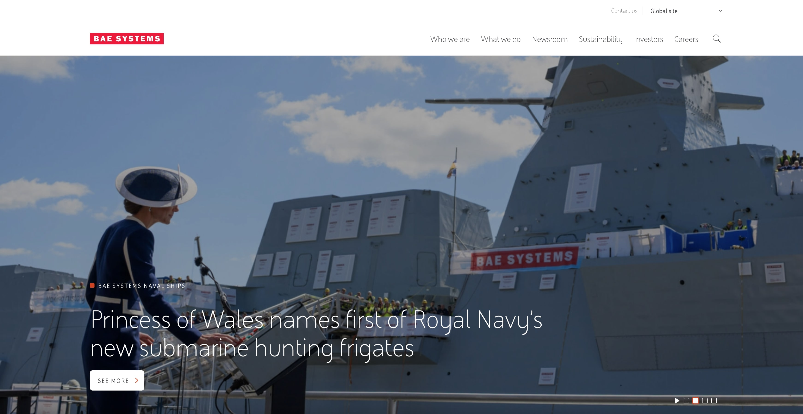

 
  

 
  

  
  <h1>BAE Systems (Infomentum)</h1>

  

    I worked on this project whilst worked for <strong>Infomentum</strong>, London, between October 2020 and May 2021.
  

  <h4>
    <a href="https://www.baesystems.com/"  target="_blank">View site</a>
  </h4>
  <h4>
    <a href="#" title="Sorry, it's company secret"  target="_blank"><s>View code (company secret)</s></a>
  </h4>

 

<!-- Table of Contents -->

# :notebook_with_decorative_cover: ToC

- [About the company](#family-about-the-company)
- [About the project](#star2-about-the-project)
  - [Screenshots](#camera-screenshots)
  - [Tech Stack](#space_invader-tech-stack)
  - [Features](#dart-features)
- [License](#warning-license)
- [Contact](#handshake-contact)

<!-- About the company -->

## :family: About the company

<strong>Infomentum</strong> is a London-based digital transformation consultancy, founded in <em>2007</em>, with ~75 employees and offices in the UK. They specialise in delivering integration, automation, and information management solutions using platforms such as <em>MuleSoft</em>, <em>Salesforce</em>, and <em>Magnolia</em>.

  <h3>Core Services</h3>
  <ul>
    <li><strong>System Integration & API-Led Connectivity</strong> – API-based integration solutions built on MuleSoft, Salesforce, and Magnolia.</li>
    <li><strong>Process Automation</strong> – Combining APIs with Robotic Process Automation (RPA) for hyperautomation.</li>
    <li><strong>Data Cloud & Digital Experience</strong> – Cloud-enabled digital platforms and enhanced user experiences.</li>
    <li><strong>Support & Managed Services</strong> – 24/7 co-managed services, DevOps, cloud support, and specialised support for MuleSoft and Salesforce.</li>
    <li><strong>Training & Consultancy</strong> – Workshops, acceleration kick-start kits, and professional guidance.</li>
  </ul>

  <h3>Industries & Solutions</h3>
  <ul>
    <li>Public Sector (policing, higher education, local authorities)</li>
    <li>Financial Services, Manufacturing, Nonprofits, Charities</li>
    <li>Solutions include accelerators for victim journeys, firearms licensing, social housing, invoice automation, and more.</li>
  </ul>

  <h3>Proven Results</h3>
  <ul>
    <li>Delivered a 61% reduction in victim enquiry calls for Humberside Police using Salesforce + MuleSoft integration.</li>
    <li>Provided a 90-day Kick‑start Integration Kit for Everyturn Mental Health, enhancing patient support platforms.</li>
  </ul>

  <h3>Business Approach</h3>
  <ul>
    <li><strong>SHIFT</strong> – Collaborative vision-setting and prototyping.</li>
    <li><strong>SHAPE</strong> – Deliver, validate, and enable full rollout.</li>
    <li><strong>SUSTAIN</strong> – Provide ongoing support via managed services.</li>
  </ul>

  <h3>Culture & Credentials</h3>
  <ul>
    <li>Highly rated team described as “confident, friendly, knowledgeable, passionate” with a “family-like feel”.</li>
    <li>Certified partner: MuleSoft, Salesforce, and Magnolia; ISO 27001 and Cyber Essentials Plus certified.</li>
  </ul>

<!-- About the project -->

## :star2: About the project

<strong>BAE Systems plc</strong> is a British multinational aerospace, defence, and security company headquartered in London. Formed in 1999 via the merger of British Aerospace and Marconi Electronic Systems, it now employs ~107,000 people worldwide and is Europe’s largest defence contractor and seventh-largest globally

<ul>
      <li><strong>Air</strong>: Combat aircraft (e.g., Eurofighter Typhoon), avionics, electronic flight & engine controls, and unmanned systems.</li>
      <li><strong>Land & Platforms</strong>: Armoured vehicles (e.g., M2 Bradley, CV90), artillery systems, missile launchers, and combat vehicle lifecycle support.</li>
      <li><strong>Maritime & Submarines</strong>: Naval shipbuilding & repair (incl. Astute, Dreadnought, SSN‑AUKUS classes), naval radars, small boats, torpedoes, and submarine design/manufacture via its Barrow-in-Furness shipyard.</li>
      <li><strong>Electronic Systems & C4ISR</strong>: Electronics for flight control, radar systems, EW, surveillance, sensors, communications, secure systems, and sensing solutions.</li>
      <li><strong>Cyber & Digital Intelligence</strong>: Cybersecurity, threat intelligence, incident response, managed detection and response, privacy compliance, and supply chain assurance via BAE Systems Digital Intelligence (formerly Detica).</li>
      <li><strong>Space Technologies</strong>: Satellite electronics, avionics, and systems for space exploration and domain awareness.</li>
    </ul>

The CMS engine is headless Oracle 11b that was brand new to me, therefore I picked up all necessary skills and knowledges that was needed for working with that system. New CMS modules and components were born under my hands and used BrowserStack to test the solution.

Three types of pages were usually created:

<ul>
  <li>Static layout with editable content</li>
  <li>Dynamic layout with dynamic content, fetched from RESTful API sources</li>
  <li>Functional pages with mixed type of contents, such as contact us page, insights, map locations, etc.</li>
</ul>

<!-- Screenshots -->

### :camera: Screenshots

 
  

<!-- TechStack -->

### :space_invader: Tech Stack

<a href="https://builtwith.com/?https%3a%2f%2fwww.baesystems.com%2f">Full list of used technologies</a>

  
Client

  <ul>
    <li><a href="https://www.w3schools.com/html/html5_semantic_elements.asp" target="_blank">Semantic HTML5</a></li>
    <li><a href="https://www.w3schools.com/css/"  target="_blank">CSS3</a></li>
    <li><a href="https://sass-lang.com/"  target="_blank">SASS</a></li>
    <li><a href="https://getbem.com/"  target="_blank">BEM</a></li>
    <li><a href="https://www.ibm.com/think/topics/rest-apis"  target="_blank">RestAPI</a></li>
    <li><a href="https://developer.mozilla.org/en-US/docs/Web/JavaScript"  target="_blank">JavaScript ES7</a></li>
    <li><a href="https://jquery.com/"  target="_blank">JQuery</a></li>
    <li><a href="https://www.json.org/">JSON</a></li>
    <li><a href="https://developer.mozilla.org/en-US/docs/Web/XML/Guides/XML_introduction"  target="_blank">XML</a></li>
  </ul>

  
Backend

  <ul>
    <li><a href="https://www.oracle.com/database/technologies/database-11g-express-edition.html">Oracle 11b</a></li>
    <li><a href="https://www.oracle.com/database/technologies/oracle-database-software-downloads.html">Oracle 12g</a></li>
  </ul>

DevOps

  <ul>
    <li><a href="https://www.mulesoft.com/">MuleSoft</a></li>
    <li><a href="https://gruntjs.com/">Grunt</a></li>
    <li><a href="https://gulpjs.com/">Gulp</a></li>
    <li><a href="https://webpack.js.org/">Webpack</a></li>
    <li><a href="https://en.wikipedia.org/wiki/A/B_testing">A/B test</a></li>
    <li><a href="https://en.wikipedia.org/wiki/Content_delivery_network">CDN</a></li>
    <li><a href="https://www.atlassian.com/">Atlassian</a></li>
    <li><a href="https://en.wikipedia.org/wiki/Agile_software_development">Agile software development</a></li>
    <li><a href="https://www.atlassian.com/software/jira">JIRA</a></li>
    <li><a href="https://www.browserstack.com/">BrowserStack</a></li>
    <li><a href="https://github.com/">GitHub</a></li>
  </ul>

<!-- Features -->

### :dart: Features

- mobile first, full responsive solution
- optimized loading time and assets (compressed files and image assets, GZIP headers, minified scripts)
- user friendly headless Oracle CMS solution
- pixel perfect result from Figma designs
- wide variation of bespoken teasers and components

<!-- License -->

## :warning: License

Distributed under the Software copyright of <strong>Infomentum</strong> Any non-authorized usage of their code leads to legal consequences, thank you.

<!-- Contact -->

## :handshake: Contact

Infomentum - [https://www.infomentum.com/](https://www.infomentum.com/), 68 King William Street, London EC4N 7HR • +44 20 3743 8014 • <a href="mailto:info@infomentum.co.uk">info@infomentum.co.uk</a>
