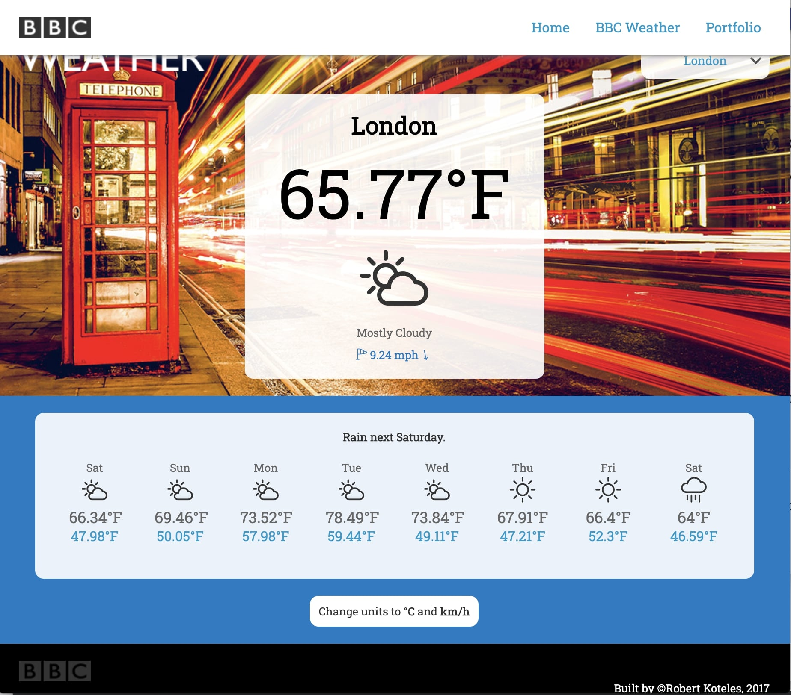

  

  <h1>The BBC interview test</h1>
  

    It was an interview task and I solved it perfectly. The task was creating a widget that loads weather forecast information into their website.
  

   
  <h4>
    <a href="#" target="_blank">View the solution</a>
  </h4>
  <h4>
    <a href="https://github.com/kotelesroberto/bbc_weather" title="Code"  target="_blank">View code</a>
  </h4>

 

<!-- Table of Contents -->

# :notebook_with_decorative_cover: ToC

- [About the company](#family-about-the-company)
- [About the project](#star2-about-the-project)
  - [Screenshots](#camera-screenshots)
  - [Tech Stack](#space_invader-tech-stack)
  - [Features](#dart-features)
- [License](#warning-license)
- [Contact](#handshake-contact)

<!-- About the company -->

## :family: About the company

<strong>The BBC ((British Broadcasting Corporation)</strong> is the United Kingdom's public service broadcaster, founded in 1922. It is headquartered in London and is one of the world's most respected and widely recognized media organizations. The BBC’s mission is to inform, educate, and entertain, as set out in its Royal Charter. It strives to maintain impartiality, quality journalism, and cultural representation.

<!-- About the project -->

## :star2: About the project

<h4>Technical parameters of the solution:</h4>
  <ul>
    <li>content are loaded from external JSON file with asyncronous call</li>
    <li>optimalized loading time</li>
    <li>full responsive</li>
    <li>OO coding approach</li>
    <li>bespoken icon set to use</li>
    <li>local JSON file for testing purposes</li>
    <li>feature: navigation is added by script</li>
    <li>feature: changing measure unit (Celsius and Fahrenheit)</li>
    <li>feature: location related automatic service</li>
    <li>feature: location related look&feel, background image</li>
  </ul>

The final webapp was easy-to-access, user-friendly and soooo cool! It was full responsive with mobile-first approach.

<!-- Screenshots -->

### :camera: Screenshots

 
  <h4>Desktop</h4>
  

<!-- TechStack -->

### :space_invader: Tech Stack

  
Client

  <ul>
    <li><a href="https://jquery.com/"  target="_blank">JQuery</a></li>
    <li><a href="https://developer.mozilla.org/en-US/docs/Web/JavaScript"  target="_blank">JavaScript ES6, Object Oriented</a></li>
    <li><a href="https://www.w3schools.com/html/html5_semantic_elements.asp" target="_blank">Semantic HTML5</a></li>
    <li><a href="https://www.w3schools.com/css/"  target="_blank">CSS3</a></li>
    <li><a href="https://api.jquery.com/jQuery.getJSON/"  target="_blank">AJAX (getJSON)</a></li>

  </ul>

Database

  <ul>
    <li><a href="https://www.json.org/">data stored in an XML/JSON file, loaded from an external provider (https://api.darksky.net/forecast/)</a></li>
  </ul>

DevOps

  <ul>
    <li><a href="https://bitbucket.org/">BitBucket</a></li>
  </ul>

<!-- Features -->

### :dart: Features

- Accessibility level: AA
- Mobile first, full responsive solution
- Fast loading time

<!-- License -->

## :warning: License

Distributed under the Software copyright of BBC. Any non-authorized usage of their code leads to legal consequences, thank you.

<!-- Contact -->

## :handshake: Contact

BBC - [https://www.bbc.com/](https://www.bbc.com/), Broadcasting House, Portland Place, London, W1A 1AA
