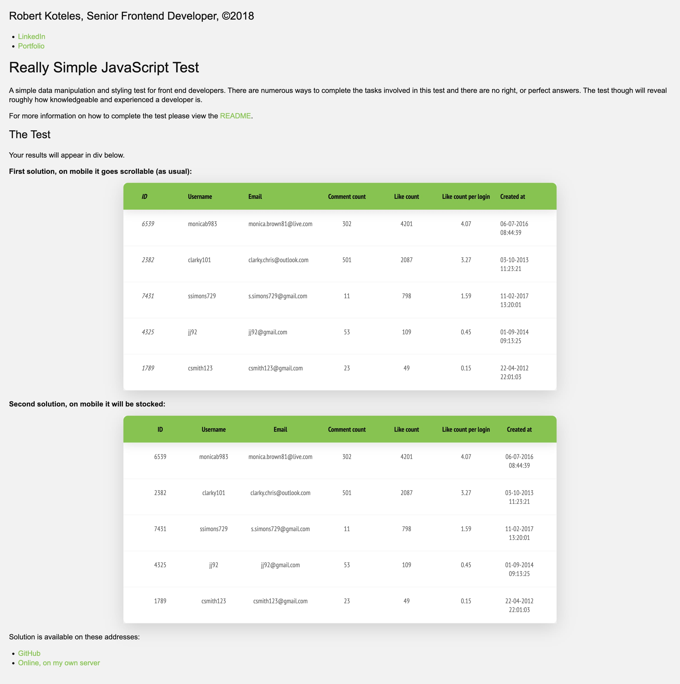

<div align="center">
  

  <h1>Breaktrough Media interview test (2018)</h1>
  
<p align="left">
It was an interview task and I solved it perfectly. A simple data manipulation and styling test for front end developers. There are
numerous ways to complete the tasks involved in this test and there are no right, or perfect answers. The test though will reveal roughly how knowledgeable and experienced a front end developer is.
</p>
   
  <h4>
    <a href="#" target="_blank">View the solution</a>
  </h4>
  <h4>
    <a href="https://github.com/kotelesroberto/breathe-test" title="Code"  target="_blank">View code</a>
  </h4>

</div>

<br />

<!-- Table of Contents -->

# :notebook_with_decorative_cover: ToC

- [About the company](#family-about-the-company)
- [About the project](#star2-about-the-project)
  - [Screenshots](#camera-screenshots)
  - [Tech Stack](#space_invader-tech-stack)
  - [Features](#dart-features)
- [License](#warning-license)
- [Contact](#handshake-contact)

<!-- About the company -->

## :family: About the company

<p><strong>BrakeThrough Media</strong> is an award-winning digital content studio based in New York City and Denver, founded by Iri Greco and Jim Fryer. With over 20 years of experience, they specialize in high-impact media across the U.S., Europe, and the U.K. 
</p>

<!-- About the project -->

## :star2: About the project

This test aims to see how well a front end developer understands JavaScript data
manipulation and how well they can style HTML output.

The test is based on a JSON object that is broken down into child objects and
arrays. This object is stored in the `./assets/js/test-data.js` file.

Your JavaScript code for manipulating the data and passing it to the DOM should
be written in the file `./assets/js/test-script.js`.

Any written or generated CSS should appear in the file `./assets/css/style.css`.

### The JSON Object

The JSON object is broken down into two core objects `user.metaData` and `user.metricData`
it is important to note that the items held within these objects are related to
each other based on their `id`. Please make sure to look at the data before you
proceed with the test.

```javascript
{
    "users": {
        "metaData": [
            {
                "id": 4325,
                "name": "James Jones",
                "username": "jj92",
                "email": "jj92@gmail.com",
                "dob": "04-03-1992",
                "created_at": "01-09-2014 09:13:25"
            },
            {
                "id": 7431,
                "name": "Sarah Simons",
                "username": "ssimons729",
                "email": "s.simons729@gmail.com",
                "dob": "13-03-2001",
                "created_at": "11-02-2017 13:20:01"
            }
        ],
        "metricData": [
            {
                "id": 7431,
                "last_login": "07-08-2017 16:33:02",
                "login_count": 501,
                "comment_count": 11,
                "like_count": 798
            },
            {
                "id": 4325,
                "last_login": "07-08-2017 19:29:43",
                "login_count": 243,
                "comment_count": 53,
                "like_count": 109
            }
        ]
    }
}
```

### The Tasks

- Display the user data stored in `./assets/js/test-data.js` in the `./index.html` file.
- The displayed data should be placed inside the div with the id `#test-data`.
- The displayed data should include the fields: id, username, email, comment count, like count, like count per login count, and created at.
- You will have to calculate the like count per login count field based on existing data fields.
- The data should be ordered by the calculated field like count per login count in descending order.
- Please style the outputted HTML so it looks presentable and so it can be viewed on a mobile device.

<!-- Screenshots -->

### :camera: Screenshots

<div align="center"> 
  <h4>Desktop</h4>
  
</div>

<!-- TechStack -->

### :space_invader: Tech Stack

<details>
  <summary>Client</summary>
  <ul>
    <li><a href="https://developer.mozilla.org/en-US/docs/Web/JavaScript"  target="_blank">JavaScript ES6, Object Oriented</a></li>
    <li><a href="https://developer.mozilla.org/en-US/docs/Web/API/XMLHttpRequest"  target="_blank">XMLHttpRequest</a></li>
    <li><a href="https://www.w3schools.com/html/html5_semantic_elements.asp" target="_blank">Semantic HTML5</a></li>
    <li><a href="https://www.w3schools.com/css/"  target="_blank">CSS3</a></li>
    <li><a href="https://sass-lang.com/"  target="_blank">SASS</a></li>
    <li><a href="https://www.json.org/"  target="_blank">JSON, RESTful API</a></li>

  </ul>
</details>

<details>
<summary>DevOps</summary>
  <ul>
    <li><a href="https://github.com/">GitHub</a></li>
  </ul>
</details>

<!-- Features -->

### :dart: Features

- Fast loading time
- Table elements are sorted by more view options

<!-- License -->

## :warning: License

Distributed under the Software copyright of Breaktrough Media. Any non-authorized usage of their code leads to legal consequences, thank you.

<!-- Contact -->

## :handshake: Contact

Breaktrough Media - [https://www.brakethroughmedia.com/](https://www.brakethroughmedia.com/),
