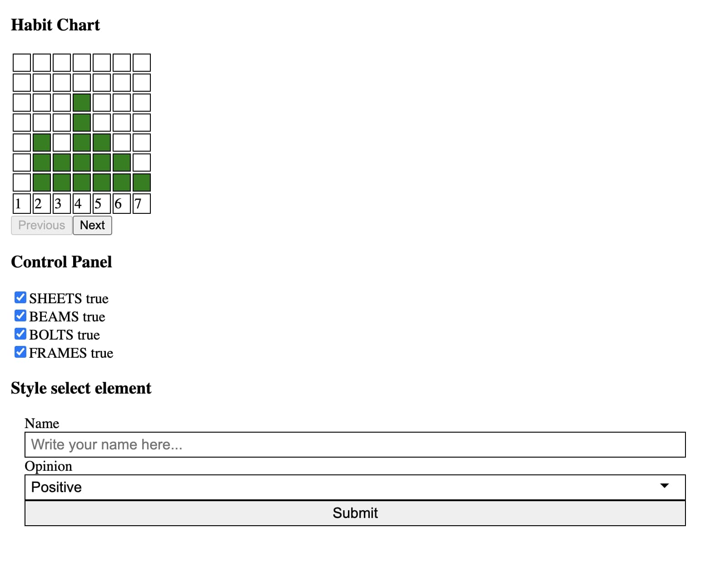

  

  <h1>The Breathe interview test</h1>
  

    It was an interview task and I solved it perfectly. 
  

   
  <h4>
    <a href="https://breathe-test-72f51.web.app/" target="_blank">View the solution</a>
  </h4>
  <h4>
    <a href="https://github.com/kotelesroberto/breathe-test" title="Code"  target="_blank">View code</a>
  </h4>

 

<!-- Table of Contents -->

# :notebook_with_decorative_cover: ToC

- [About the company](#family-about-the-company)
- [About the project](#star2-about-the-project)
  - [Screenshots](#camera-screenshots)
  - [Tech Stack](#space_invader-tech-stack)
  - [Features](#dart-features)
- [License](#warning-license)
- [Contact](#handshake-contact)

<!-- About the company -->

## :family: About the company

<strong>Breathe HR</strong> is a UK-based software provider, founded in 2012, that offers a cloud-native HR management platform designed for small and medium-sized enterprises (up to ~200 employees) .

It has grown to support over 15,000 UK SMEs, managing more than 190,000 users through a successful network of over 250 HR partners .

In 2020, Breathe became part of ELMO Group, aligning itself with other mid-enterprise HR software brands .

<!-- About the project -->

## :star2: About the project

The task was creating a Vite application that has 3 React widgets

<ul align="left">
  <li>Factory supply chain: This component is for marking chain dependancy in the lifecycle of a factory. If a step is not available, any other steps after, related to that step should be disabled.</li>
  <li>Effort chart of the Employee: This component is for showing the activity of the Employee per each day. Tasks done should be marked by green allocated boxes, vertically per each day. The calendar should show 7 days only, user can paginate left or right if there is any rest of data to show.</li>
  <li>Style select element</li>
</ul>

<h4>Technical parameters of the solution:</h4>
  <ul>
    <li>React component classes are called by parameters</li>
    <li>JavaScript ES6 based</li>
    <li>styles are encoded into the JSX files, not in separated CSS files</li>
    <li>NodeJS application</li>
    <li>Uses Firebase</li>
  </ul>

<!-- Screenshots -->

### :camera: Screenshots

 
  <h4>Desktop</h4>
  

<!-- TechStack -->

### :space_invader: Tech Stack

  
Client

  <ul>
    <li><a href="https://jquery.com/"  target="_blank">JQuery</a></li>
    <li><a href="https://developer.mozilla.org/en-US/docs/Web/JavaScript"  target="_blank">JavaScript ES6, Object Oriented</a></li>
    <li><a href="https://www.w3schools.com/html/html5_semantic_elements.asp" target="_blank">Semantic HTML5</a></li>
    <li><a href="https://www.w3schools.com/css/"  target="_blank">CSS3</a></li>
    <li><a href="https://api.jquery.com/jQuery.getJSON/"  target="_blank">AJAX (getJSON)</a></li>

  </ul>

Database

  <ul>
    <li><a href="https://www.json.org/">data stored in an XML/JSON file, loaded from an external provider (https://api.darksky.net/forecast/)</a></li>
  </ul>

DevOps

  <ul>
    <li><a href="https://bitbucket.org/">BitBucket</a></li>
  </ul>

<!-- Features -->

### :dart: Features

- Accessibility level: AA
- Mobile first, full responsive solution
- Fast loading time

<!-- License -->

## :warning: License

Distributed under the Software copyright of Breathe HR. Any non-authorized usage of their code leads to legal consequences, thank you.

<!-- Contact -->

## :handshake: Contact

Breathe HR - [https://www.breathehr.com/en-gb/](https://www.breathehr.com/en-gb/),
