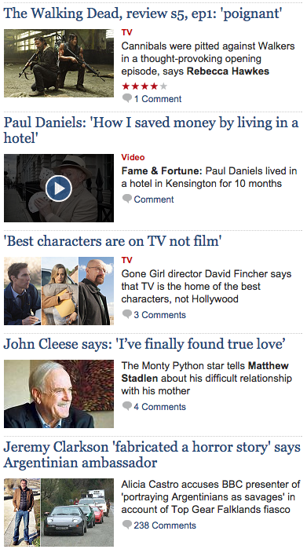
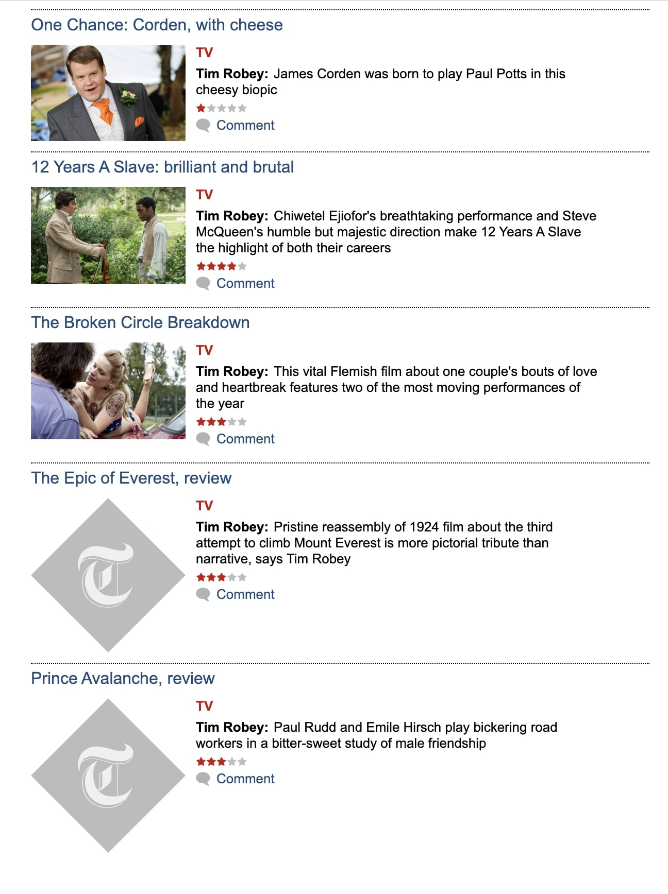
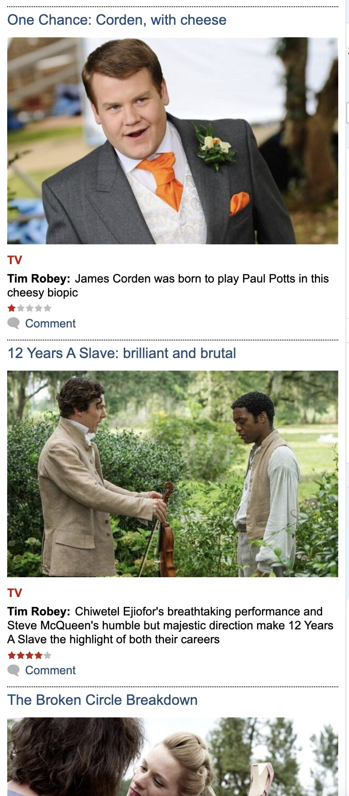

  

  <h1>The Daily Telegraph interview test</h1>
  

    It was an interview task and I solved it perfectly. The task was creating a widget that loads program information into their website.
  

   
  <h4>
    <a href="#" target="_blank">View the solution</a>
  </h4>
  <h4>
    <a href="https://github.com/kotelesroberto/daily-telegraph-test" title="Code"  target="_blank">View code</a>
  </h4>

 

<!-- Table of Contents -->

# :notebook_with_decorative_cover: ToC

- [About the company](#family-about-the-company)
- [About the project](#star2-about-the-project)
  - [Screenshots](#camera-screenshots)
  - [Tech Stack](#space_invader-tech-stack)
  - [Features](#dart-features)
- [License](#warning-license)
- [Contact](#handshake-contact)

<!-- About the company -->

## :family: About the company

<strong>Telegraph Media Group Limited</strong> is a leading British multimedia publisher based in London. Founded in 1948 (with roots dating back to the launch of The Daily Telegraph in 1855), it is a subsidiary of Press Holdings and operates under its parent company, Press Acquisitions Limited 

<!-- About the project -->

## :star2: About the project

<h4>Technical parameters of the solution:</h4>
  <ul>
    <li>content are loaded from external JSON file with asyncronous call</li>
    <li>optimalized loading time</li>
    <li>full responsive</li>
    <li>feature: sort by</li>
    <li>feature: filter</li>
    <li>feature: layout changer</li>
  </ul>

The final webapp was easy-to-access, user-friendly and soooo cool! It was full responsive with mobile-first approach.

<!-- Screenshots -->

### :camera: Screenshots

 
  <h4>Sample</h4>
  

 
  <h4>Desktop</h4>
  

 
  <h4>Mobile</h4>
  

<!-- TechStack -->

### :space_invader: Tech Stack

  
Client

  <ul>
    <li><a href="https://developer.mozilla.org/en-US/docs/Web/JavaScript"  target="_blank">JavaScript ES6, Object Oriented</a></li>
    <li><a href="https://nodejs.org"  target="_blank">NodeJS</a></li>
    <li><a href="https://nodejs.org/api/esm.html"  target="_blank">Node.js Modules</a></li>
    <li><a href="https://www.w3schools.com/html/html5_semantic_elements.asp" target="_blank">Semantic HTML5</a></li>
    <li><a href="https://www.w3schools.com/css/"  target="_blank">CSS3</a></li>
  </ul>

Database

  <ul>
    <li><a href="https://www.json.org/">data stored in an XML/JSON file</a></li>
  </ul>

DevOps

  <ul>
    <li><a href="https://bitbucket.org/">BitBucket</a></li>
  </ul>

<!-- Features -->

### :dart: Features

- Accessibility level: AA
- Mobile first, full responsive solution
- Fast loading time

<!-- License -->

## :warning: License

Distributed under the Software copyright of Telegraph Media Group Limited. Any non-authorized usage of their code leads to legal consequences, thank you.

<!-- Contact -->

## :handshake: Contact

Telegraph Media Group Limited, The Daily Telegraph - [https://www.telegraph.co.uk/](https://www.telegraph.co.uk/), 111 Buckingham Palace Road, London, SW1W 0DT, United Kingdom
