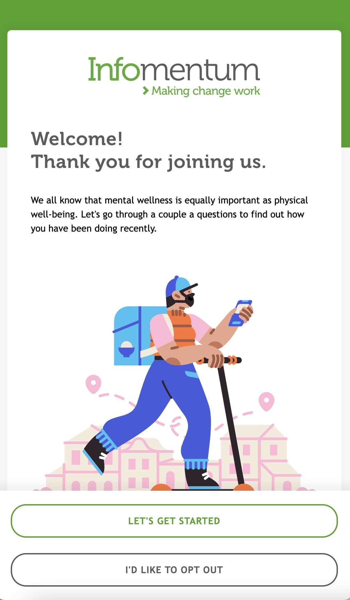
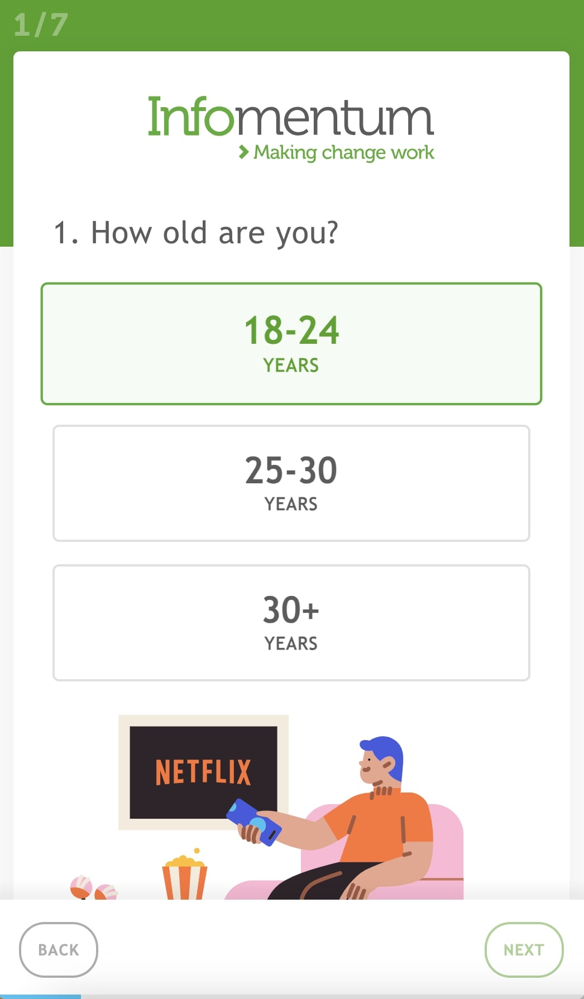
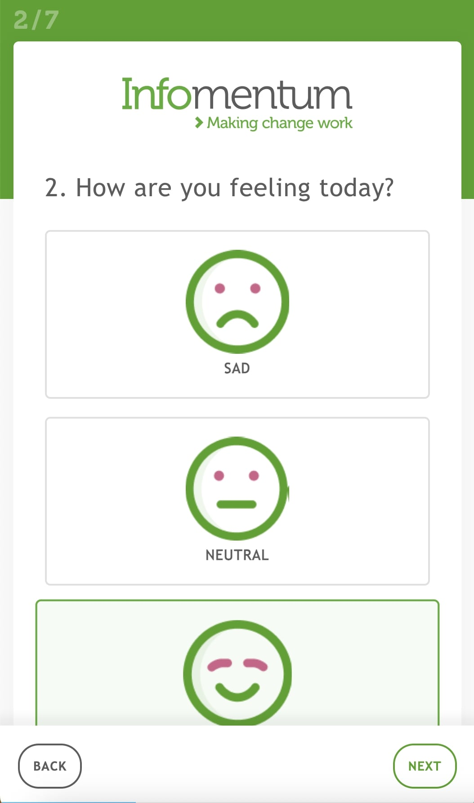
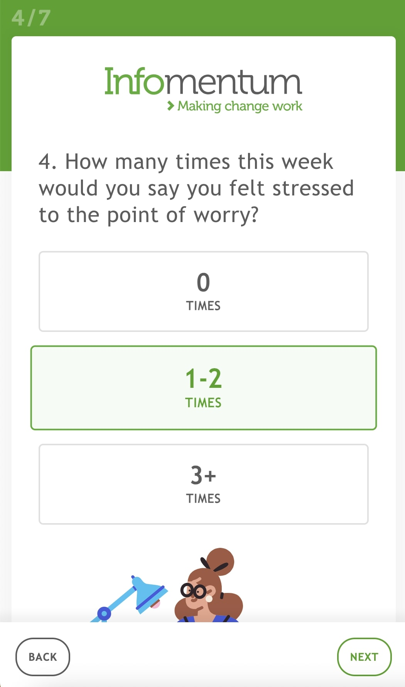
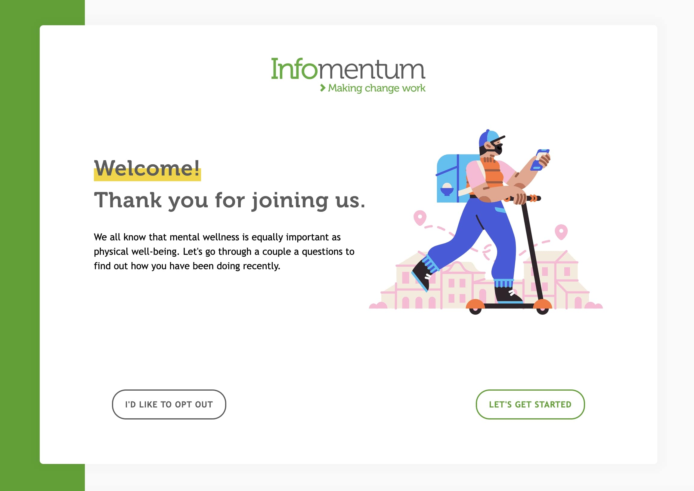
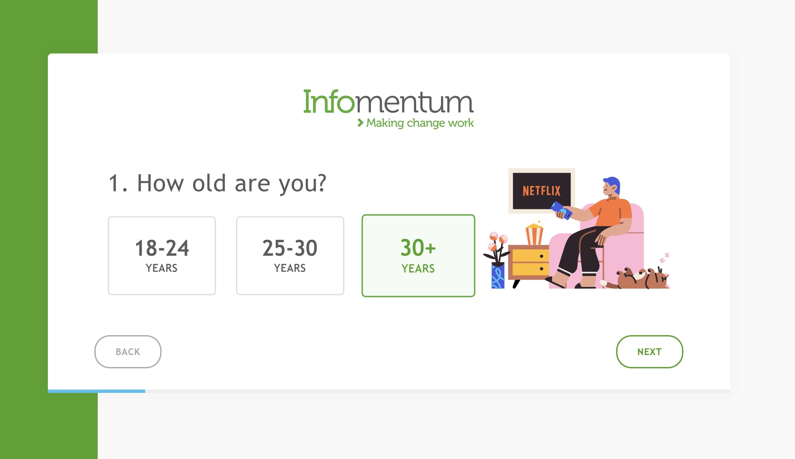
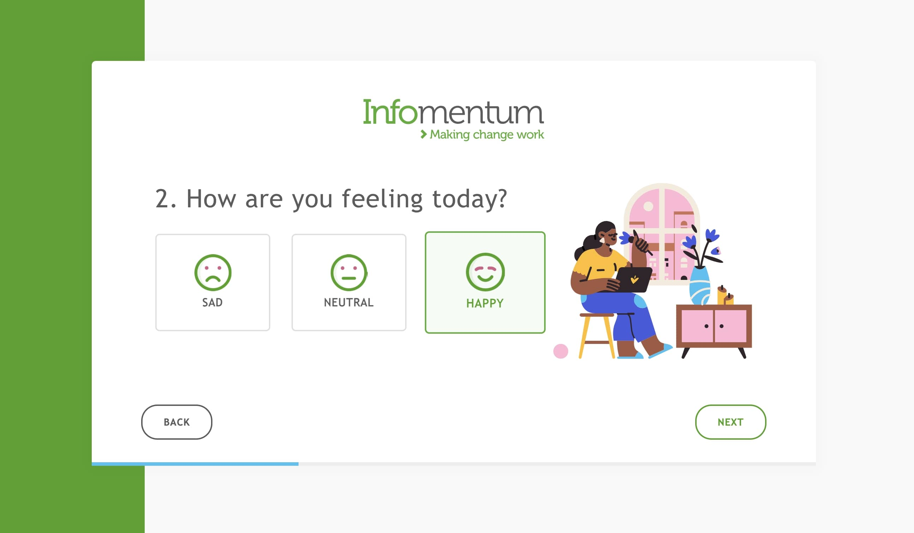
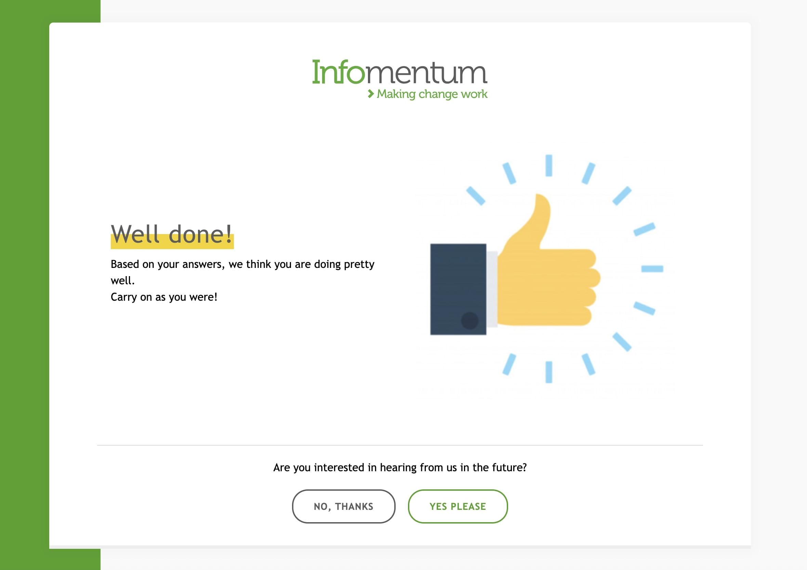

  

  <h1>Infomentum interview test</h1>
  
  

    It was an interview task and I solved it perfectly. After they double-checked my solution, immediatelly offered me the advertised role.
  

  

  The company provided the design in PDF and Figma files, all the font files, and the specifications.
  

  <h4>
    <a href="#" target="_blank">View the solution</a>
  </h4>
  <h4>
    <a href="https://github.com/kotelesroberto/infomentum_test" title="Code"  target="_blank">View code</a>
  </h4>

  <h4>Videos</h4>
<!-- BEGIN YOUTUBE-CARDS -->

  <!-- END YOUTUBE-CARDS -->

 

<!-- Table of Contents -->

# :notebook_with_decorative_cover: ToC

- [About the company](#family-about-the-company)
- [About the project](#star2-about-the-project)
  - [Screenshots](#camera-screenshots)
  - [Tech Stack](#space_invader-tech-stack)
  - [Features](#dart-features)
- [License](#warning-license)
- [Contact](#handshake-contact)

<!-- About the company -->

## :family: About the company

<strong>Infomentum</strong> is a UK-based technology consultancy headquartered in London, founded in 2007, specializing in digital transformation through integration, automation, and information management. Infomentum empowers organizations by integrating systems, automating processes, and fostering digital innovation—delivering tangible business value and scalable efficiency.

<h3>Recognition & Partnerships</h3>
<ul>
  <li>Strategic partners: Salesforce Summit Partner, MuleSoft, Magnolia.</li>
  <li>Certifications: ISO 27001, Cyber Essentials Plus</li>
</ul>

<h3>Proven Impact</h3>
Successful case studies highlight measurable results:
<ul> 
  <li>Humberside Police: 61% reduction in victim inquiry calls through automation.</li>
  <li>Top UK logistics firm: Integration of 100+ legacy systems for enhanced efficiency</li>
</ul>

<!-- About the project -->

## :star2: About the project

<h4>Technical parameters of the solution:</h4>
  <ul>
    <li>Handlebars templating</li>
    <li>element validation: buttons are inactive until all selection is available</li>
    <li>newsletter subscription module</li>
    <li>content are loaded from external JSON file with asyncronous call</li>
    <li>optimalized loading time</li>
    <li>full responsive</li>
    <li>pixel perfect design after given design files</li>
  </ul>

The final webapp was easy-to-access, user-friendly and soooo cool! It was full responsive with mobile-first approach.

<!-- Screenshots -->

### :camera: Screenshots

<h4>Mobile</h4>

 
  

 
  

 
  

 
  

<h4>Desktop</h4>

 
  

 
  

 
  

 
  

<!-- TechStack -->

### :space_invader: Tech Stack

  
Client

  <ul>
    <li><a href="https://developer.mozilla.org/en-US/docs/Web/JavaScript"  target="_blank">JavaScript ES6, Object Oriented</a></li>
    <li><a href="https://www.w3schools.com/html/html5_semantic_elements.asp" target="_blank">Semantic HTML5</a></li>
    <li><a href="https://nodejs.org"  target="_blank">NodeJS</a></li>
    <li><a href="https://nodejs.org/api/esm.html"  target="_blank">Node.js Modules</a></li>
    <li><a href="https://sass-lang.com/"  target="_blank">SASS</a></li>
    <li><a href="https://handlebarsjs.com/"  target="_blank">Handlebars templating</a></li>
  </ul>

Database

  <ul>
    <li><a href="https://www.json.org/">data stored in an XML/JSON file</a></li>
  </ul>

DevOps

  <ul>
    <li><a href="https://bitbucket.org/">BitBucket</a></li>
    <li><a href="https://gulpjs.com/">Gulp</a></li>
  </ul>

<!-- Features -->

### :dart: Features

<ul>
  <li>Content is loaded from local JSON file</li>
  <li>Accessibility level: AA</li>
  <li>Mobile first, full responsive solution</li>
  <li>Fast loading time</li>
</ul>

<!-- License -->

## :warning: License

Distributed under the Software copyright of Infomentum. Any non-authorized usage of their code leads to legal consequences, thank you.

<!-- Contact -->

## :handshake: Contact

Infomentum - [https://www.infomentum.com](https://www.infomentum.com), 4th Floor, 68 King William Street, London, EC4N 7HR, United Kingdom
