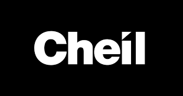
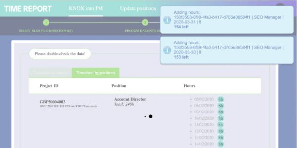

  

  <h1>Cheil UK - KNOX automatic integration into projectmanager.com system (Cheil)</h1>
  

    I worked on this project whilst worked at Cheil UK, London. This company is an internal agency of the Samsung company.
  

   
  <h4>
    <a href="#" target="_blank"><s>View site (strictly for internal use)</s></a>
  </h4>
  <h4>
    <a href="https://www.youtube.com/watch?v=ZxNxO2z3a90" target="_blank"><s>Watch video (for data security reason the video is not available to the public)</s></a>
  </h4>
  <h4>
    <a href="#" title="Sorry, it's company secret"  target="_blank"><s>View code (company secret)</s></a>
  </h4>

 

<!-- Table of Contents -->

# :notebook_with_decorative_cover: ToC

- [About the company](#family-about-the-company)
- [About the project](#star2-about-the-project)
  - [Screenshots](#camera-screenshots)
  - [Tech Stack](#space_invader-tech-stack)
  - [Features](#dart-features)
- [My contribution to the project](#white_check_mark-my-contribution-to-the-project)
- [License](#warning-license)
- [Contact](#handshake-contact)

<!-- About the company -->

## :family: About the company

<strong>Cheil UK</strong> is a London-based integrated marketing and advertising agency, part of the global Cheil Worldwide network (originally founded by Samsung in Korea in 1973). They specialise in crafting connected commerce experiences at the intersection of physical, digital, and immersive brand engagement

<!-- About the project -->

## :star2: About the project

<h4>Features of this project</h4>
  <ul>
    <li>at the time of coding this solution the employee's data was managed in <a href="https://www.samsungknox.com/en/blog/optimizing-technology-to-improve-employee-productivity">Samsung KNOX</a></li>
    <li>secure keys are stored in a PHP variable</li>
    <li>developed on localhost with test data and also in development mode, initially</li>
    <li>install php dependencies with composer</li>
  </ul>

<h4>Technical parameters of this project, developed by me:</h4>
  <ul>
    <li>connecting to S3 bucket (file upload, reading files from and sending files to S3 bucket)</li>
    <li>RESTful API for fetching and pushing the data between the services</li>
    <li>LESS pre-processor</li>
    <li>native JavaScript project</li>
    <li>full responsive</li>
  </ul>

<!-- Screenshots -->

### :camera: Screenshots

 
  

<!-- TechStack -->

### :space_invader: Tech Stack

  
Client

  <ul>
    <li><a href="https://developer.mozilla.org/en-US/docs/Web/JavaScript"  target="_blank">JavaScript</a></li>
    <li><a href="https://jquery.com/"  target="_blank">JQuery</a></li>
    <li><a href="https://handlebarsjs.com/"  target="_blank">Handlebars templating</a></li>
    <li><a href="https://nodejs.org"  target="_blank">NodeJS</a></li>
    <li><a href="https://nodejs.org/api/esm.html"  target="_blank">Node.js Modules</a></li>
    <li><a href="https://browserify.org/"  target="_blank">Browserify</a></li>
    <li><a href="https://lodash.com/"  target="_blank">lodash performance optimalization</a></li>
    <li><a href="https://www.w3schools.com/html/html5_semantic_elements.asp" target="_blank">Semantic HTML5</a></li>
    <li><a href="https://www.w3schools.com/css/"  target="_blank">CSS3</a></li>
  </ul>

  
Backend and storage

  <ul>
    <li><a href="https://www.php.net/"  target="_blank">PhP</a></li>
  </ul>
    <li><a href="https://aws.amazon.com/pm/serv-s3/"  target="_blank">AWS Simple Cloud Storage (S3)</a></li>
    <li><a href="https://api.projectmanager.com/api/v3//"  target="_blank">Projectmanager.com API</a></li>

Database

  <ul>
    <li><a href="https://www.json.org/">data stored in an XML/JSON file</a></li>
    <li><a href="https://www.heroku.com/">HEROKU</a></li>
  </ul>

DevOps

  <ul>
    <li><a href="https://bitbucket.org/">BitBucket</a></li>
    <li><a href="https://www.jslint.com/">JS Lint</a></li>
    <li><a href="https://www.postman.com/">PostMan</a></li>
    <li><a href="https://gulpjs.com/">Gulp</a></li>
  </ul>

<!-- Features -->

### :dart: Features

- Accessibility level: AA
- Mobile first, full responsive solution
- Fast loading time
- Cached content and images

<!-- My contribution to the project -->

## :white_check_mark: My contribution to the project

This entire project belonged to me, from the beginning until the end of it.

<!-- License -->

## :warning: License

Distributed under the Software copyright of Cheil UK. Any non-authorized usage of their code leads to legal consequences, thank you.

<!-- Contact -->

## :handshake: Contact

Cheil UK -
[https://cheil.uk/](https://cheil.uk/), London Office: 10 Queen Street Place, London, EC4R 1BE
