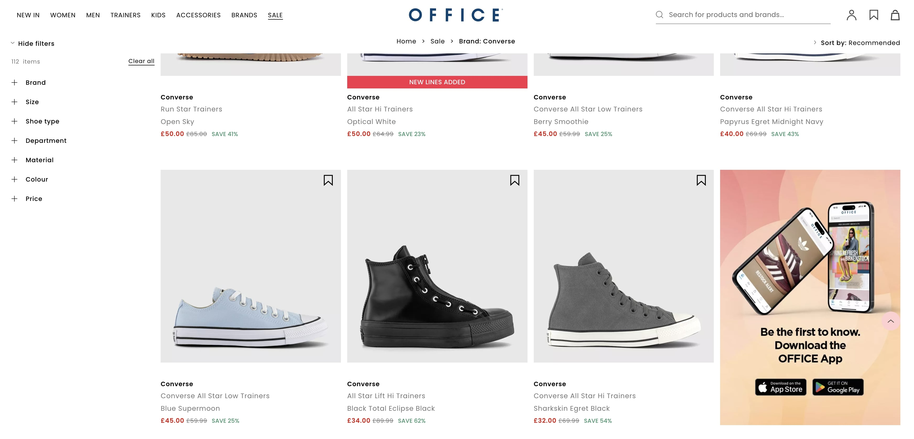
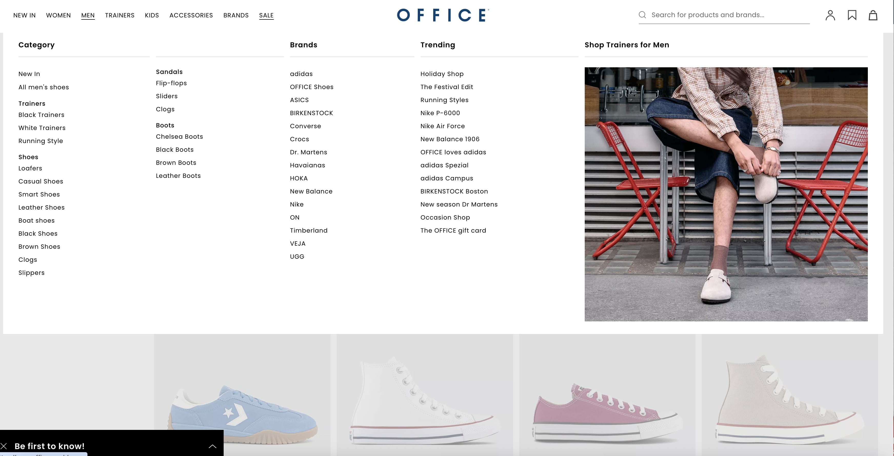
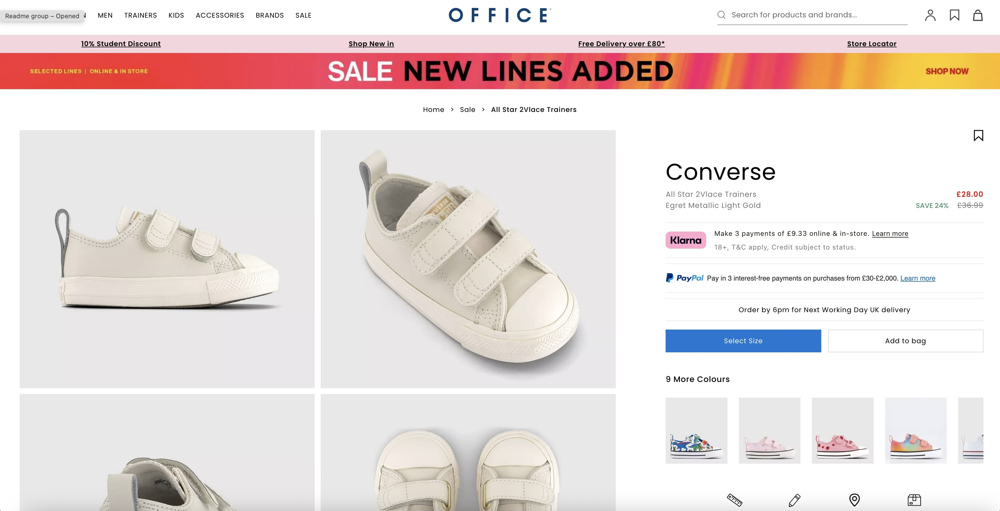
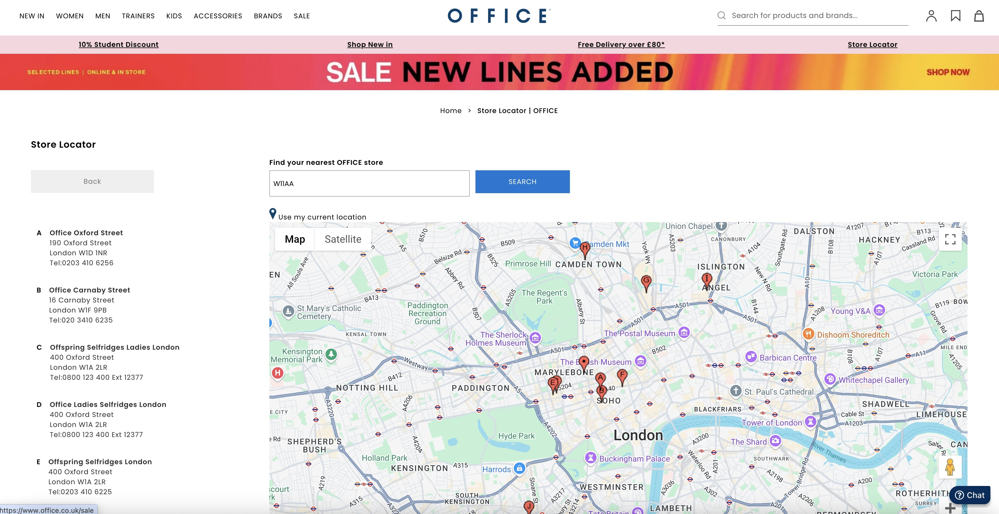
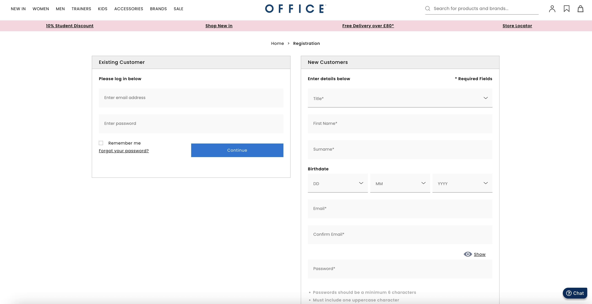

<!--
Hey, thanks for using the awesome-readme-template template.
If you have any enhancements, then fork this project and create a pull request
or just open an issue with the label "enhancement".

Don't forget to give this project a star for additional support ;)
Maybe you can mention me or this repo in the acknowledgements too
-->

  
   
   
  <h1>Office shoes (KPS)</h1>
  
  

    I worked on this project whilst worked as a freelancer for KPS, London. Way of working at this company was <strong>remote</strong>.
  

   
  <h4>
    <a href="https://www.office.co.uk/" target="_blank">View site</a>
  </h4>
  <h4>
    <a href="#" title="Sorry, it's company secret"  target="_blank"><s>View code (company secret)</s></a>
  </h4>

 

<!-- Table of Contents -->

# :notebook_with_decorative_cover: ToC

- [About the company](#family-about-the-company)
- [About the project](#star2-about-the-project)
  - [Screenshots](#camera-screenshots)
  - [Tech Stack](#space_invader-tech-stack)
- [My contribution to the project](#white_check_mark-my-contribution-to-the-project)
- [License](#warning-license)
- [Contact](#handshake-contact)

<!-- About the company -->

## :family: About the company

<The><strong>KPS</strong> is a leading digital transformation consultancy, established in <em>2000 (Germany)</em>, with a UK presence headquartered in Wimbledon, London. It operates across Europe—UK, DACH, Benelux, Nordics—and beyond. The company delivers agile, end-to-end digital solutions—from strategy and customer experience to enterprise processes—using a fixed-price, ready-to-deploy model. With deep industry expertise and a proven rapid delivery methodology, they help businesses accelerate transformation, enhance customer engagement, and integrate best-in-class platforms.

  <h3>Instant Transformation</h3>
  <ul>
    <li><strong>Pre‑packaged & Customisable Solutions:</strong> Ready-to-use digital platforms delivered at fixed price, tailored to brand needs.</li>
    <li><strong>Rapid Impact:</strong> Designed for immediate effectiveness—secure, fast, and cost-transparent.</li>
  </ul>

  <h3>End‑to‑End Digital Capabilities</h3>
  <ul>
    <li><strong>Digital Strategy:</strong> Competitive positioning and future-ready business models.</li>
    <li><strong>Customer Interaction:</strong> CX, e‑commerce, CRM, personalisation, composable commerce.</li>
    <li><strong>Digital Enterprise:</strong> ERP, supply chain, finance, process automation, enterprise systems.</li>
  </ul>
  
All underpinned by integration platforms like SAP, Salesforce, Mirakl, Bloomreach, and others.

  <h3>Industry Focus & Expertise</h3>
  <ul>
    <li>Retail & Consumer Goods (e.g., Harrods, Superdrug, Brakes, The Body Shop).</li>
    <li>Manufacturing, FMCG, Wholesale & B2B sectors.</li>
    <li>Expertise in SAP S/4HANA implementations and composable commerce.</li>
  </ul>

  <h3>Credentials & Results</h3>
  <ul>
    <li>Completed 370+ projects over 20+ years, employing ~1,200 consultants with €180 million annual turnover.</li>
    <li>Recognised for excellence: UK Digital Growth Awards, Retail Systems Awards, SAP Pinnacle Award, etc.</li>
    <li>Renowned for rapid transformation: proprietary methodology “Instant Transformation” / “Rapid Transformation”.</li>
  </ul>

  <h3>Locations & Reach</h3>
  <ul>
    <li>UK HQ in Wimbledon, London</li>
    <li>European offices in Germany, Austria, Belgium, Netherlands, Denmark, Sweden, Switzerland, Spain.</li>
  </ul>

<!-- About the project -->

## :star2: About the project

The website is an eCommerce webshop where visitors can create own profile and can buy shoes. There is an amazing variation of shoes on the webpage, in different colours and sizes.

The website is full repsonsive, fully optimized solution with WCAG AA level of accessibility.

<!-- Screenshots -->

### :camera: Screenshots

 
  

 
  

 
  

 
  

 
  

<!-- TechStack -->

### :space_invader: Tech Stack

<a href="https://builtwith.com/?https%3a%2f%2fwww.office.co.uk%2f">Full list of used technologies</a>

  
Client

  <ul>
    <li><a href="https://developer.mozilla.org/en-US/docs/Web/JavaScript"  target="_blank">JavaScript</a></li>
    <li><a href="https://www.npmjs.com/"  target="_blank">NPM packages</a></li>
    <li><a href="https://www.w3schools.com/html/html5_semantic_elements.asp" target="_blank">Semantic HTML5</a></li>
    <li><a href="https://www.w3schools.com/css/"  target="_blank">CSS3</a></li>
    <li><a href="https://sass-lang.com/"  target="_blank">SASS</a></li>
    <li><a href="https://jquery.com/"  target="_blank">JQuery</a></li>
    <li><a href="https://handlebarsjs.com/"  target="_blank">Handlebars templating</a></li>
    <li><a href="https://www.thelightbox.org.uk/"  target="_blank">Lightbox</a></li>
  </ul>

Hosting

  <ul>
    <li><a href="https://aws.amazon.com/">AWS</a></li>
    <li><a href="https://aws.amazon.com/ses/">Amazon SES</a></li>
    <li><a href="https://www.akamai.com/solutions/cloud-computing">Akamai cloud computing</a></li>
  </ul>

DevOps

  <ul>
    <li><a href="https://bitbucket.org/">BitBucket</a></li>
    <li><a href="https://www.docker.com/">Docker</a></li>
    <li><a href="https://www.jenkins.io/">Jenkins</a></li>
    <li><a href="https://www.jslint.com/">JS Lint</a></li>
    <li><a href="https://github.com/features/actions">GitHub Actions</a></li>
    <li><a href="https://docs.github.com/en/actions/writing-workflows/about-workflows">GitHub Workflow</a></li>
    <li><a href="https://www.bazaarvoice.com/">BazaarVoice</a></li>
    <li><a href="https://tagmanager.google.com/">Google Analytics</a></li>
    <li><a href="https://tagmanager.google.com/">Google Tag Manager</a></li>
    <li><a href="https://www.browserstack.com/">BrowserStack</a></li>
  </ul>

<!-- My contribution to the project -->

## :white_check_mark: My contribution to the project

I joined as a freelancer to the KPS development team and in the first few days I had to pick up the in-house way of working and got to know the structure of the project.

I had to write codes to show up products on the product listing pages, also the image galleries.

My task was making the website full responsive and mobile-first. It was quite time-consuming as many small mistakes I've found in the stylesheets and I have created a logical, dynamic style-system that generates the perfect layout for all screen sizes.

<!-- License -->

## :warning: License

Distributed under the Software copyright of KPS and OFFICE. Any non-authorized usage of their code leads to legal consequences, thank you.

<!-- Contact -->

## :handshake: Contact

KPS -
[https://kps.com/uk/en.html](https://kps.com/uk/en.html)
