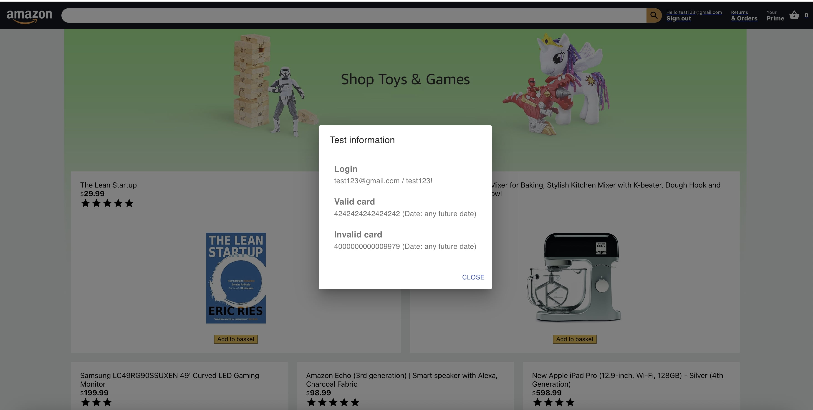
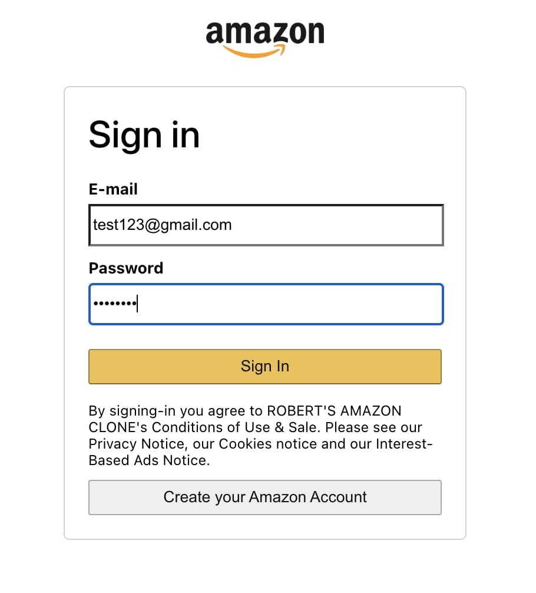
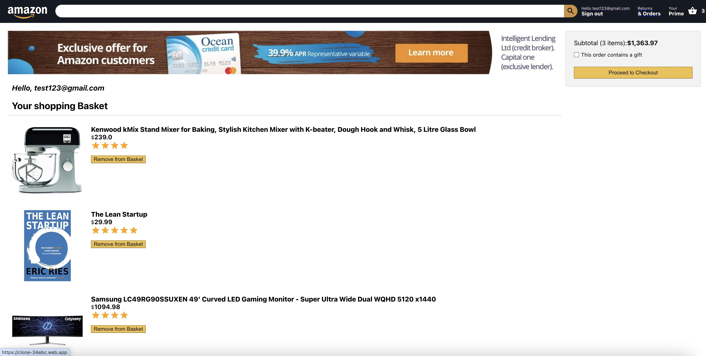
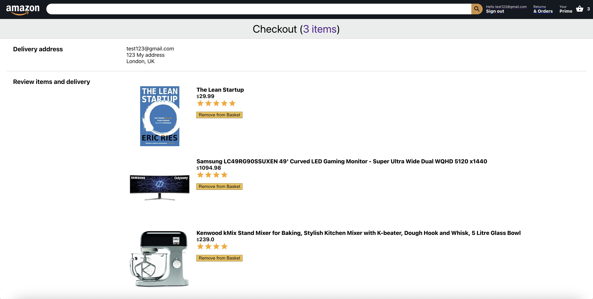
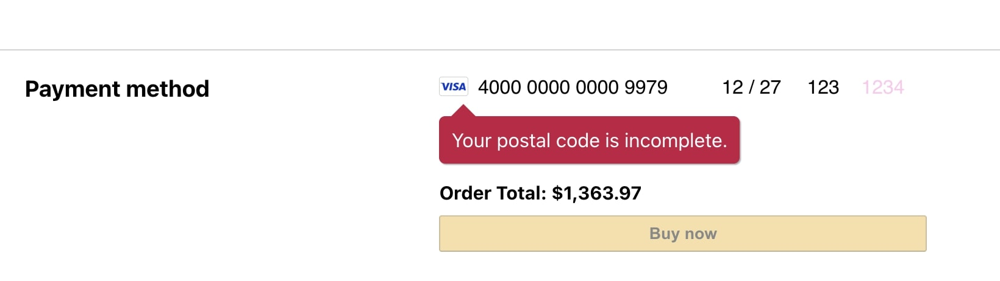
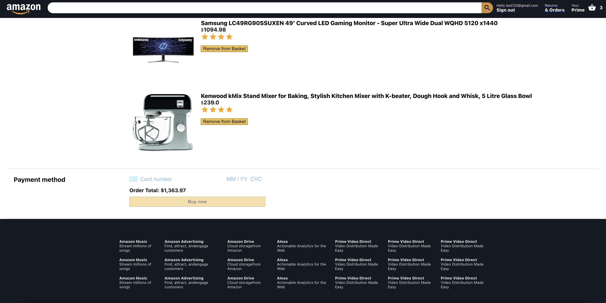

  

 

  <h1>Amazon with React JS (Firebase + Styled Components + Redux) (private project)</h1>

  <h4>
    <a href="https://clone-34ebc.web.app/" target="_blank">View demo</a>
  </h4>
  
  <h4>
    <a href="https://github.com/kotelesroberto/amazon-clone" title="Code"  target="_blank">View code</a>
  </h4>

  <!-- BEGIN YOUTUBE-CARDS -->

  <!-- END YOUTUBE-CARDS -->

 

<!-- Table of Contents -->

# :notebook_with_decorative_cover: ToC

- [About the project](#star2-about-the-project)
  - [Screenshots](#camera-screenshots)
  - [Tech Stack](#space_invader-tech-stack)
  - [Features](#dart-features)
- [License](#warning-license)

<!-- About the project -->

## :star2: About the project

The idea was creating a standalone ReactJS application from scratch in my spare time. I guess everyone knows Amazon, that's why I decided to create it on my own. It was my very first private ReactJS project and was an excellent opportunity to learn!

  <i>
    This is a private project, just for fun. Created this project for the reason of learning, training and self-entertainment. I have learned many tiny coding tricks during this coding task and also discovered new modules and services. Private projects are always good for refresh your developer knowledge and get the bigger picture about what's going on around the IT world.
    </i>
  

The final webapp was easy-to-access, user-friendly and soooo cool! It was full responsive with mobile-first approach.

<!-- Screenshots -->

### :camera: Screenshots

 
  

 
  

 
  

 
  

 
  

 
  

<!-- TechStack -->

### :space_invader: Tech Stack

  
Client

  <ul>
    <li><a href="https://react.dev/">React</a></li>
    <li><a href="https://www.react-spring.dev/"  target="_blank"> React spring</a></li>
    <li><a href="https://react-redux.js.org/">React Redux</a></li>
    <li><a href="https://react.dev/learn/managing-state">State management</a></li>
    <li><a href="https://developer.mozilla.org/en-US/docs/Web/JavaScript"  target="_blank">JavaScript ES7</a></li>
    <li><a href="https://www.w3schools.com/html/html5_semantic_elements.asp" target="_blank">Semantic HTML5</a></li>
    <li><a href="https://www.w3schools.com/css/css_intro.asp"  target="_blank">CSS</a></li>
    <li><a href="https://axios-http.com/docs/intro"  target="_blank">Axios</a></li>
    <li><a href="https://mui.com/material-ui/"  target="_blank">Material UI</a></li>
    <li><a href="https://stripe.com/"  target="_blank">Stripe</a></li>

  </ul>

Database and store

  <ul>
    <li><a href="https://firebase.google.com/">Firebase</a></li>
  </ul>

DevOps

  <ul>
    <li><a href="https://expressjs.com/">Express JS</a></li>
    <li><a href="https://github.com/">GitHub</a></li>
    <li><a href="https://www.jslint.com/">JS Lint</a></li>
    <li><a href="https://www.npmjs.com/">NPM JS</a></li>
  </ul>

<!-- Features -->

### :dart: Features

<u>On this demo site you can use many features, for instance:</u>

<ul>
  <li>Homepage
    <ul>
      <li>product listing</li>
      <li>add to basket function</li>
    </ul>
  </li>
  <li>Basket page (checkout)
    <ul>
      <li>remove from basket function</li>
      <li>checkout</li>
    </ul>
  </li>
  
  <li>Login / logout: using Firebase</li>
</ul>

<!-- License -->

## :warning: License

Distributed under the MTI copyright. I don't mind if you use this code for educational purposes. Cheers!
