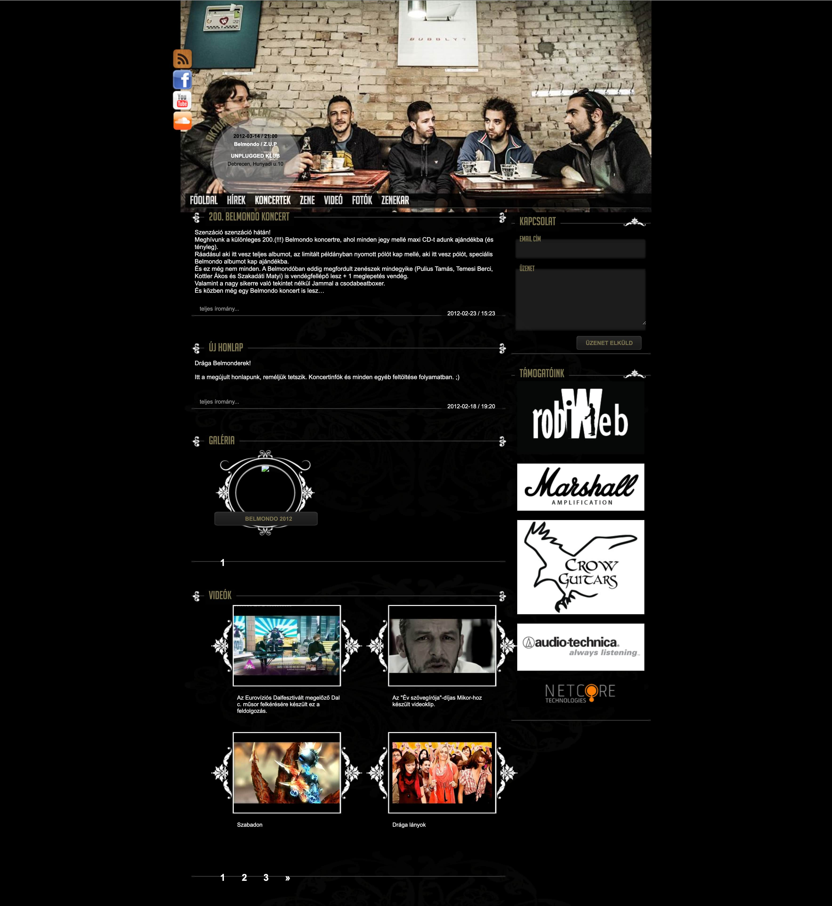
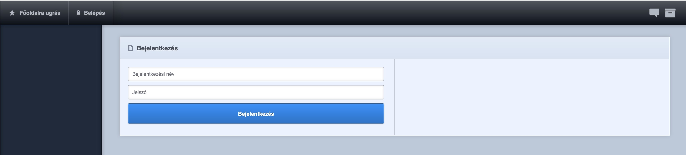
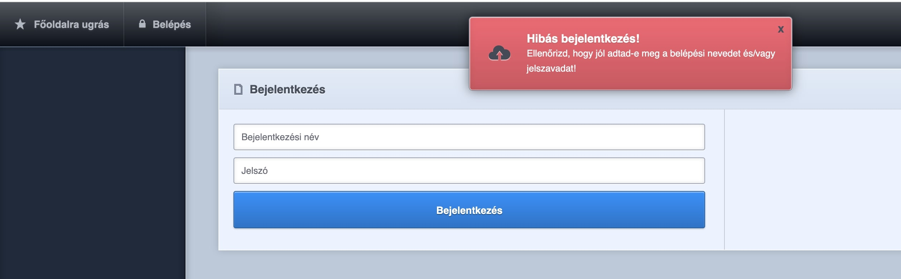
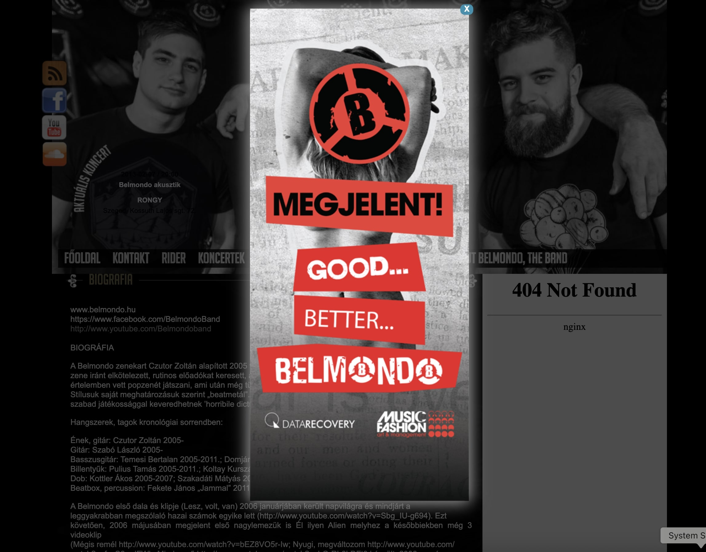

  

 

  <h1>Official band page of the BELMONDO pop band(2012)</h1>
  
  <h4>
    <a href="https://web.archive.org/web/20120801000000*/https://belmondo.hu/" target="_blank">View site</a>
  </h4>
  
  <h4>
    <a href="#" title="Private code"  target="_blank"><u>View code (private)</u></a>
  </h4>

 

<!-- Table of Contents -->

# :notebook_with_decorative_cover: ToC

- [About the project](#star2-about-the-project)
  - [Screenshots](#camera-screenshots)
  - [Tech Stack](#space_invader-tech-stack)
  - [Features](#dart-features)
- [License](#warning-license)

<!-- About the project -->

## :star2: About the project

The project was creating a PHP-based website for the band with interactive gig information system, email reminders, galleries and band infos. The website has a client and an admin site. The whole system is my own development, I mean also the supporting CMS system that is also written in PHP.

  <h3>Features of the frontend:</h3>
  <ul>
    <li>Make booking for a specific date range</li>
    <li>automatic price information</li>
  </ul>

  <h3>Features of the administrational area:</h3>
  <ul>
    <li>User management</li>
    <li>Concert management</li>
    <li>Email management, newsletters</li>
    <li>Dynamic content management: create/edit/delete contents and pages</li>
    <li>Assets management for the galleries</li>
  </ul>

<!-- Screenshots -->

### :camera: Screenshots

 
  

 
  

 
  

 
  

<!-- TechStack -->

### :space_invader: Tech Stack

  
Client

  <ul>
    <li><a href="https://developer.mozilla.org/en-US/docs/Web/JavaScript"  target="_blank">JavaScript ES5</a></li>
    <li><a href="https://www.w3schools.com/html/html5_semantic_elements.asp" target="_blank">Semantic HTML5</a></li>
    <li><a href="https://www.w3schools.com/css/css_intro.asp"  target="_blank">CSS</a></li>
    <li><a href="https://developers.google.com/maps"  target="_blank">Google Maps API</a></li>
    <li><a href="https://developers.facebook.com/"  target="_blank">Facebook DEV API</a></li>
  </ul>

  
Backend

  <ul>
    <li><a href="https://www.php.net/"  target="_blank">PHP</a></li>
    <li><a href="https://developer.mozilla.org/en-US/docs/Web/XML/Guides/XML_introduction"  target="_blank">XML</a></li>
  </ul>

Database and store

  <ul>
    <li><a href="">MySQL</a></li>
  </ul>

DevOps

  <ul>
    <li><a href="https://github.com/">GitHub</a></li>
  </ul>

<!-- Features -->

### :dart: Features

<u>On this webpage the following pages and features are available:</u>

<ul>
  <li>Cookie management</li>
  <li>
  Homepage
    <ul>
      <li>contact us module</li>
      <li>dynamic teaser: videos</li>
      <li>dynamic teaser: gallery</li>
      <li>dynamic teaser: news</li>
      <li>header / footer / main menu</li>
    </ul>
  </li>
  <li>Contact us page</li>
  <li>Rider</li>
  <li>Gigs</li>
  <li>News</li>
  <li>Assets and documents for the media and press</li>
  <li>Lyrics</li>
  <li>About the band</li>
  <li>Contact us</li>
</ul>

<!-- License -->

## :warning: License

Distributed under the copyright of Belmondo. Replicating the code is strictly prohibited! Cheers!
