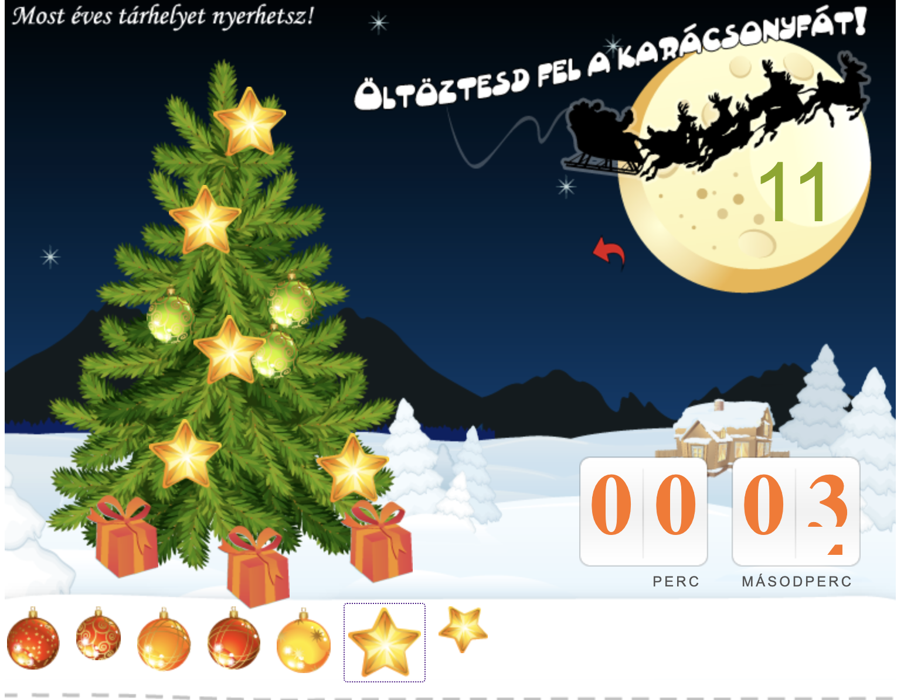

  

 

  <h1>Christmas game for Facebook</h1>
  
  <h4>
    <a href="#" target="_blank"><s>View demo</s></a>
  </h4>
  
  <h4>
    <a href="https://github.com/kotelesroberto/fiberhost_christmas" title="Code"  target="_blank">View code</a>
  </h4>

 

<!-- Table of Contents -->

# :notebook_with_decorative_cover: ToC

- [About the project](#star2-about-the-project)
  - [Screenshots](#camera-screenshots)
  - [Tech Stack](#space_invader-tech-stack)
  - [Features](#dart-features)
- [License](#warning-license)

<!-- About the project -->

## :star2: About the project

This game was developed as a Facebook application. Users could decorate a christmas tree and when time is up, the canvas was snapshotted into a single image and saved into a folder on the server and also (with the user's permission) it was posted on their Facebook wall.

<!-- Screenshots -->

### :camera: Screenshots

 
  

 
  

 
  

 
  

 
  

 
  

 
  

 
  

<!-- TechStack -->

### :space_invader: Tech Stack

  
Client

  <ul>
    <li><a href="https://developer.mozilla.org/en-US/docs/Web/JavaScript"  target="_blank">JavaScript ES5</a></li>
    <li><a href="https://jquery.com/"  target="_blank">JQuery</a></li>
    <li><a href="https://www.w3schools.com/html/html5_semantic_elements.asp" target="_blank">Semantic HTML5</a></li>
    <li><a href="https://www.w3schools.com/css/css_intro.asp"  target="_blank">CSS</a></li>
  </ul>

  
Backend

  <ul>
    <li><a href="https://www.php.net/"  target="_blank">PHP</a></li>
    <li><a href="https://developer.mozilla.org/en-US/docs/Web/XML/Guides/XML_introduction"  target="_blank">XML</a></li>
    <li><a href="https://developers.facebook.com/"  target="_blank">Facebook Developer APIs</a></li>

  </ul>

Database and store

  <ul>
    <li><a href="https://www.mysql.com/">MySQL</a></li>
    <li><a href="https://www.phpmyadmin.net/">PHPMyAdmin</a></li>
  </ul>

DevOps

  <ul>
    <li><a href="https://github.com/">GitHub</a></li>
  </ul>

<!-- Features -->

### :dart: Features

<ul>
  <li>Permission popup window</li>
  <li>Play game</li>
  <li>When time is up: share the result on the Facebook wall</li>
  <li>Restart game</li>
</ul>

<!-- License -->

## :warning: License

Distributed under the Private Copyright. Any distribution or copy the code or rany part of the webpage without our consent is strictly illegal.
