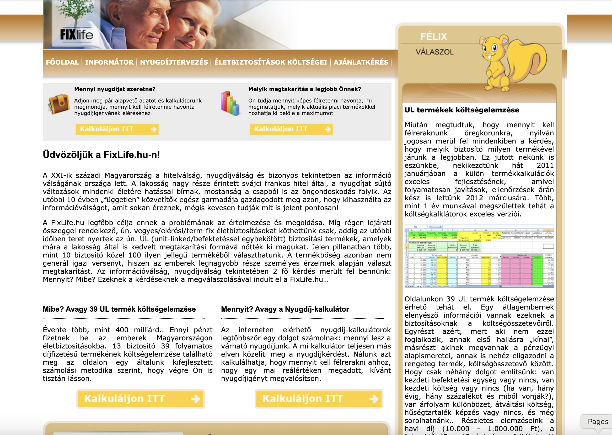
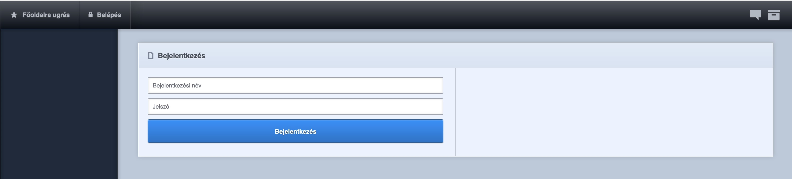
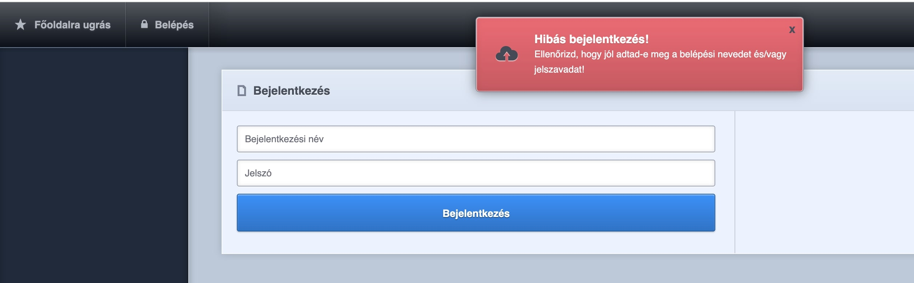
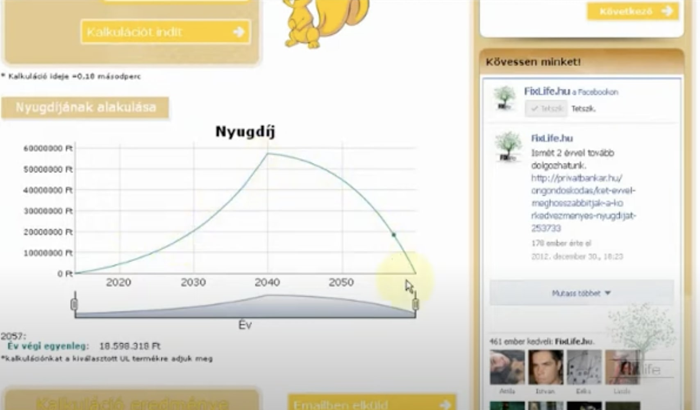
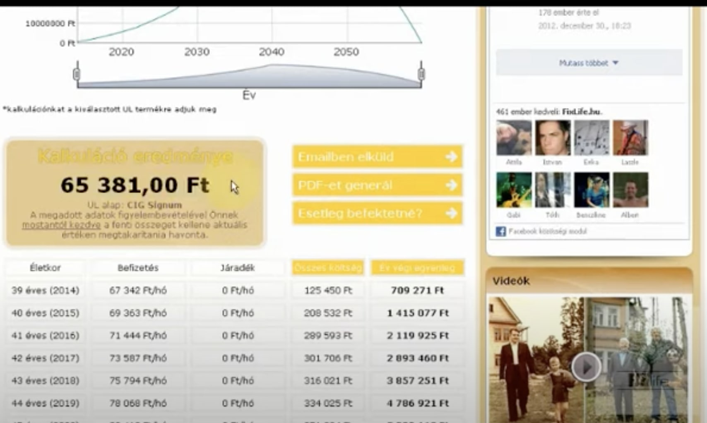
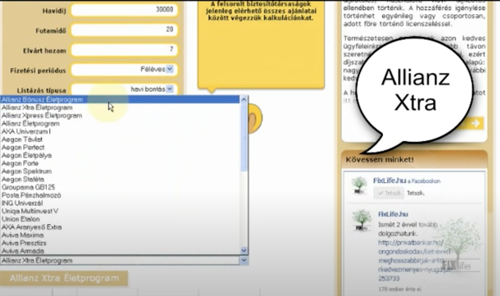
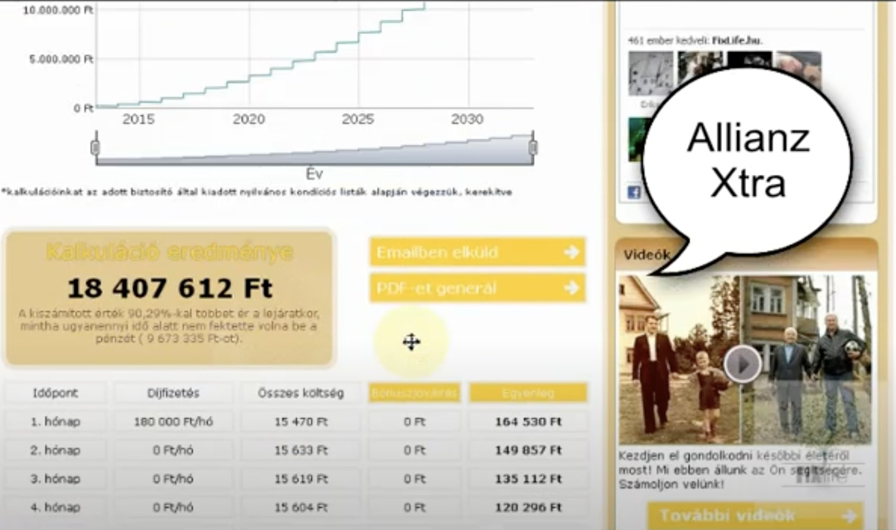
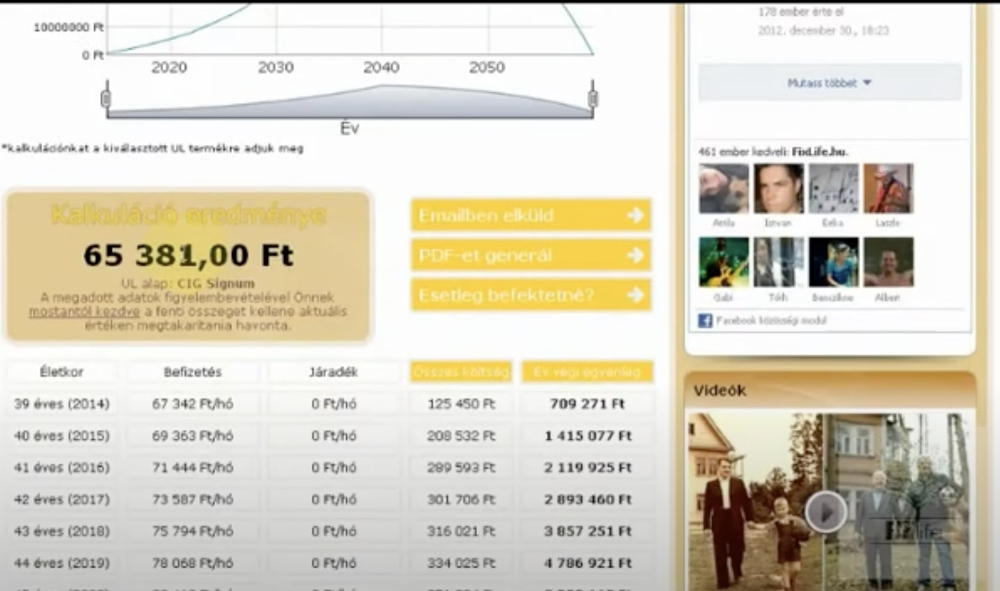

  

 

  <h1>FixLife - pension and investment calculator and forecaster (2012)</h1>
  
  <h4>
    <a href="https://web.archive.org/web/20120627050122/http://fixlife.hu/" target="_blank">View demo on WebArchive</a>
  </h4>
  
  <h4>
    <a href="#" title="Code"  target="_blank"><s>View code (PRIVATE)</s></a>
  </h4>
  
  <h4>
    <a href="https://www.youtube.com/@hufixlife5719" title="Youtube"  target="_blank">Youtube channel</a>
  </h4>

<!-- BEGIN YOUTUBE-CARDS -->

  <!-- END YOUTUBE-CARDS -->

 

<!-- Table of Contents -->

# :notebook_with_decorative_cover: ToC

- [About the project](#star2-about-the-project)
  - [Screenshots](#camera-screenshots)
  - [Tech Stack](#space_invader-tech-stack)
  - [Features](#dart-features)
- [License](#warning-license)

<!-- About the project -->

## :star2: About the project

In 2012 me and a friend of mine found an opportunity on the insurance market. Many investment plans and pension schemas were available on the market but there was not any comaprison tool to help the customers. We decided to create a wesbite that is easy-to-use and compares the available packages on the insurance / investment market. After giving some basic data such as age, investment capital, pension age limit, etc. the webapp calculated the fees and the values of the invested amount of money for the future, on monthly basis. I created the website from scratch on PHP base and also reated the business logic, that worked perfectly with the insurance products (yes, I've got academic degree of Math). After having the math formulas it was quite easy to deliver the solution that had not just an easy-to-read table format but also an inteactive chart and graph.
With the final calculation it was easy to see which insurance product is the best within the range of the investment plan.

<u>With the website the user could:</u>

<ul>
  <li>register / login / logout</li>
  <li>subscribe for a plan</li>
  <li>manage their account</li>
  <li>calculate their private pension</li>
  <li>compare the actual investment offers on the market</li>
  <li>modify investment contract</li>
  <li>manage intervention</li>
</ul>

<strong>For the calculations we used ALL products of the following insurance companies:</strong>

<ul id="triple">
<li><a href="http://www.biztositasifeltetelek.hu/tarsasagok_aegon.htm" target="_blank">Aegon</a></li>
<li><a href="http://www.biztositasifeltetelek.hu/tarsasagok_allianz.htm" target="_blank">Allianz</a></li>
<li><a href="http://www.biztositasifeltetelek.hu/tarsasagok_aviva.htm" target="_blank">AVIVA/MetLife</a></li>
<li><a href="http://www.biztositasifeltetelek.hu/tarsasagok_axa.htm" target="_blank">AXA</a></li>
<li><a href="http://www.biztositasifeltetelek.hu/tarsasagok_groupama_garancia.htm" target="_blank">Groupama Garancia</a></li>
<li><a href="http://www.biztositasifeltetelek.hu/tarsasagok_ing.htm" target="_blank">ING</a></li>
<li><a href="http://www.biztositasifeltetelek.hu/tarsasagok_generali_providencia.htm" target="_blank">Generali-Providencia</a></li>
<li><a href="http://www.biztositasifeltetelek.hu/tarsasagok_kandh.htm" target="_blank">K&amp;H</a></li>
<li><a href="http://www.biztositasifeltetelek.hu/tarsasagok_posta.htm" target="_blank">Posta</a></li>
<li><a href="http://www.biztositasifeltetelek.hu/tarsasagok_cig.htm" target="_blank">CIG Pannónia</a></li>
<li><a href="http://www.biztositasifeltetelek.hu/tarsasagok_signal.htm" target="_blank">Signal</a></li>
<li><a href="http://www.biztositasifeltetelek.hu/tarsasagok_union.htm" target="_blank">Union</a></li>
<li><a href="http://www.biztositasifeltetelek.hu/tarsasagok_uniqa.htm" target="_blank">Uniqa</a></li>
</ul>

<!-- Screenshots -->

### :camera: Screenshots

 
  

 
  

 
  

 
  

 
  

 
  

 
  

 
  

 
  

<!-- TechStack -->

### :space_invader: Tech Stack

  
Client

  <ul>
    <li><a href="https://developer.mozilla.org/en-US/docs/Web/JavaScript"  target="_blank">JavaScript ES5</a></li>
    <li><a href="https://www.w3schools.com/html/html5_semantic_elements.asp" target="_blank">Semantic HTML5</a></li>
    <li><a href="https://www.w3schools.com/css/css_intro.asp"  target="_blank">CSS</a></li>
  </ul>

  
Backend

  <ul>
    <li><a href="https://www.php.net/"  target="_blank">PHP</a></li>
    <li><a href="https://developer.mozilla.org/en-US/docs/Web/XML/Guides/XML_introduction"  target="_blank">XML</a></li>
  </ul>

Database and store

  <ul>
    <li><a href="">MySQL</a></li>
  </ul>

DevOps

  <ul>
    <li><a href="https://github.com/">GitHub</a></li>
  </ul>

<!-- Features -->

### :dart: Features

<u>On this website you can use many features, for instance:</u>

<ul>
  <li>Homapage
    <ul>
      <li>Latest news and summary</li>
      <li>Social connections</li>
      <li>Latest videos gallery</li>
      <li>Latest images gallery</li>
      <li>Header / Footer / Main navigation</li>
    </ul>
  </li>
  <li>Insurance calculator page</li>
  <li>Pension investment comparison tool</li>
  <li>About us</li>
  <li>Contact us</li>
  <li>T&Cs</li>
  <li>Cookie information</li>
  <li>Login / register</li>
</ul>

<!-- License -->

## :warning: License

Distributed under the Private Copyright. Any distribution or copy the code or rany part of the webpage without our consent is strictly illegal.
