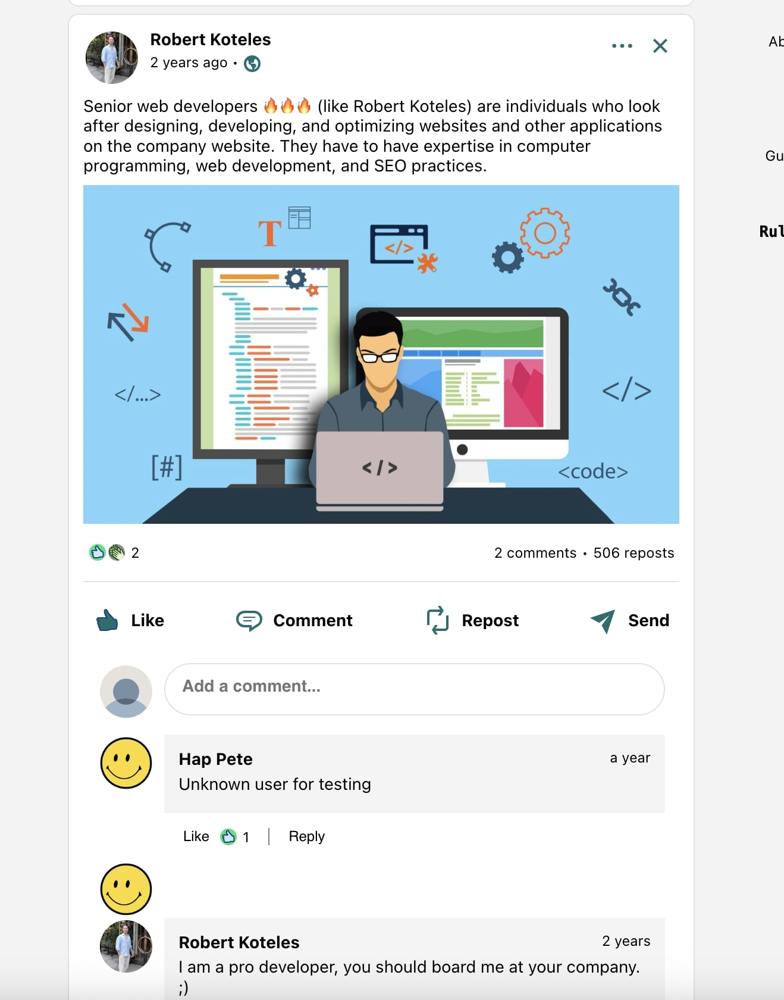

  

 

  

 

  <h1>LinkedIn with React JS (Firebase + Styled Components + Redux) (private project)</h1>

The idea was creating a standalone ReactJS application from scratch in my spare time. As I use the LinkedIn quite often it was evident that the LinkedIn will be something I wanna build by myself, with a lot of real, fully working functions.

    This is a private project, just for fun. Created this project for the reason of learning, training and self-entertainment. I have learned many tiny coding tricks during this coding task and also discovered new modules and services. Private projects are always good for refresh your developer knowledge and get the bigger picture about what's going on around the IT world.
  

   
  <h4>
    <a href="https://rulex-f553b.web.app" target="_blank">View demo</a>
  </h4>
  
  <h4>
    <a href="https://github.com/kotelesroberto/linkedin-clone" title="Code"  target="_blank">View code</a>
  </h4>

 

<!-- Table of Contents -->

# :notebook_with_decorative_cover: ToC

- [About the project](#star2-about-the-project)
  - [Screenshots](#camera-screenshots)
  - [Tech Stack](#space_invader-tech-stack)
  - [Features](#dart-features)
- [License](#warning-license)

<!-- About the project -->

## :star2: About the project

<h4>Features of this project</h4>
  <ul>
    <li>at the time of coding this solution the employee's data was managed in <a href="https://www.samsungknox.com/en/blog/optimizing-technology-to-improve-employee-productivity">Samsung KNOX</a></li>
    <li>project managers needed a transparent, quick and effective automatic data migration tool into projectmanager.com system</li>
    <li></li>
  </ul>

<h4>Technical parameters of this project, developed by me:</h4>
  <ul>
    <li></li>
  </ul>

The final webapp was easy-to-access, user-friendly and soooo cool! It was full responsive with mobile-first approach.

<!-- Screenshots -->

### :camera: Screenshots

 
  

 
  

 
  

 
  

 
  

 
  

 
  

 
  

 
  

 
  

 
  

 
  

<!-- TechStack -->

### :space_invader: Tech Stack

  
Client

  <ul>
    <li><a href="https://react.dev/">React</a></li>
    <li><a href="https://www.styled-components.com/">React styled components</a></li>
    <li><a href="https://react-redux.js.org/">React Redux</a></li>
    <li><a href="https://react.dev/learn/managing-state">State management</a></li>
    <li><a href="https://developer.mozilla.org/en-US/docs/Web/JavaScript"  target="_blank">JavaScript ES7</a></li>
    <li><a href="https://www.w3schools.com/html/html5_semantic_elements.asp" target="_blank">Semantic HTML5</a></li>
    <li><a href="https://sass-lang.com/"  target="_blank">SASS / SCSS</a></li>
  </ul>

Database and store

  <ul>
    <li><a href="https://firebase.google.com/">Firebase</a></li>
  </ul>

DevOps

  <ul>
    <li><a href="https://bitbucket.org/">BitBucket</a></li>
    <li><a href="https://www.jslint.com/">JS Lint</a></li>
    <li><a href="https://www.npmjs.com/">NPM JS</a></li>
  </ul>

<!-- Features -->

### :dart: Features

<u>On this demo site you can use many features, for instance:</u>

<ul><li>do registration</li><li>do login by email/password</li><li>do login by Google account</li><li>on the posts page:<ul><li>activate the content boxes</li><li>read posts</li><li>create a new post<ul><li>simple post with emojis</li><li>simple post with emojis + batch media uploader up to 5 images / post</li><li>write content and add Youtube link to extract and show it in a video player</li></ul></li><li>read/write comments to a post</li><li>like a post</li></ul></li><li>use the Chat feature (hide and show message items, filter to sender, open a message, do chat). The entire Chat feature is done without using any bootstrap or plugin.</li><li>visit the Jobs page</li><li>edit user profile:<ul><li>change user photo</li><li>change user cover photo</li><li>change user information</li><li>change user about section</li></ul></li></ul>

<!-- License -->

## :warning: License

Distributed under the MTI copyright. I don't mind if you use this code for educational purposes. Cheers!
