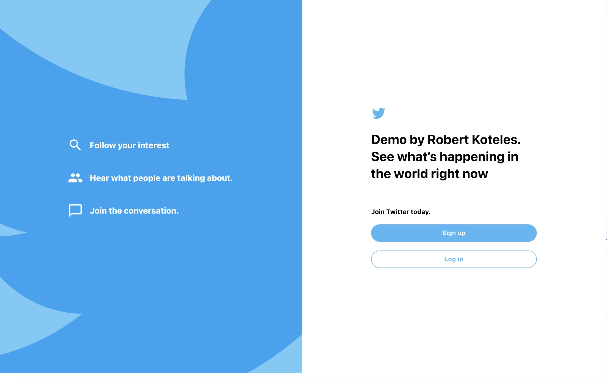
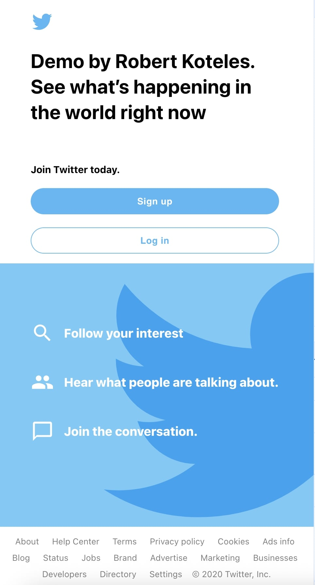
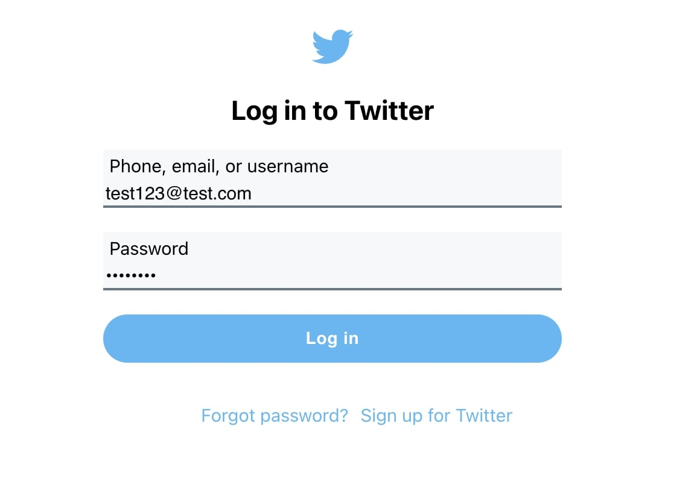
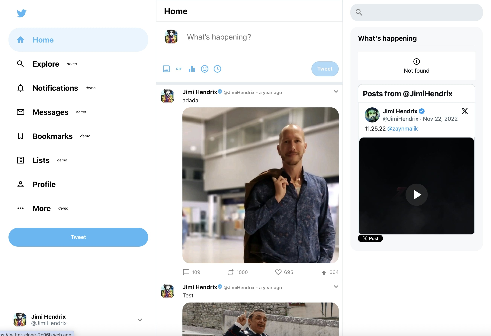
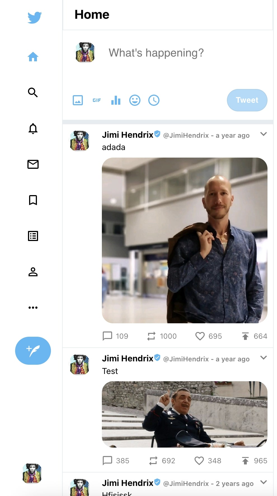
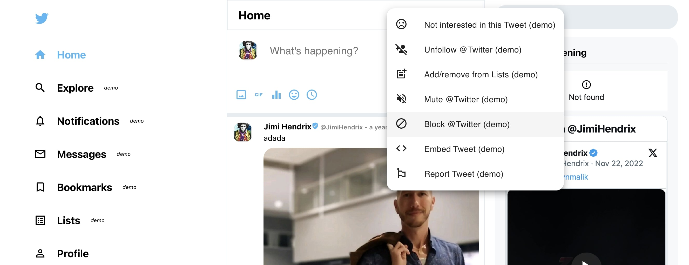
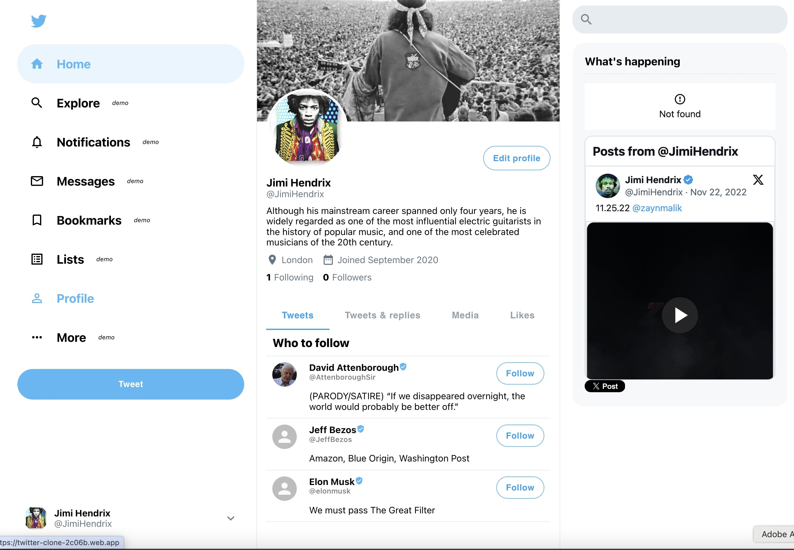
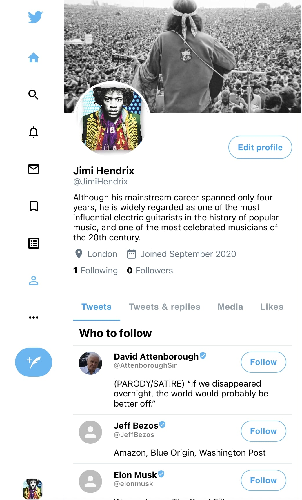
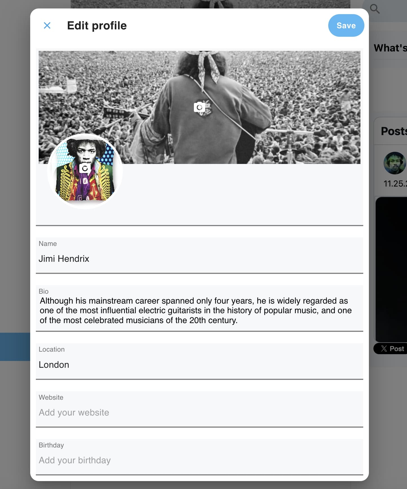

  

 

  <h1>Twitter clone (React, Firebase, Node JS)

(private project)</h1>

 
This nice React application is a clone of the Twitter website. The reason of creating it is legendary. I sent my CV to Twitter Inc. and applied for a developer position but with a very strong portfolio. It was the time when recruiters and companies started using ATS for checking resumes against the role JD. So, mine was refused by them without having anyone really reading my resume. So, as  a revange I have created this Twitter clone app in just 2 days(!) and sent the link to the recruitment team. Just in case... You know.... Of course nobody sent me any feedback after... Well, that's life.

All data is loaded asyncronously from JSON file.

  <h4>
    <a href="https://twitter-clone-2c06b.web.app/" target="_blank">View demo</a>
  </h4>
  
  <h4>
    <a href="https://github.com/kotelesroberto/twitter-clone" title="Code"  target="_blank">View code</a>
  </h4>

 

<!-- Table of Contents -->

# :notebook_with_decorative_cover: ToC

- [About the project](#star2-about-the-project)
  - [Screenshots](#camera-screenshots)
  - [Tech Stack](#space_invader-tech-stack)
  - [Features](#dart-features)
- [License](#warning-license)

<!-- About the project -->

## :star2: About the project

The idea was creating a standalone ReactJS application from scratch in my spare time. As everyone uses Tinder nowadays I saw a big potential in learning the way of building a dating site like that.

    This is a private project, just for fun. Created this project for the reason of learning, training and self-entertainment. I have learned many tiny coding tricks during this coding task and also discovered new modules and services. Private projects are always good for refresh your developer knowledge and get the bigger picture about what's going on around the IT world.
  

The final webapp was easy-to-access, user-friendly and soooo cool! It was full responsive with mobile-first approach.

<!-- Screenshots -->

### :camera: Screenshots

 
  

 
  

 
  

 
  

 
  

 
  

 
  

 
  

 
  

<!-- TechStack -->

### :space_invader: Tech Stack

  
Client

  <ul>
    <li><a href="https://react.dev/">React</a></li>
    <li><a href="https://www.styled-components.com/">React styled components</a></li>
    <li><a href="https://react-redux.js.org/">React Redux</a></li>
    <li><a href="https://react.dev/reference/react/useReducer">React Reducer</a></li>
    <li><a href="https://react.dev/reference/react/createContext">React Context</a></li>
    <li><a href="https://react.dev/learn/managing-state">State management</a></li>
    <li><a href="https://mui.com/material-ui/material-icons/">Material UI icon</a></li>
    <li><a href="https://nodejs.org"  target="_blank">NodeJS</a></li>
    <li><a href="https://nodejs.org/api/esm.html"  target="_blank">Node.js Modules</a></li>
    <li><a href="https://developer.mozilla.org/en-US/docs/Web/JavaScript"  target="_blank">JavaScript ES7</a></li>
    <li><a href="https://www.w3schools.com/html/html5_semantic_elements.asp" target="_blank">Semantic HTML5</a></li>
    <li><a href="https://sass-lang.com/"  target="_blank">SASS / SCSS</a></li>
    <li><a href="https://stripe.com/payments"  target="_blank">Stripe (payment)</a></li>
  </ul>

Database and store

  <ul>
    <li><a href="https://firebase.google.com/">Firebase</a></li>
    <li><a href="https://www.mongodb.com/">MongoDB</a></li>
  </ul>

DevOps

  <ul>
    <li><a href="https://expressjs.com/">Express JS</a></li>
    <li><a href="https://bitbucket.org/">BitBucket</a></li>
    <li><a href="https://www.jslint.com/">JS Lint</a></li>
    <li><a href="https://www.npmjs.com/">NPM JS</a></li>
    <li><a href="https://axios-http.com/docs/intro"  target="_blank">Axios</a></li>
  </ul>

<!-- Features -->

### :dart: Features

<u>On this demo site you can use many features, for instance:</u>

<ul>
  <li>Loading user profiles from JSON</li>
</ul>

<!-- License -->

## :warning: License

Distributed under the MTI copyright. I don't mind if you use this code for educational purposes. Cheers!
