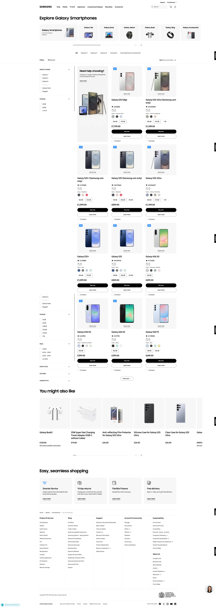

  

  <h1>Samsung UK (Cheil)</h1>
  

    I worked at Cheil UK, London, taht is an internal agency of the Samsung company. Way of working at this company was in the office until 2021 but COVID-19 had broke out and started <strong>working from home</strong>.
  

   
  <h4>
    <a href="https://www.samsung.com/uk/" target="_blank">View actual site</a>
  </h4>
  <h4>
    <a href="https://web.archive.org/web/20211208161009/https://www.samsung.com/uk/" target="_blank">View site from 2022</a>
  </h4>
  <h4>
    <a href="https://www.youtube.com/watch?v=BS8OWCfy2B8"  target="_blank">Watch Youtube video</a>
  </h4>
  <h4>
    <a href="#" title="Sorry, it's company secret"  target="_blank"><s>View code (company secret)</s></a>
  </h4>

 

<!-- Table of Contents -->

# :notebook_with_decorative_cover: ToC

- [About the company](#family-about-the-company)
- [My contribution as a Tech Leader](#white_check_mark-my-contribution-to-the-project)
- [About the project](#star2-about-the-project)
  - [Screenshots](#camera-screenshots)
- [License](#warning-license)
- [Contact](#handshake-contact)

<!-- About the company -->

## :family: About the company

<strong>Samsung UK</strong> is the British division of Samsung Electronics, a global technology leader based in South Korea. It operates through its official website <a href="https://www.samsung.com/uk">samsung.com/uk</a>, physical retail stores, and business partnerships to serve both consumers and enterprises across the United Kingdom.

The brand of Samsung is known by almost everyone. Their webpage offering the full range of Samsung hardware: smartphones, tablets, TVs, wearables, home appliances, computers, accessories, smart displays, and mores.

<h4>Main functions of the website:</h4>

<ul>
  <li><strong>Product Retail:</strong> Sells Samsung's full range of electronics and appliances, including smartphones (like Galaxy devices), TVs, tablets, wearables, laptops, monitors, and smart home devices.</li>
  <li><strong>Customer Support:</strong> Offers in-depth support through online help, live chat, telephone assistance, in-store visits, and at-home repair services.</li>
  <li><strong>Repair Services:</strong> Provides official repair solutions—via courier, in-store, or mobile technicians—as well as a self-repair program for DIY fixes using genuine parts.</li>
</ul>

<!-- My contribution to the project -->

## :white_check_mark: My contribution to the project

As a <strong>Tech Lead</strong> I had to manage my team and also focus on finding the newest tech solutions to implement. At the same time, in 60% of my time I also wrote algorithms and created fantastic coded solutions. Made the external agencies connected to the internal Samsung team, also managed third-party contributions when we worked on the same project, together. It means we had daily stand ups where we shared our visions and ideas and also agreed in the path to follow. Working with various teams external and also in-house made me being confident in having the hat of the leader on and having hands on the projects.

The main goal was always achieving the best user experience and making the visitors buying from the website. With my effective contribution the Samsung UK earned massive profit (around £3-4 million) per each product launch (phones, tablets and TVs)

My role included travles to Warsaw where we, as team, had to work in a protected environment (no data leaks) on the digital representation of the new products. It was fun, really.

<!-- About the project -->

## :star2: About the project

<h4>What had to do?</h4>
  We had various projects for the website that always belonged a new product or promotions that helped the sale process. 

<!-- Screenshots -->

### :camera: Screenshots

 
  <h3>Actual website</h3>
  

 
  <h3>Website from 2022</h3>
  

<!-- License -->

## :warning: License

Distributed under the Software copyright of Cheil UK / Samsung UK. Any non-authorized usage of their code leads to legal consequences, thank you.

<!-- Contact -->

## :handshake: Contact

Cheil UK -
[https://cheil.uk/](https://cheil.uk/), London Office: 10 Queen Street Place, London, EC4R 1BE
