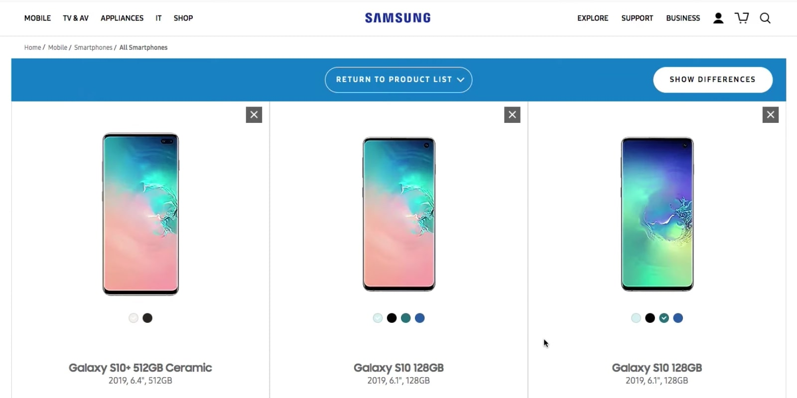

<!--
Hey, thanks for using the awesome-readme-template template.
If you have any enhancements, then fork this project and create a pull request
or just open an issue with the label "enhancement".

Don't forget to give this project a star for additional support ;)
Maybe you can mention me or this repo in the acknowledgements too
-->

  

  <h1>Samsung UK - Comparison Tool (Cheil)</h1>
  
  

    I worked on this project whilst worked at Cheil UK, London. This company is an internal agency of the Samsung company. Way of working at this company was in the office but COVID-19 had broke out and started <strong>working from home</strong>.
  

   
  <h4>
    <a href="https://www.samsung.com/uk/" target="_blank"><s>View site</s></a>
  </h4>
  <h4>
    <a href="https://www.youtube.com/watch?v=BS8OWCfy2B8"  target="_blank">Watch Youtube video</a>
  </h4>
  <h4>
    <a href="#" title="Sorry, it's company secret"  target="_blank"><s>View code (company secret)</s></a>
  </h4>

 

<!-- Table of Contents -->

# :notebook_with_decorative_cover: ToC

- [About the Project](#star2-about-the-project)
  - [Screenshots](#camera-screenshots)
  - [Tech Stack](#space_invader-tech-stack)
  - [Features](#dart-features)
- [My contribution to the project](#white_check_mark-my-contribution-to-the-project)
- [License](#warning-license)
- [Contact](#handshake-contact)

<!-- About the Project -->

## :star2: About the Project

Samsung UK is the British division of Samsung Electronics, a global technology leader based in South Korea. It operates through its official website <a href="https://www.samsung.com/uk">samsung.com/uk</a>, physical retail stores, and business partnerships to serve both consumers and enterprises across the United Kingdom.

The brand of Samsung is known by almost everyone. Their webpage offering the full range of Samsung hardware: smartphones, tablets, TVs, wearables, home appliances, computers, accessories, smart displays, and mores.

Developing plugins for the TinyMCE editor was exclusively my task. All new plugins written by me were dedicated for special features, such as creating chemical formulas and convert into HTML5 shape, teasers, etc. Basket function was a harder part of the development as more variations the customer wanted to have.

<h4>Main functions of the website:</h4>

<ul>
  <li><strong>Product Retail:</strong> Sells Samsung's full range of electronics and appliances, including smartphones (like Galaxy devices), TVs, tablets, wearables, laptops, monitors, and smart home devices.</li>
  <li><strong>Customer Support:</strong> Offers in-depth support through online help, live chat, telephone assistance, in-store visits, and at-home repair services.</li>
  <li><strong>Repair Services:</strong> Provides official repair solutions—via courier, in-store, or mobile technicians—as well as a self-repair program for DIY fixes using genuine parts.</li>
</ul>

<h4>What had to do?</h4>
  <ul>
    <li>create pixel-perfect layout for every devices, all screen sizes</li>
    <li>mobile first, full responsive</li>
    <li>all content comes from JSON file with asyncronous RestAPI call</li>
    <li>images were stored on Heroku server</li>
    <li>the AEM CMS was quite restricted, therefore this cmparison tool, as an extra layout, was added to the site with Adobe A/B testing injection into the header, so the relevant JavaScript code was added asyncronous and added after the page load event.</li>
    <li>build a business logic for the compared devices</li>
    <li>each properties of the products were possible to show/hide, also include/exclude from the comparison</li>
    <li>by scrolling the webpage the selected items shown up at the bottom of the screen, on a stripe</li>
    <li>the solution was sensitive to the actual position of the page scroll</li>
  </ul>

<h4>Features for this project, developed by me:</h4>
  <ul>
    <li>created pixel-perfect layout for every devices, all screen sizes</li>
    <li>mobile first, full responsive</li>
    <li>all content comes from  JSON file</li>
    <li>images were stored on Heroku server</li>
    <li>optimized page loading time, compressed images, compressed JS content into one file, browser cache to store what was loaded once, so the solution saved bandwith for the next page load</li>
    
had to load the content from an XML/JSON file than process it (JSON stringify) and create a representation of the data in the memory

  </ul>

The final webapp was easy-to-access, user-friendly and soooo cool! It was full responsive with mobile-first approach.

<!-- Screenshots -->

### :camera: Screenshots

 
  

<!-- TechStack -->

### :space_invader: Tech Stack

  
Client

  <ul>
    <li><a href="https://developer.mozilla.org/en-US/docs/Web/JavaScript"  target="_blank">JavaScript</a></li>
    <li><a href=https://business.adobe.com/products/experience-manager/adobe-experience-manager.html">AEM 6.4</a></li>
    <li><a href="https://www.w3schools.com/html/html5_semantic_elements.asp" target="_blank">Semantic HTML5</a></li>
    <li><a href="https://www.w3schools.com/css/"  target="_blank">CSS3</a></li>
  </ul>

Database

  <ul>
    <li><a href="https://www.json.org/">in an XML/JSON file</a></li>
  </ul>

DevOps

  <ul>
    <li><a href="https://bitbucket.org/">BitBucket</a></li>
    <li><a href="https://www.jslint.com/">JS Lint</a></li>
    <li><a href="#">Bespoken content scraper on the local development</a></li>
  </ul>

<!-- Features -->

### :dart: Features

- Accessibility level: AA
- Mobile first, full responsive solution
- It follows the BG (Brand Guideline)
- Fast loading time
- Cached content and images
- Fully optimized loading event and running time with Adobe A/B test code injection into the header

<!-- My contribution to the project -->

## :white_check_mark: My contribution to the project

This entire project belonged to me, from the beginning until the end of it. I had to manage thedesign team and had my hands on the design processes. After having the design FIGMA pages I created teh webapp from scratch and used Adobe A/B test to inject the solution into the AEM pages. Had to create an injection ruke as the solution (and its content) was developed for specific pages (for instance: comparison of mobile phones was only visible on smartphone pages). For testing during teh develpoment phase I used BroswerStack and multiple real devices, also the in-built Chrome DevTools.

<!-- License -->

## :warning: License

Distributed under the Software copyright of Williams Lea Tag. Any non-authorized usage of their code leads to legal consequences, thank you.

<!-- Contact -->

## :handshake: Contact

Williams Lea Tag -
[https://www.williamslea.com/](https://www.williamslea.com/), 1-5 Poland St, London W1F 8PR
