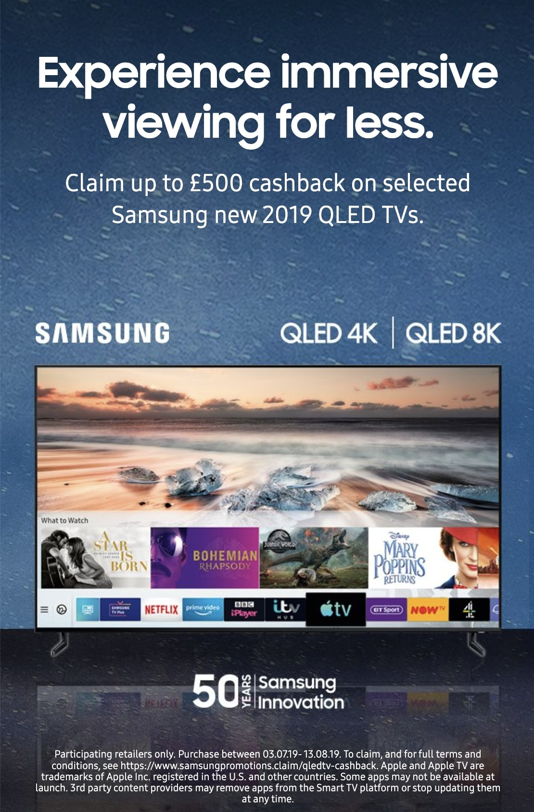
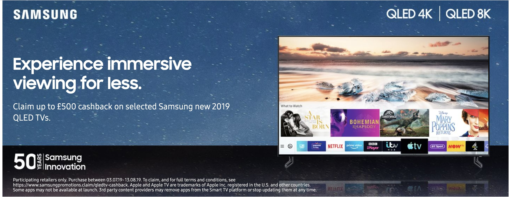

  

  <h1>Samsung UK - Dynamic banners for IE market (Cheil)</h1>
  
  

    I worked on this project whilst worked at Cheil UK, London. This company is an internal agency of the Samsung company. Way of working at this company was in the office but COVID-19 had broke out and started <strong>working from home</strong>.
  

   
  <h4>
    <a href="https://www.samsung.com/ie/" target="_blank">View site</a>
  </h4>
  <h4>
    <a href="#" title="Sorry, it's company secret"  target="_blank"><s>View code (company secret)</s></a>
  </h4>

 

<!-- Table of Contents -->

# :notebook_with_decorative_cover: ToC

- [About the company](#family-about-the-company)
- [About the project](#star2-about-the-project)
  - [Screenshots](#camera-screenshots)
  - [Tech Stack](#space_invader-tech-stack)
  - [Features](#dart-features)
- [My contribution to the project](#white_check_mark-my-contribution-to-the-project)
- [License](#warning-license)
- [Contact](#handshake-contact)

<!-- About the company -->

## :family: About the company

Samsung UK is the British division of Samsung Electronics, a global technology leader based in South Korea. It operates through its official website <a href="https://www.samsung.com/uk">samsung.com/uk</a>, physical retail stores, and business partnerships to serve both consumers and enterprises across the United Kingdom.

The brand of Samsung is known by almost everyone. Their webpage offering the full range of Samsung hardware: smartphones, tablets, TVs, wearables, home appliances, computers, accessories, smart displays, and mores.

<h4>Main functions of the website:</h4>

<ul>
  <li><strong>Product Retail:</strong> Sells Samsung's full range of electronics and appliances, including smartphones (like Galaxy devices), TVs, tablets, wearables, laptops, monitors, and smart home devices.</li>
  <li><strong>Customer Support:</strong> Offers in-depth support through online help, live chat, telephone assistance, in-store visits, and at-home repair services.</li>
  <li><strong>Repair Services:</strong> Provides official repair solutions—via courier, in-store, or mobile technicians—as well as a self-repair program for DIY fixes using genuine parts.</li>
</ul>

<!-- About the project -->

## :star2: About the project

<h4>Features of this project</h4>
  <ul>
  <li>showing dynamic banner information on Samsung IE site</li>
  </ul>

<h4>Technical parameters of this project, developed by me:</h4>
  <ul>
    <li>the banner is integrated into the Samsung IE page by using AEM A/B test, the code is injected asynchronously and data is loaded from JSON file</li>
    <li>created pixel-perfect layout for every devices, all screen sizes</li>
    <li>mobile first, full responsive</li>
    <li>all content comes from  JSON file</li>
  </ul>

The final webapp was easy-to-access, user-friendly and soooo cool! It was full responsive with mobile-first approach.

<!-- Screenshots -->

### :camera: Screenshots

 
  

 
  

<!-- TechStack -->

### :space_invader: Tech Stack

  
Client

  <ul>
    <li><a href="https://developer.mozilla.org/en-US/docs/Web/JavaScript"  target="_blank">JavaScript</a></li>
    <li><a href="https://jquery.com/"  target="_blank">JQuery</a></li>
    <li><a href="https://handlebarsjs.com/"  target="_blank">Handlebars templating</a></li>
    <li><a href="https://nodejs.org"  target="_blank">NodeJS</a></li>
    <li><a href="https://nodejs.org/api/esm.html"  target="_blank">Node.js Modules</a></li>
    <li><a href="https://browserify.org/"  target="_blank">Browserify</a></li>
    <li><a href="https://lodash.com/"  target="_blank">lodash performance optimalization</a></li>
    <li><a href=https://business.adobe.com/products/experience-manager/adobe-experience-manager.html">AEM 6.4</a></li>
    <li><a href="https://www.w3schools.com/html/html5_semantic_elements.asp" target="_blank">Semantic HTML5</a></li>
    <li><a href="https://www.w3schools.com/css/"  target="_blank">CSS3</a></li>
    <li><a href="https://developer.samsung.com/design-system/font"  target="_blank">Samsung Fonts</a></li>
    <li><a href="https://developer.samsung.com/design"  target="_blank">Samsung Design Principles</a></li>
  </ul>

Database

  <ul>
    <li><a href="https://www.json.org/">data stored in an XML/JSON file</a></li>
    <li><a href="https://www.heroku.com/">HEROKU</a></li>
  </ul>

DevOps

  <ul>
    <li><a href="https://bitbucket.org/">BitBucket</a></li>
    <li><a href="https://www.jslint.com/">JS Lint</a></li>
    <li><a href="#">Bespoken content scraper on the local development</a></li>
    <li><a href="https://www.postman.com/">PostMan</a></li>
    
  </ul>

<!-- Features -->

### :dart: Features

- Accessibility level: AA
- Mobile first, full responsive solution
- It follows the BG (Brand Guideline)
- Fast loading time
- Cached content and images
- Fully optimized loading event and running time with Adobe A/B test code injection into the header

<!-- My contribution to the project -->

## :white_check_mark: My contribution to the project

This entire project belonged to me, from the beginning until the end of it. I had to manage the design team and had my hands on the design processes. After having the design FIGMA pages I created teh webapp from scratch and used Adobe A/B test to inject the solution into the AEM pages. Had to create an injection ruke as the solution (and its content) was developed for specific pages (for instance: comparison of mobile phones was only visible on smartphone pages). For testing during the develpoment phase I used BroswerStack and multiple real devices, also the in-built Chrome DevTools.

Based on the insights this comparison tool created a significant rise in sales that ended up in a visible extra profit for Samsung UK.

<!-- License -->

## :warning: License

Distributed under the Software copyright of Cheil UK / Samsung UK. Any non-authorized usage of their code leads to legal consequences, thank you.

<!-- Contact -->

## :handshake: Contact

Cheil UK -
[https://cheil.uk/](https://cheil.uk/), London Office: 10 Queen Street Place, London, EC4R 1BE
