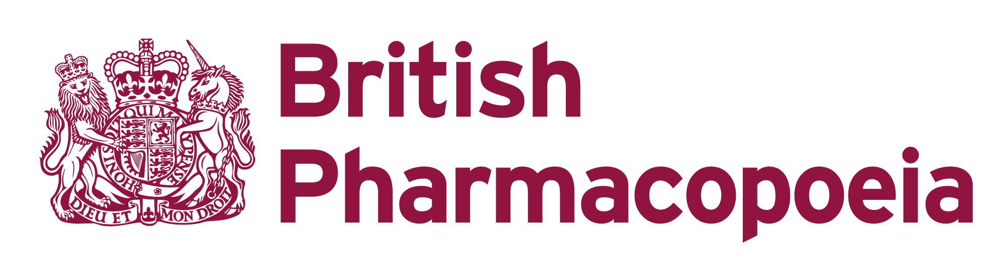

<!--
Hey, thanks for using the awesome-readme-template template.
If you have any enhancements, then fork this project and create a pull request
or just open an issue with the label "enhancement".

Don't forget to give this project a star for additional support ;)
Maybe you can mention me or this repo in the acknowledgements too
-->

  

  <h1>British Pharmacopoeia (Williams Lea Tag)</h1>
  
  

    I worked on this project whilst worked for Williams Lea Tag, London. Way of working at this company was <strong>remote</strong>.
  

   
  <h4>
    <a href="https://beta.pharmacopoeia.com/" target="_blank">View demo</a>
  </h4>
  <h4>
    <a href="#" title="Sorry, it's company secret"  target="_blank"><s>View code (company secret)</s></a>
  </h4>
  <h4>
    <a href="https://youtu.be/j-xa58239R8"  target="_blank">Watch Youtube video</a>
  </h4>

  <!-- BEGIN YOUTUBE-CARDS -->

  <!-- END YOUTUBE-CARDS -->

 

<!-- Table of Contents -->

# :notebook_with_decorative_cover: ToC

- [About the project](#star2-about-the-project)
  - [Screenshots](#camera-screenshots)
  - [Tech Stack](#space_invader-tech-stack)
  - [Features](#dart-features)
- [My contribution to the project](#white_check_mark-my-contribution-to-the-project)
- [License](#warning-license)
- [Contact](#handshake-contact)

<!-- About the project -->

## :star2: About the project

The project itself was about building a professional website for users with subscription. Based on their plan the users access to different level of contents and documents.

The content of the site was fully created by in-house CMS system where the TinyMCE editor had bespoken plugins (developed by me) to make content management super easy: teasers, formulas, accordions, BF unique elements, etc. All formules are perfectly displayed on all screen.

<h4>Features developed by me and my team:</h4>
  <ul>
    <li>manage images, PDF files and other assets</li>
    <li>content management
      <ul>
        <li>create a page</li>
        <li>edit a page</li>
        <li>manage navigation</li>
      </ul>
    </li>
    <li>manage monographs</li>
    <li>document management</li>
    <li>all unique TinyMCE plugins for creating and managing content and making repeated tasks simple</li>
  </ul>

The final webapp was easy-to-access, user-friendly with a detailed search function. Every formulas are displayed with proper indexes. The site was full responsive with mobile-first approach.

<!-- Screenshots -->

### :camera: Screenshots

 
  

<!-- TechStack -->

### :space_invader: Tech Stack

<a href="https://builtwith.com/?https%3a%2f%2fbeta.pharmacopoeia.com%2f">Full list of used technologies</a>

  
Client

  <ul>
    <li><a href="https://developer.mozilla.org/en-US/docs/Web/JavaScript"  target="_blank">JavaScript</a></li>
    <li><a href="https://jquery.com/"  target="_blank">JQuery</a></li>
    <li><a href="https://www.npmjs.com/"  target="_blank">NPM packages</a></li>
    <li><a href="#">In-house CMS and plugins</a></li>
    <li><a href="https://www.w3schools.com/html/html5_semantic_elements.asp" target="_blank">Semantic HTML5</a></li>
    <li><a href="https://www.w3schools.com/css/"  target="_blank">CSS3</a></li>
  </ul>

Database

  <ul>
    <li><a href="https://www.mysql.com/">MySQL</a></li>
  </ul>

DevOps

  <ul>
    <li><a href="https://bitbucket.org/">BitBucket</a></li>
    <li><a href="https://www.docker.com/">Docker</a></li>
    <li><a href="https://www.jenkins.io/">Jenkins</a></li>
    <li><a href="https://www.jslint.com/">JS Lint</a></li>
    <li><a href="https://github.com/features/actions">GitHub Actions</a></li>
    <li><a href="https://docs.github.com/en/actions/writing-workflows/about-workflows">GitHub Workflow</a></li>
    <li><a href="https://www.browserstack.com/">BrowserStack</a></li>
  </ul>

<!-- Features -->

### :dart: Features

- Accessibility level: AA
- Mobile first, full responsive solution
- User friendly web portal for users with subscriptions
- Subscribe to different plans
- Browse within publications and catalogues
- Shop (publications and reference standards)
- News reel
- Connect to social media and LinkedIn trough secure API
- All content is done by using bespoken CMS
- It follows the CBG (Company Brand Guideline) and GDS (Governmental Design System)

<!-- My contribution to the project -->

## :white_check_mark: My contribution to the project

My active participation helped the team to shape new ideas and way of coding. I always had new ideas to introduce into the business. Mentorating other developers was one of my daily tasks. Rest of my tasks were leading meetings, searching Government-related informations and solutions. We worked in 2 weeks Sprints and all deadlines were strictly kept and the project was finished within the budget.

<!-- License -->

## :warning: License

Distributed under the Software copyright of Williams Lea Tag. Any non-authorized usage of their code leads to legal consequences, thank you.

<!-- Contact -->

## :handshake: Contact

Williams Lea Tag -
[https://www.williamslea.com/](https://www.williamslea.com/), 1-5 Poland St, London W1F 8PR
