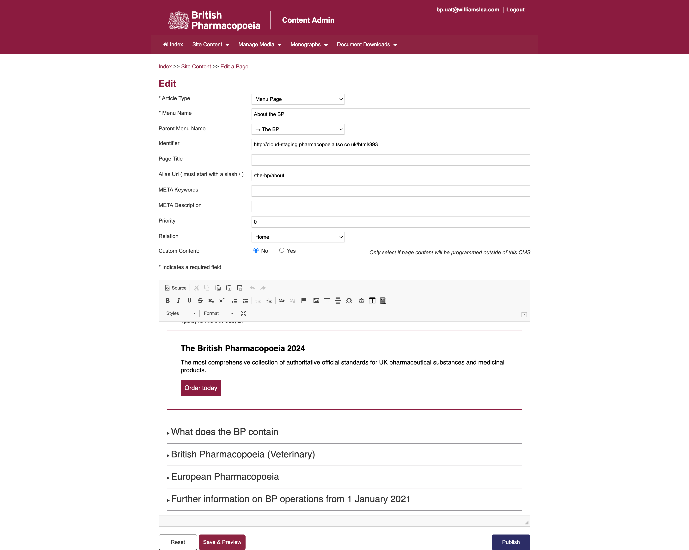

<!--
Hey, thanks for using the awesome-readme-template template.
If you have any enhancements, then fork this project and create a pull request
or just open an issue with the label "enhancement".

Don't forget to give this project a star for additional support ;)
Maybe you can mention me or this repo in the acknowledgements too
-->

  

  <h1>British Pharmacopoeia (Williams Lea Tag)</h1>
  
  

    I worked on this project whilst worked for Williams Lea Tag, London. Way of working at this company was <strong>remote</strong>.
  

   
  <h4>
    <a href="https://beta.pharmacopoeia.com/" target="_blank">View Demo</a>
  </h4>
  <h4>
    <a href="https://youtu.be/Qv2ppnCHLsg"  target="_blank">Watch Youtube video</a>
  </h4>

 

<!-- Table of Contents -->

# :notebook_with_decorative_cover: ToC

- [About the Project](#star2-about-the-project)
  - [Screenshots](#camera-screenshots)
  - [Tech Stack](#space_invader-tech-stack)
  - [Features](#dart-features)
  - [Environment Variables](#key-environment-variables)
- [License](#warning-license)
- [Contact](#handshake-contact)

<!-- About the Project -->

## :star2: About the Project

The project itself was about building a professional webapp for pharmacy-related user-queries. Using the proper chemical formulas was the key of our work. No room of mistakes! We used an in-house headless CMS, that was created for this project only. Everything was written by us, so the CMS was not a commercial one.

Developing plugins for the TinyMCE editor was exclusively my task. All new plugins written by me were dedicated for special features, such as creating chemical formulas and convert into HTML5 shape, teasers, etc. Basket function was a harder part of the development as more variations the customer wanted to have.

<h4>Features developed by me and my team:</h4>
  <ul>
    <li>manage images, PDF files and other assets</li>
    <li>content management
      <ul>
        <li>create a page</li>
        <li>edit a page</li>
        <li>manage navigation</li>
      </ul>
    </li>
    <li>manage monographs</li>
    <li>document management</li>
    <li>all unique TinyMCE plugins for creating and managing content and making repeated tasks simple</li>
  </ul>

The final webapp was easy-to-access, user-friiendly with a detailed search function. Every forumlas are displayed with proper indexes. The site was full responsive with mobile-first approach.

<!-- Screenshots -->

### :camera: Screenshots

 
  

<!-- TechStack -->

### :space_invader: Tech Stack

  
Client

  <ul>
    <li><a href="https://developer.mozilla.org/en-US/docs/Web/JavaScript"  target="_blank">JavaScript</a></li>
    <li><a href="https://jquery.com/"  target="_blank">JQuery</a></li>
    <li><a href="https://www.npmjs.com/"  target="_blank">NPM packages</a></li>
    <li><a href="#">In-house CMS and plugins</a></li>
    <li><a href="https://www.w3schools.com/html/html5_semantic_elements.asp" target="_blank">Semantic HTML5</a></li>
    <li><a href="https://www.w3schools.com/css/"  target="_blank">CSS3</a></li>
  </ul>

Database

  <ul>
    <li><a href="https://www.mysql.com/">MySQL</a></li>
  </ul>

DevOps

  <ul>
    <li><a href="https://bitbucket.org/">BitBucket</a></li>
    <li><a href="https://www.docker.com/">Docker</a></li>
    <li><a href="https://www.jenkins.io/">Jenkins</a></li>
    <li><a href="https://www.jslint.com/">JS Lint</a></li>
    <li><a href="https://github.com/features/actions">GitHub Actions</a></li>
    <li><a href="https://docs.github.com/en/actions/writing-workflows/about-workflows">GitHub Workflow</a></li>
  </ul>

<!-- Features -->

### :dart: Features

- Accessibility level: AA
- Mobile first, full responsive solution
- User friendly customer portal as a web app
- Wide selection of actions on the page: get a quote, compare plans, manage user data, secure login/logout, etc.
- It follows the CBG (Company Brand Guideline)

<!-- License -->

## :warning: License

Distributed under the Software copyright of Williams Lea Tag. Any non-authorized usage of their code leads to legal consequences, thank you.

<!-- Contact -->

## :handshake: Contact

Williams Lea Tag -
[https://www.williamslea.com/](https://www.williamslea.com/), 1-5 Poland St, London W1F 8PR
