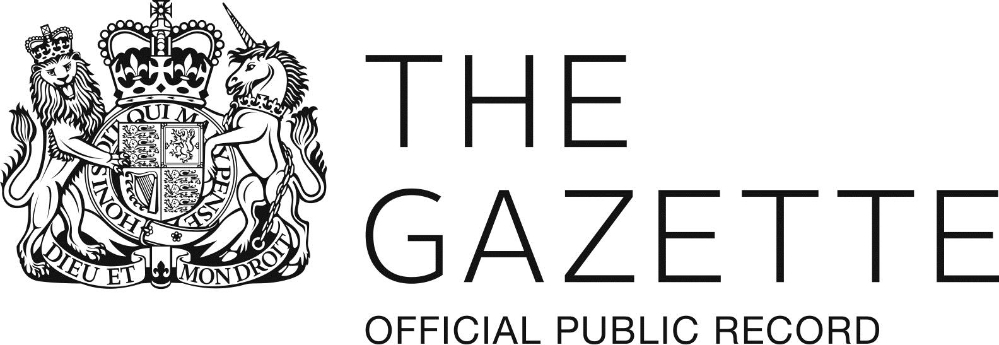
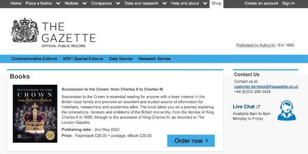
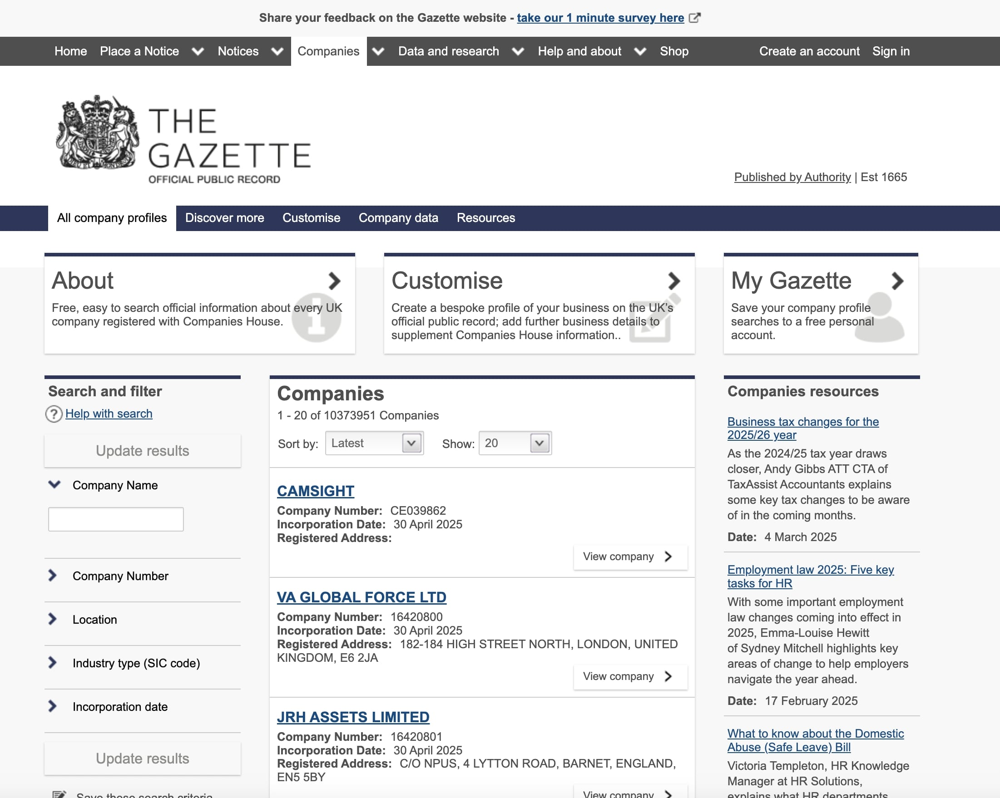
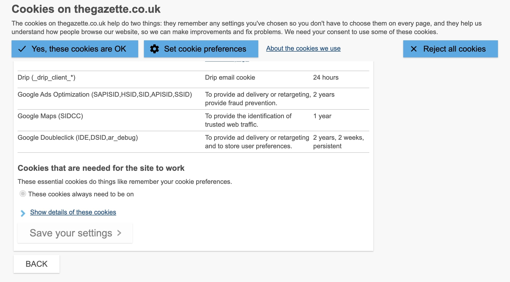
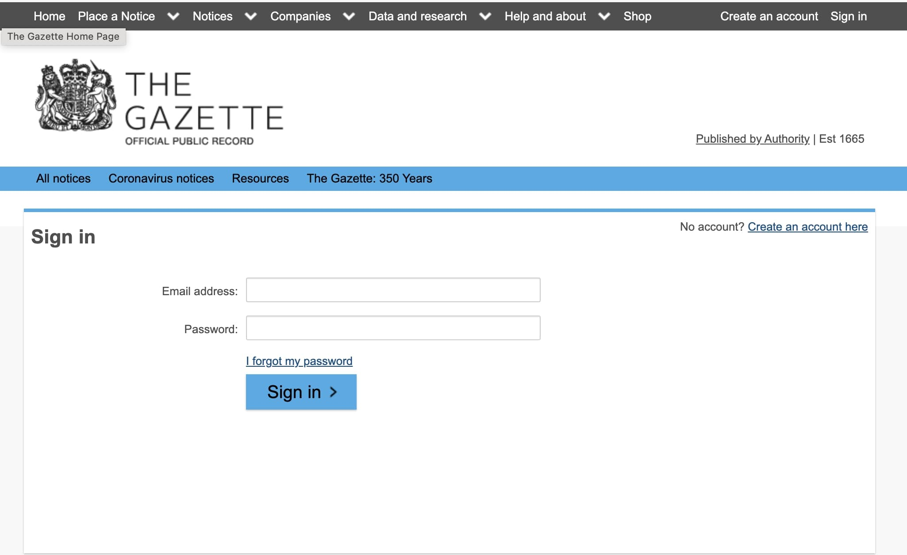

<!--
Hey, thanks for using the awesome-readme-template template.
If you have any enhancements, then fork this project and create a pull request
or just open an issue with the label "enhancement".

Don't forget to give this project a star for additional support ;)
Maybe you can mention me or this repo in the acknowledgements too
-->

  

  <h1>The Gazette (Williams Lea Tag)</h1>
  
  

    I worked on this project whilst worked for Williams Lea Tag, London. Way of working at this company was <strong>remote</strong>. It was a governmental project, by the way.
  

   
  <h4>
    <a href="https://www.thegazette.co.uk/" target="_blank">View demo</a>
  </h4>
  <h4>
    <a href="#" title="Sorry, it's a company secret"  target="_blank"><s>View code (company secret)</s></a>
  </h4>

 

<!-- Table of Contents -->

# :notebook_with_decorative_cover: ToC

- [About the Service](#paperclip-about-the-service)
- [About the project](#star2-about-the-project)
  - [Screenshots](#camera-screenshots)
  - [Tech Stack](#space_invader-tech-stack)
  - [Features](#dart-features)
- [My contribution to the project](#white_check_mark-my-contribution-to-the-project)
- [License](#warning-license)
- [Contact](#handshake-contact)

<!-- About the service -->

## :paperclip: About the service

<h4>Core Services</h4>
<ol>
  <li>Publication of Official Notices
    <ul>
      <li>Hosts over 450 types of notices, including mandatory legal ones (e.g., insolvency, bankruptcy, deceased estates, planning, transport, corporate filings</li>
      <li>Notice placers such as insolvency practitioners, solicitors, executors, and government bodies must register and are verified before submitting notices</li>
      <li>Notices are indexed weekly, daily, or in real-time, depending on the edition and type of notice</li>
    </ul>
  </li>
  <li> Business & Company Profiles
    <ul>
      <li>The site provides official UK company profiles sourced from The Gazette and Companies House, offering a comprehensive timeline of incorporations, director appointments, filings, and name changes</li>
      <li>These profiles support due diligence, market analysis, and risk assessment</li>
    </ul>
  </li>
  <li>Honours & Military Records
    <ul>
      <li>Publishes the King’s/Queen’s Birthday and New Year Honours, military commissions, promotions, and despatch mentions</li>
      <li>Researchers and family historians use the archives to trace citations dating back to the 17th century</li>
    </ul>
  </li>
  <li>Searchable Archives & Digital Editions
    <ul>
      <li>Offers a fully searchable archive dating back centuries in easily downloadable formats (XML, CSV, PDF)</li>
      <li>Subscribers can access e‑editions of the print Gazettes—London (daily), Edinburgh (twice weekly), and Belfast (weekly)— on any device</li>
    </ul>
  </li>
  <li>Data Service for Businesses
    <ul>
      <li>
Provides a Data Service geared towards KYC, AML, credit management, lead generation, and supply-chain monitoring</li>
      <li>Delivers structured datasets on bankruptcy, corporate and personal insolvency, deceased estates, company incorporations, and strike-off notices</li>
      <li>Clients include banks, government bodies, credit agencies, and private firms—services are available via email, FTP, or API, with subscription plans varying from daily to monthly feeds</li>
    </ul>
  </li>

</ol>

<!-- About the project -->

## :star2: About the project

The project itself was about building a professional website where the users can get legal documentations, declarations and announcements from the official source.

The content of the site was fully created by bespoken system.

A strict Cookie policy solution was introduced to fulfill the legal requirements.

Accessibility requrements was also very strict, we had to achieve the highest (A) level of it.

<h4>Features developed by me and my team:</h4>
  <ul>
    <li>manage images, PDF files and other assets</li>
    <li>content management
      <ul>
        <li>create a page</li>
        <li>edit a page</li>
        <li>manage navigation</li>
      </ul>
    </li>
    <li>document management</li>
    <li>Cookie policy management throughout the entire website</li>
    <li>Location sensitive multi modal system</li>
  </ul>

The final webapp was easy-to-access, user-friendly with a detailed search function. The site was full responsive with mobile-first approach.

<!-- Screenshots -->

### :camera: Screenshots

 
  

 
  

 
  

 
  

<!-- TechStack -->

### :space_invader: Tech Stack

  
Client

  <ul>
    <li><a href="https://developer.mozilla.org/en-US/docs/Web/JavaScript"  target="_blank">JavaScript ES6</a></li>
    <li><a href="https://jquery.com/"  target="_blank">JQuery</a></li>
    <li><a href="https://www.npmjs.com/"  target="_blank">NPM packages</a></li>
    <li><a href="#">Bespoken CMS and plugins</a></li>
    <li><a href="https://www.w3schools.com/html/html5_semantic_elements.asp" target="_blank">Semantic HTML5</a></li>
    <li><a href="https://www.w3schools.com/css/"  target="_blank">CSS3</a></li>
    <li><a href="https://stripe.com/"  target="_blank">Stripe</a></li>
  </ul>

  
Backend

  <ul>
    <li><a href="https://docs.oracle.com/javase/8/docs/api/java/lang/package-summary.html"  target="_blank">JAVA</a></li>
  </ul>

Database

  <ul>
    <li><a href="https://www.mysql.com/">MySQL</a></li>
  </ul>

DevOps

  <ul>
    <li><a href="https://bitbucket.org/">BitBucket</a></li>
    <li><a href="https://www.docker.com/">Docker</a></li>
    <li><a href="https://www.jenkins.io/">Jenkins</a></li>
    <li><a href="https://www.jslint.com/">JS Lint</a></li>
    <li><a href="https://github.com/features/actions">GitHub Actions</a></li>
    <li><a href="https://docs.github.com/en/actions/writing-workflows/about-workflows">GitHub Workflow</a></li>
  </ul>

<!-- Features -->

### :dart: Features

- Accessibility level: A
- Mobile first, full responsive solution
- Browse within the companies
- Complex search function
- Strict cookie policy system using local storage
- Shop function, Stripe payment integration
- It follows the CBG (Company Brand Guideline) and GDS (Governmental Design System)

<!-- My contribution to the project -->

## :white_check_mark: My contribution to the project

My active participation helped the team to shape new ideas and way of coding. I always had new ideas to introduce into the business. Mentorating other developers was one of my daily tasks. Rest of my tasks were leading meetings, searching Government-related informations and solutions. We worked in 2 weeks Sprints and all deadlines were strictly kept and the project was finished within the budget. There was no room of mistakes, it was the most strict project I ever worked.

<!-- License -->

## :warning: License

Distributed under the Software copyright of Williams Lea Tag. Any non-authorized usage of their code leads to legal consequences, thank you.

<!-- Contact -->

## :handshake: Contact

Williams Lea Tag -
[https://www.williamslea.com/](https://www.williamslea.com/), 1-5 Poland St, London W1F 8PR
