

  

  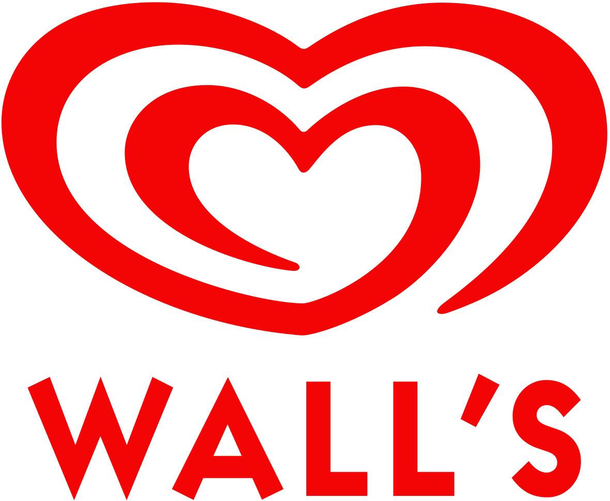

 

  <h1>Wall's Ice Creams (Williams Lea Tag)</h1>
  

    I worked on this project whilst worked as a Freelancer at Williams Lea Tag, London.
  

   
  <h4>
    <a href="https://www.wallsicecream.com/uk/" target="_blank">View site</a>
  </h4>
  <h4>
    <a href="#" title="Sorry, it's company secret"  target="_blank"><s>View code (company secret)</s></a>
  </h4>

 

<!-- Table of Contents -->

# :notebook_with_decorative_cover: ToC

- [About the company](#family-about-the-company)
- [About the project](#star2-about-the-project)
  - [Screenshots](#camera-screenshots)
  - [Tech Stack](#space_invader-tech-stack)
  - [Features](#dart-features)
- [My contribution to the project](#white_check_mark-my-contribution-to-the-project)
- [License](#warning-license)
- [Contact](#handshake-contact)

<!-- About the company -->

## :family: About the company

<strong>Williams Lea</strong> is a global provider of skilled business‑critical support and outsourcing services, founded in <em>1820</em> in London. Now operating across 20+ countries with 5,700–7,000 employees, it serves top-tier clients in financial services, legal, and professional sectors.

  <h3>Core Service Offerings</h3>
  <ul>
    <li><strong>Presentation & Creative Services</strong>
      <ul>
        <li>High‑volume pitchbooks & presentations</li>
        <li>Creative & graphic design</li>
      </ul>
    </li>
    <li><strong>Business & Administrative Services</strong>
      <ul>
        <li>Secretarial & administrative support</li>
        <li>Document & word processing</li>
        <li>Billing, collections & AP/procurement support</li>
        <li>Business Information Services (data research & analysis)</li>
        <li>CRM & data management</li>
        <li>Publications & subscriptions management</li>
        <li>Information governance & records management</li>
      </ul>
    </li>
    <li><strong>Office & Document Services</strong>
      <ul>
        <li>Digital mail & mailroom operations</li>
        <li>Printing, reprographics & fleet management</li>
        <li>Reception, hospitality & colleague experience</li>
      </ul>
    </li>
  </ul>

  <h3>ENGAGE Technology Platform</h3>
  <ul>
    <li>Digital client portal for service requests, analytics, audit logs, and real‑time insights</li>
    <li>Automated workflows & integration with MS Outlook, ServiceNow; secure chain‑of‑custody tracking</li>
    <li>24/7 global support model with onshore/offshore delivery; right‑shore framework to optimize service levels</li>
  </ul>

  <h3>Sector Expertise</h3>
  <ul>
    <li>Financial services & global investment banking</li>
    <li>Legal & law firms — including e‑billing and outside counsel guidelines support</li>
    <li>Professional services & consulting</li>
  </ul>

  <h3>Key Differentiators</h3>
  <ul>
    <li>Legacy of 200+ years—evolved from financial printing to modern business services</li>
    <li>Global workforce with 24/7 coverage serving clients across geographies</li>
    <li>Blends people, process & technology to deliver scalable, compliant solutions</li>
  </ul>

  <h3>Corporate Growth & Reach</h3>
  <ul>
    <li>Operating in over 20 countries</li>
    <li>Acquired Intelligent Office (2022) to enhance UK legal market | Backed by Advent International</li>
    <li>Reports ~€400 million revenue; formerly owned by Deutsche Post, then private equity</li>
  </ul>

  <h3>Summary</h3>
  
Williams Lea delivers high‑touch, technology‑enabled outsourcing and support services—spanning creative, administrative, document and office operations—to professional clients worldwide. With a heritage of innovation, comprehensive service portfolio, and 24/7 global delivery, it helps organisations streamline back‑office functions and drive operational excellence.

<!-- About the project -->

## :star2: About the project

As a freelancer I had to build and maintain the whole ice cream portfolio of the Unilever company.

I had to create stylesheet definitions and also template layouts for all of these brands within the website:

<ul>
  <li>
    <a href="https://www.wallsicecream.com/uk/our-brands/cornetto.html" target="_blank">Cornetto</a>
  </li>
  <li>
    <a href="https://www.wallsicecream.com/uk/our-brands/carte-d-or.html" target="_blank">Carte D'Or</a>
  </li>
  <li>
    <a href="https://www.wallsicecream.com/uk/our-brands/kids.html" target="_blank">Calippo</a>
  </li>
  <li>
    <a href="https://www.wallsicecream.com/uk/our-brands/feast.html" target="_blank">Feast</a>
  </li>
  <li>
    <a href="https://www.magnumicecream.com/uk/home.html" target="_blank">Magnum</a>
  </li>
  <li>
    <a href="https://www.wallsicecream.com/uk/our-brands/softscoop.html" target="_blank">Soft Scoop</a>
  </li>
  <li>
    <a href="https://www.wallsicecream.com/uk/our-brands/cornetto-soft.html" target="_blank">Cornetto</a>
  </li>
  <li>
    <a href="https://www.wallsicecream.com/uk/our-brands/solero.html" target="_blank">Solero</a>
  </li>
  <li>
    <a href="https://www.wallsicecream.com/uk/our-brands/guuud.html" target="_blank">Guuud</a>
  </li>
  <li>
    <a href="https://www.wallsicecream.com/uk/p/twister-mini-pineapple-6mp.html/08711327576957" target="_blank">Twister</a>
  </li>
  <li>
    <a href="https://www.wallsicecream.com/uk/our-brands/kids.html" target="_blank">Kids</a>
  </li>
  <li>
    <a href="https://www.wallsicecream.com/uk/our-brands/viennetta.html" target="_blank">Vienetta</a>
  </li>
</ul>

<h4>What had to do?</h4>
  <ul>
    <li>create pixel-perfect layout for every devices, all screen sizes</li>
    <li>mobile first, full responsive</li>
    <li>all content comes from JSON file with asyncronous RestAPI call</li>
  </ul>

<h4>Features of this project:</h4>
  <ul>
    <li>this is an AEM 6.3 site</li>
    <li>all content is dynamic, managed by editors or people with higher level access</li>
    <li>pixel-perfect layout for every devices, all screen sizes</li>
    <li>mobile first, full responsive</li>
    <li>optimized page loading time, compressed images, compressed JS content into one file, browser cache to store what was loaded once, so the solution saved bandwith for the next page load</li>
    <li>template layout change is done by simply changing a classname in the body tag</li>
  </ul>

<!-- Screenshots -->

### :camera: Screenshots

 
  <h3>Wall's ice cream selection</h3>
  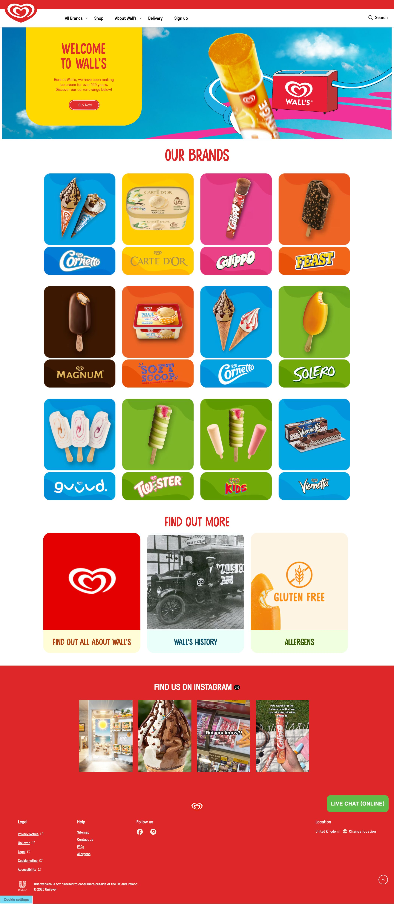

 
  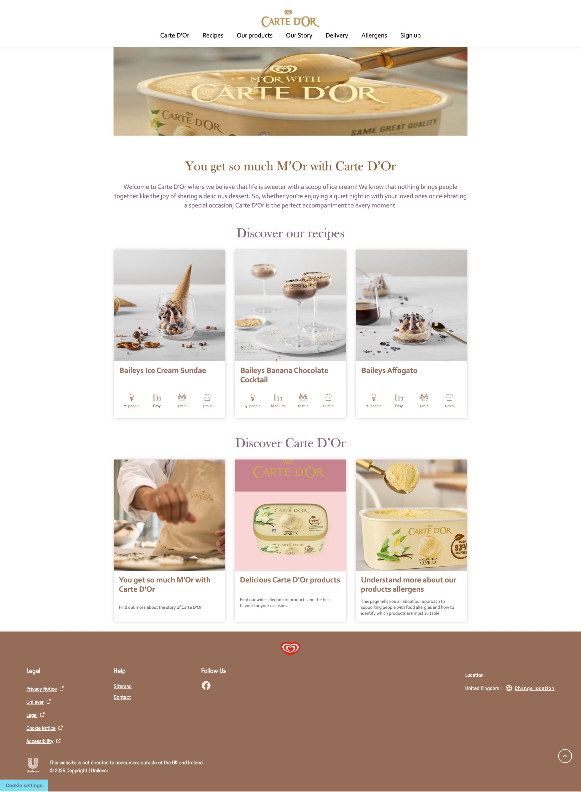

 
  <h3>Cornetto</h3>
  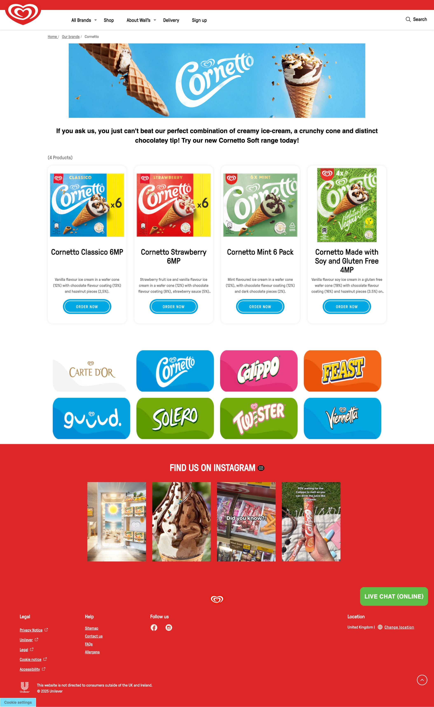

 
  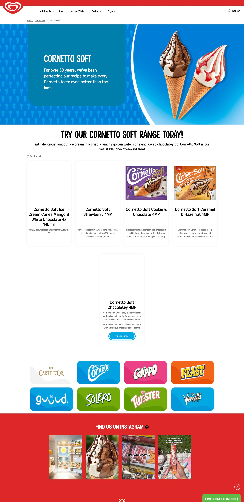

 
  <h3>Feast</h3>
  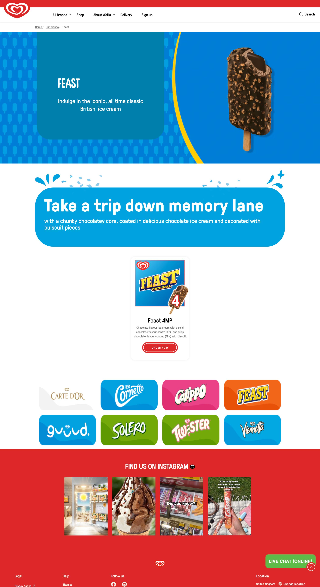

 
  <h3>Guuud</h3>
  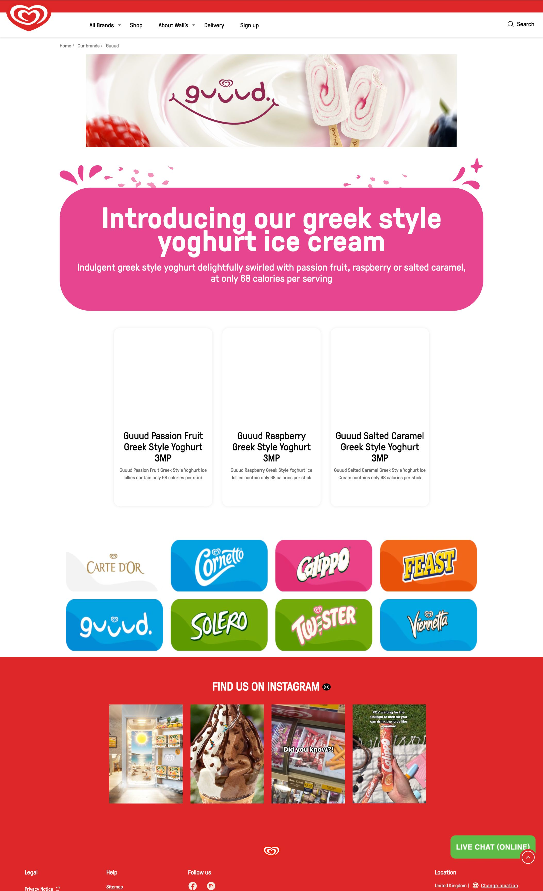

 
  <h3>Magnum</h3>
  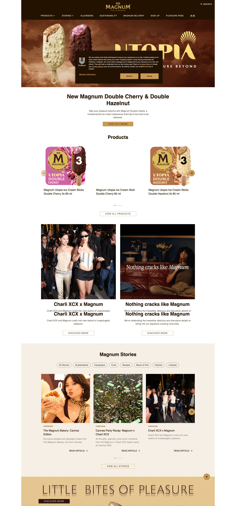

 
  <h3>Soft Scoop</h3>
  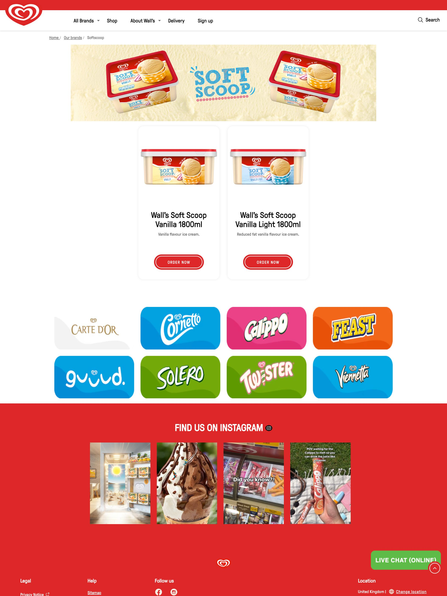

 
  <h3>Solero</h3>
  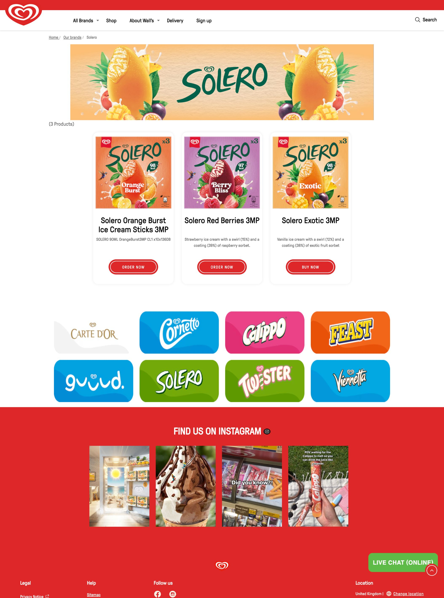

 
  <h3>Twister</h3>
  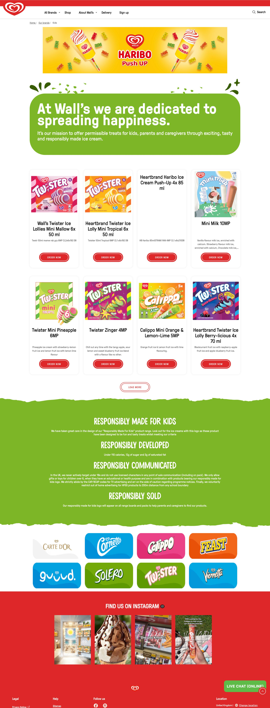

 
  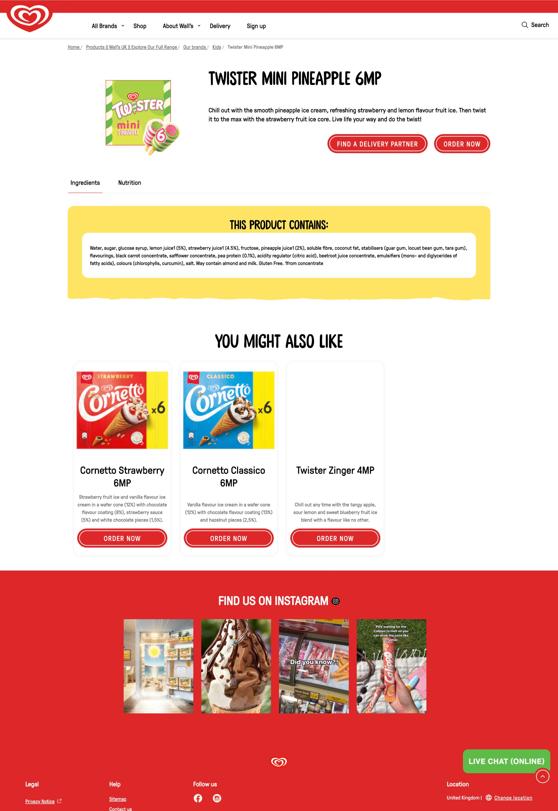

 
  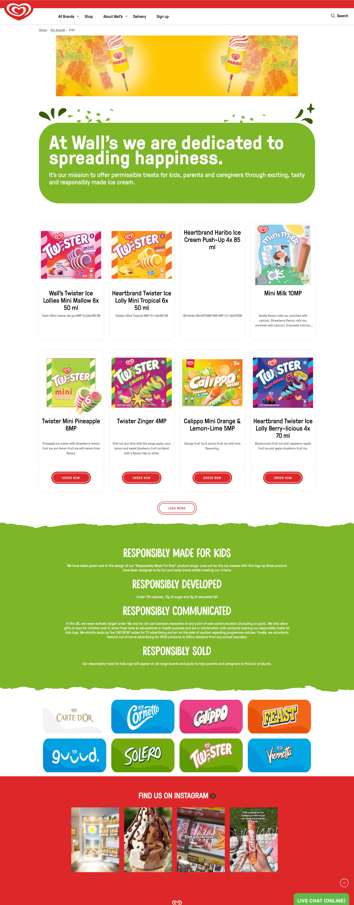

 
  <h3>Vienetta</h3>
  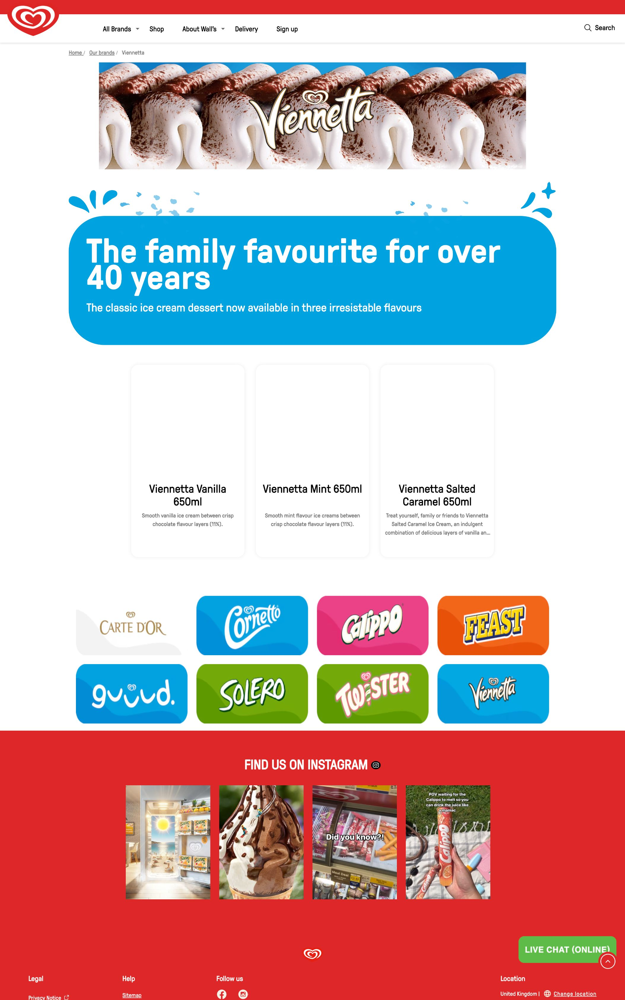

<!-- TechStack -->

### :space_invader: Tech Stack

<a href="https://builtwith.com/?https%3a%2f%2fwww.wallsicecream.com%2fuk%2f">Full list of used technologies</a>

  
Client

  <ul>
    <li><a href="https://www.w3schools.com/html/html5_semantic_elements.asp" target="_blank">Semantic HTML5</a></li>
    <li><a href="https://www.w3schools.com/css/"  target="_blank">CSS3</a></li>
    <li><a href="https://lesscss.org/"  target="_blank">LESS</a></li>
    <li><a href="https://developer.mozilla.org/en-US/docs/Web/JavaScript"  target="_blank">JavaScript</a></li>
    <li><a href="https://jquery.com/"  target="_blank">jQuery</a></li>
    <li><a href="https://react.dev/"  target="_blank">ReactJS</a></li>
    <li><a href="https://www.ibm.com/think/topics/rest-apis"  target="_blank">RestAPI</a></li>
    <li><a href="https://www.json.org/">JSON</a></li>
    <li><a href="https://developer.mozilla.org/en-US/docs/Web/XML/Guides/XML_introduction"  target="_blank">XML</a></li>
  </ul>

DevOps

  <ul>
    <li><a href="https://github.com/">GitHub</a></li>
    <li><a href="https://www.jslint.com/">JS Lint</a></li>
    <li><a href="https://www.postman.com/">PostMan</a></li>
    <li><a href="https://gruntjs.com/">Grunt</a></li>
    <li><a href="https://www.jenkins.io/">Jenkins</a></li>
    <li><a href="https://experienceleaguecommunities.adobe.com/t5/adobe-experience-manager/aem-6-3-download-link/m-p/261740">AEM 6.3</a></li>
    <li><a href="https://www.atlassian.com/software/jira">JIRA</a></li>
  </ul>

<!-- Features -->

### :dart: Features

- Accessibility level: AA
- Mobile first, full responsive solution
- It follows the BG (Brand Guideline)
- Fast loading time
- Cached content and images

<!-- My contribution to the project -->

## :white_check_mark: My contribution to the project

As a freelancer my contract had an expiration date, therefore the entire project should be done before the deadline, that just happened. I have created all stylesheets for each brands and also wrote scripts that helped QA team to double-check the solutions. Also created AEM teasers and components, managed AEM assets within a strict rule set.

The Unilever client was highly satisfied with the quality and speed of the development, that was a fantastic feedback to me.

<!-- License -->

## :warning: License

Distributed under the Software copyright of Williams Lea Tag and Unilever. Any non-authorized usage of their code leads to legal consequences, thank you.

<!-- Contact -->

## :handshake: Contact

Williams Lea Tag -
[https://www.williamslea.com/](https://www.williamslea.com/),30 Old Broad St, London EC2N 1HT, UK
